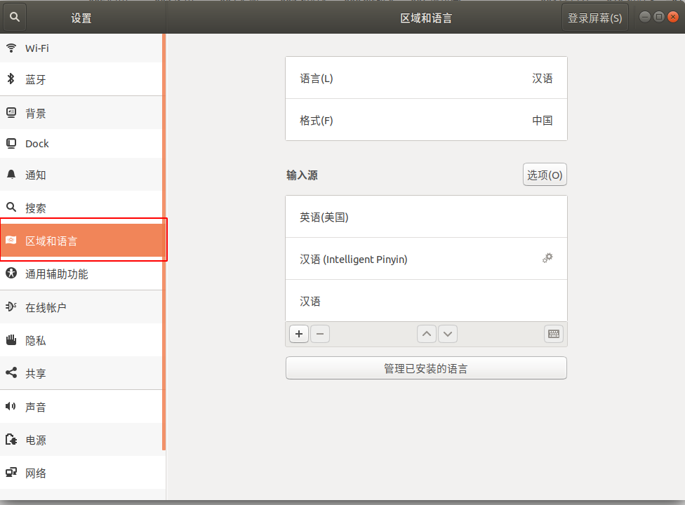
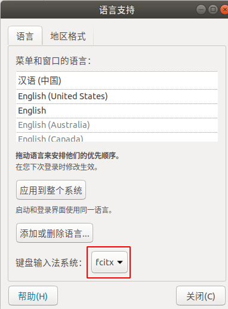

# 安装完ubuntu 需要安装的软件

[TOC]

## 1 先更新系统  
```shell
sudo apt-get update
```
## 2 安装IDE  
```shell
sudo apt-get install qtcreator
```
## 3 安装搜狗  
* 百度 ：sougou for linx  
* 下载Ubnutu版本的搜狗输入法  
* 直接通过Ubuntu软件中心安装  
* 安装完成后在设置->区域和语言->键盘输入法系统->fcitx  
*   
*   
*   
* 注销、重新登录   

## 4 获取root  
```shell
su - 
```
## 5 安装新立得
* 在软件中心搜索Synergy
* 点击安装即可