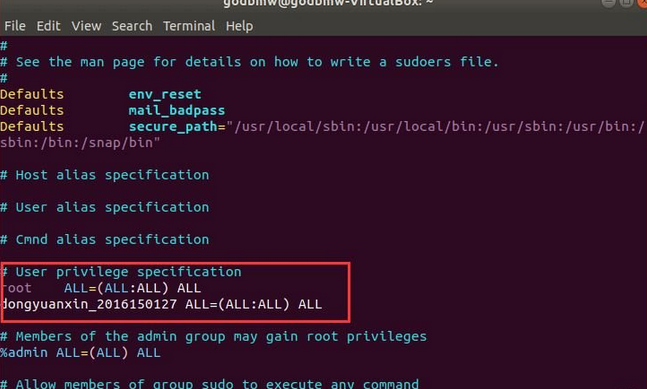

# Ubuntu创建用户并赋权限

[TOC]
参考：  https://blog.csdn.net/qq_33867131/article/details/86490083 
## 1 创建用户  
### 1.1 创建用户名XXX  
```shell
sudo useradd -m XXX -d /home/XXX -s /bin/bash
```
命令含义：  
* -r：建立系统账号  
* -m：自动建立用户的登入目录  
* -s：指定用户登入后所使用的shell  
### 1.2 为用户名设置密码  
```shell
sudo passwd XXX
```

### 1.3 修改用户的权限：（ /etc/sudoers文件只有r权限，在改动前需要增加w权限，改动后，再去掉w权限 ）   
* 为sudoers增加写入权限  
```shell
      sudo chmod +w /etc/sudoers
      sudo vim /etc/sudoers  
```

* 为用户XXX添加读写权限  
```shell
      # User privilege specification 
      root　ALL=(ALL:ALL) ALL
      XXX ALL=(ALL:ALL) ALL    // 这一行为新添加的代码
```
     
* 将sudoers文件的操作权限改为只读模式  
```
      sudo chmod -w /etc/sudoers
```
## 2 删除用户  
### 2.1 删除用户  
```
sudo userdel XXX
sudo rm -rf /home/XXX
```
### 2.2 删除或者注释掉/etc/sudoers中关于要删除用户的配置，否则无法再次创建同名用户  
### 2.3 彻底删除用户残余信息
```
 cd /home              # 删除/home目录下的文件          
 rm -rf XXX
 cat /etc/passwd       # 删除/etc/passwd下的用户
 cat /etc/group        # 删除/etc/group下的用户组文件
 cd /var/spool/mail	# 删除/var/spool/mail下的邮箱文件	
 rm -rf XXX
```
