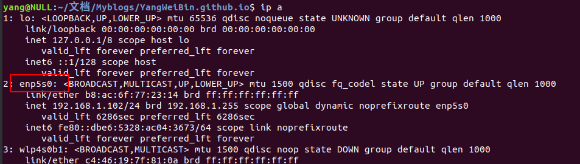
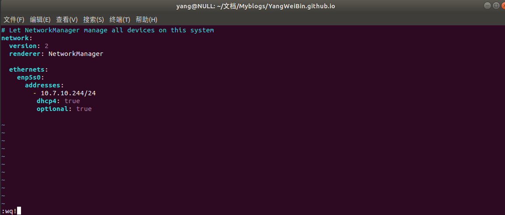

# Ubuntu18.04 LTS开启静态IP  

[TOC]

## 1 首先先看设备名  
```shell
ip a
```
      
 上面2：是有线网卡，3：是无线网卡，我们只设置有线网卡即可。  

 ## 2 看下自己的IP  
```shell
ifconfig
```
## 3 创建网络配置文件  
```shell
sudo vim /etc/netplan/01-network-manager-all.yaml
```
在文件中添加     
      
需要注意的是，IP地址不能乱加，你可以先利用ifconfig看看自己的IP 再修改  

## 4 应用配置文件  
```shell
sudo netplan apply
```
## 5 验证IP  
```shell
ip a
```