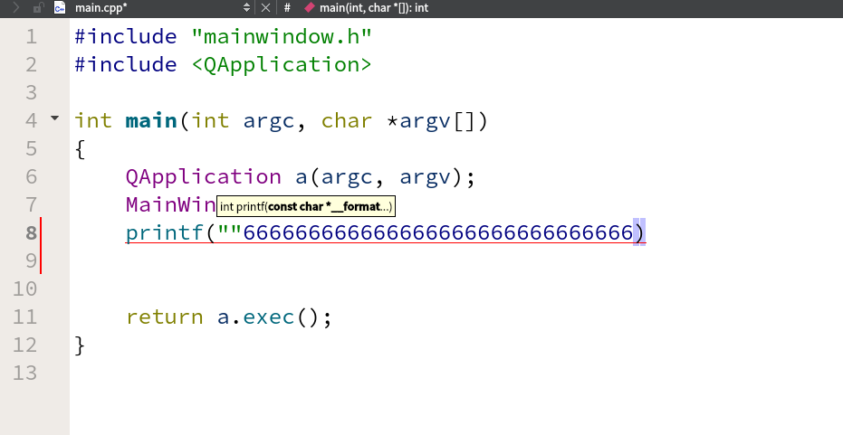
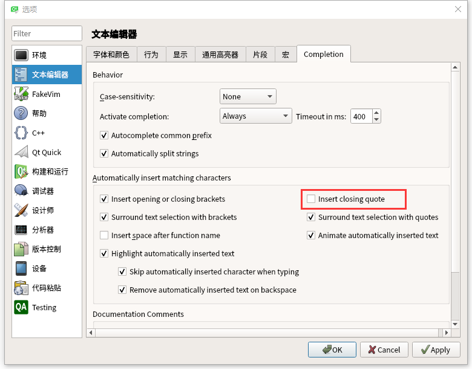
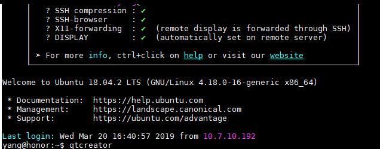

# 远程登录qtcreator遇到问题  

[TOC]

## 1 按键冲突问题  

### 1.1 问题描述  
  
  上面问题是由于qtcreator的引号补全功能和MobaXterm按键冲突引起的问题，打了引号后按 right 键，光标没有向右，反而出现一堆66666666，只需将双引号的自动补全功能去掉即可。  

 ### 1.2 解决方案  
  
  将自动插入引号对勾去掉，点Apply 然后 OK 即可。  

## 2 有时输入qtcreator，没弹出界面  

### 2.1 问题描述  
  
  在登陆完成后，输入qtcreator，没有弹出qt界面，显示2 - 3行的错误。  

### 2.2 解决方案  
 * 产生原因：网速不好  
 * 等网速稍好一些了再次输入即可，不要随便动服务器。  
