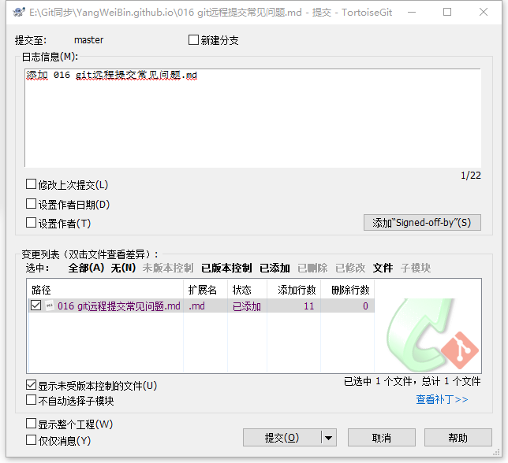
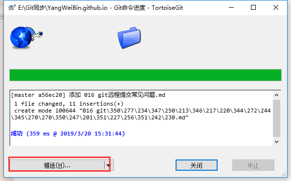
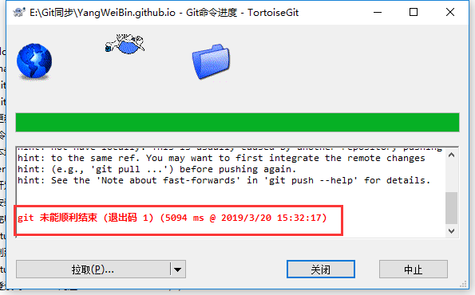
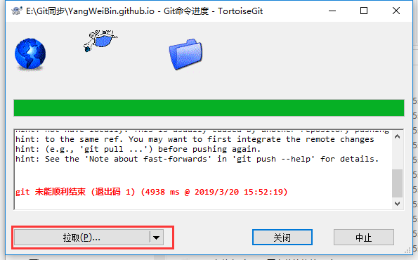
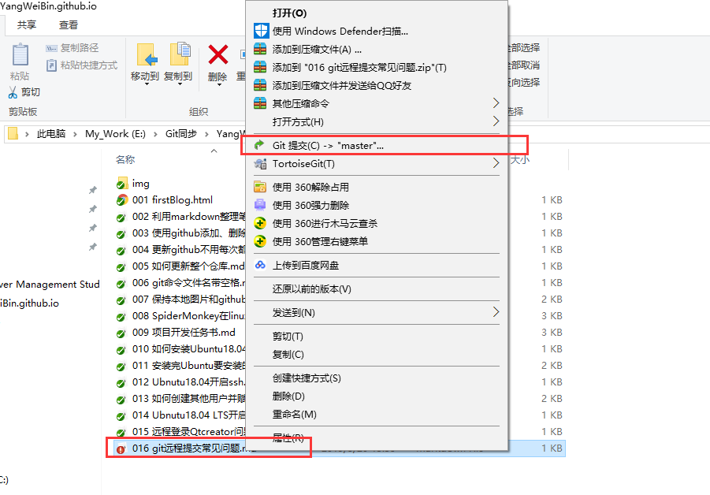
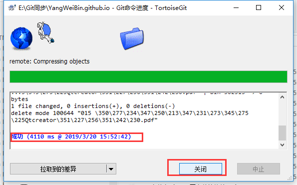

# git远程提交遇到的问题  

[TOC]

## 1 问题描述  
当对仓库进行添加文档时，出现下面问题：  
当添加文件016时，  

  
向远程仓库推送，  
  
出现如下错误，
   

## 2 错误原因  
由于这个仓库在你推送时，你没有提前拉取最新的仓库，而你更新前的本地仓库与远程仓库，不一致，直接推送导致失败。  
为什么会不一致呢？  
* 多个协作者更新仓库，你的本地仓库不是最新仓库；  
* 你在其他地方修改过仓库，比如其他文件夹，或者其他电脑，而本地仓库不是最新远程仓库；  
* 为什么必须要最新的呢？防止你新上传的和远程仓库更新的内容或者文件名产生冲突。  

## 3 解决方案     
### 3.1 直接拉取远程仓库  
  
### 3.2 对新添加的文档稍加修改（例如：最后加俩空格），提交   
  
### 3.3 正常上传，注意每次提交原因不能一样，否则没法回退，直接报错  
  

## 4 结论
每次在本地更新仓库前必须拉取一下最新的仓库。拉取时即使有相同文件名文件内容不同，也不会去覆盖你的本地文件，放心操作即可。

