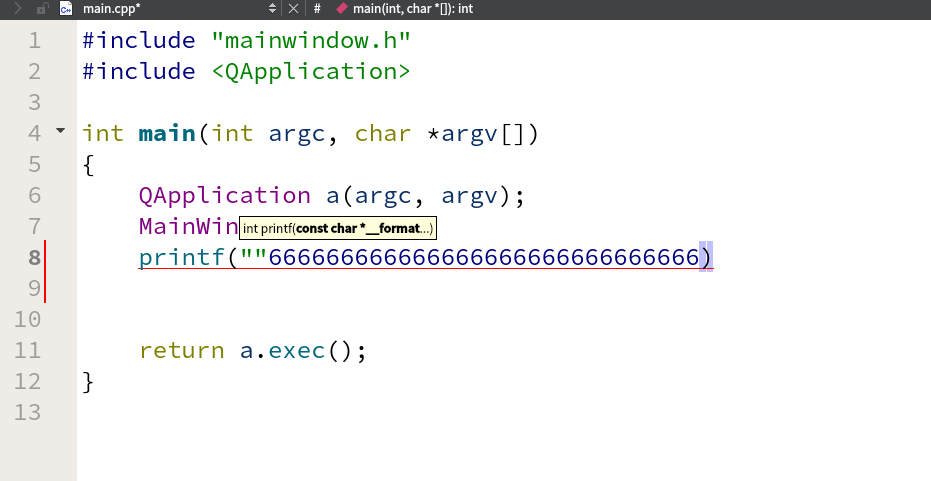
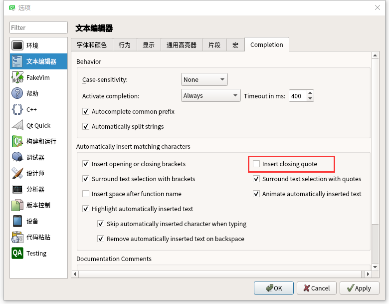

# 远程登录qtcreator遇到问题  

[TOC]

## 1 问题描述  
  
     上面问题是由于qtcreator的引号补全功能和MobaXterm按键冲突引起的问题，打了引号后按 right 键，光标没有向右，反而出现一堆66666666，只需将双引号的自动补全功能去掉即可。  

 ## 2 解决方案  
  
      将自动插入引号对勾去掉，点Apply 然后 OK 即可。  