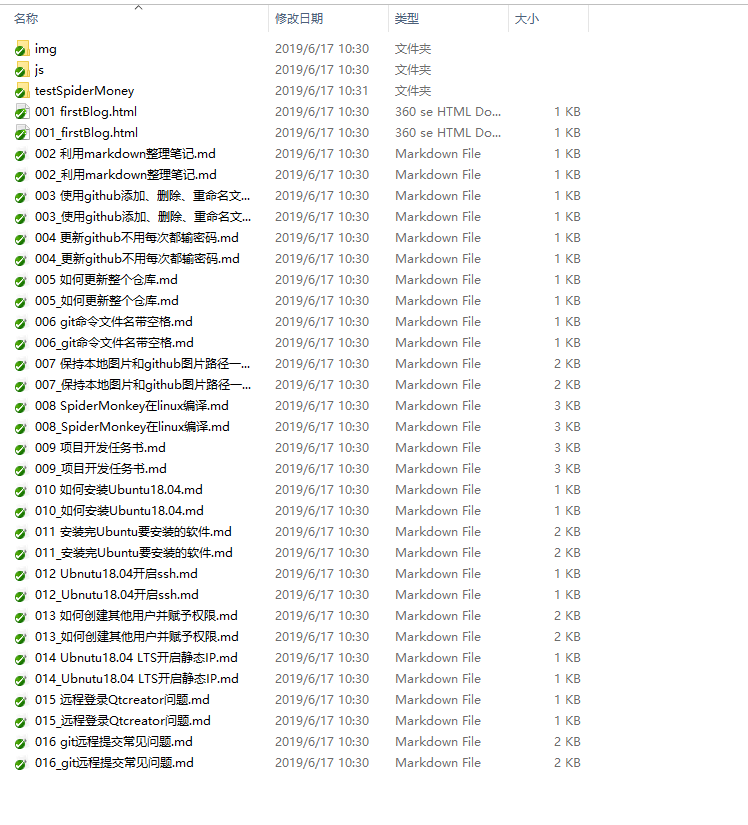
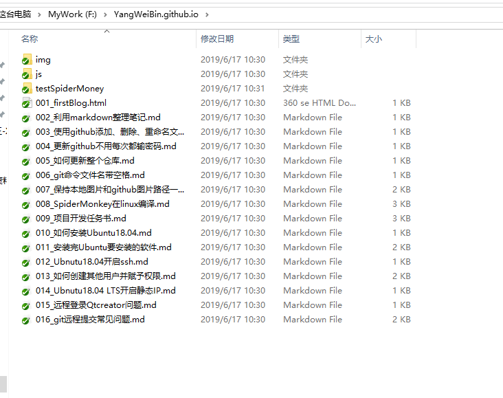
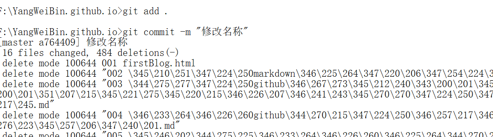
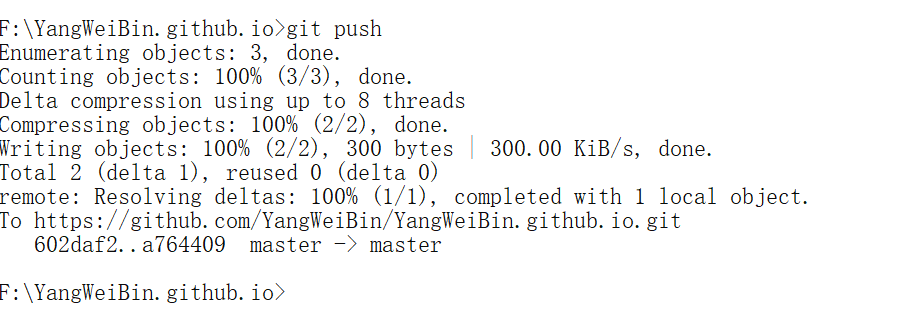

# 1 批量修改文件名  

## 1.1 修改文件名  
* 先修改文件：  
  
* 修改文件名，删除多余文件  
  

## 1.2 更新仓库  
* 进入仓库目录  
```Shell
cd F:\YangWeiBin.github.io
```
* 更新仓库  
```Shell
git add .
```
**注意：点的个数由文件夹的嵌套层数决定，如果是一个"."代表仓库根目录**  
## 1.3 添加更新信息  
```Shell
git commit -m "修改名称"
```
  


## 1.4 提交更新信息  
```Shell
git push
```
