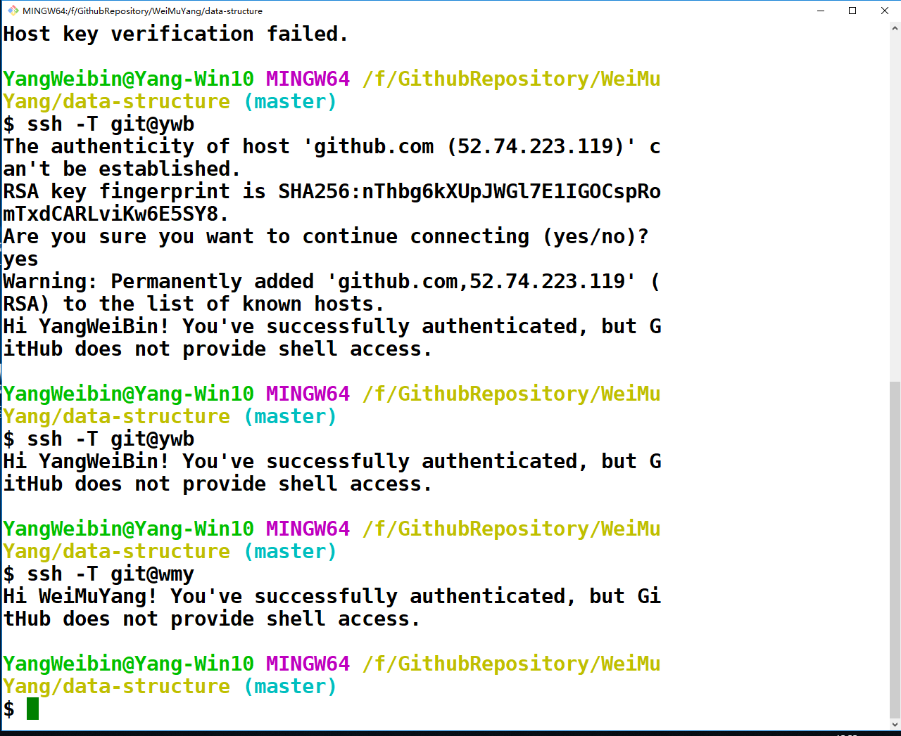
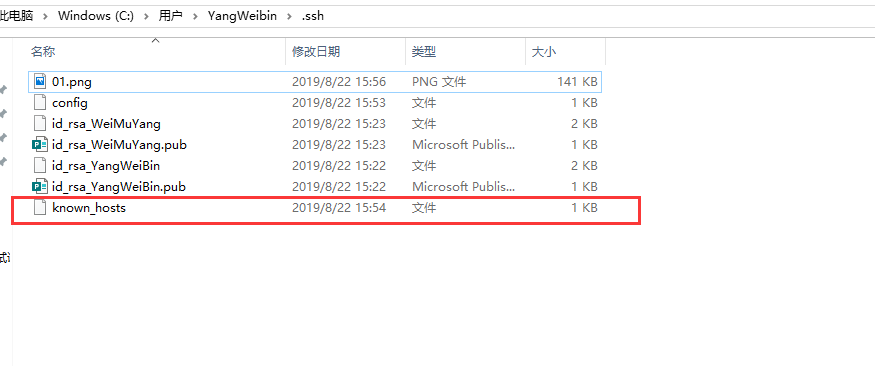
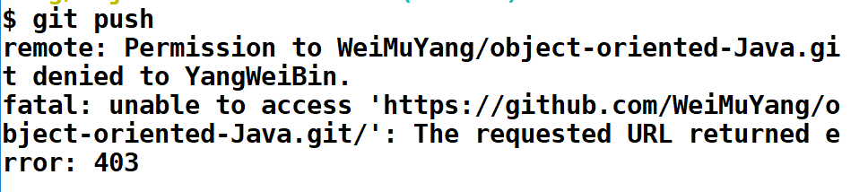

# github实现一台设备多个账户    
## 1 github上传代的方式    
git可以使用四种主要的协议来传输资料: 本地协议（Local），HTTP 协议，SSH（Secure Shell）协议及 git 协议。其中，本地协议由于目前大都是进行远程开发和共享代码所以一般不常用，而git协议由于缺乏授权机制且较难架设所以也不常用。  
最常用的便是SSH和HTTP(S)协议。git关联远程仓库可以使用http协议或者ssh协议。  
### 1.1 https协议优缺点     
- 优点1: 相比 SSH 协议，可以使用用户名／密码授权是一个很大的优势，这样用户就不必须在使用 Git 之前先在本地生成 SSH 密钥对再把公钥上传到服务器。 对非资深的使用者，或者系统上缺少 SSH 相关程序的使用者，HTTP 协议的可用性是主要的优势。 与 SSH 协议类似，HTTP 协议也非常快和高效  
- 优点2: 企业防火墙一般会打开 80 和 443 这两个常见的http和https协议的端口，使用http和https的协议在架设了防火墙的企业里面就可以绕过安全限制正常使用git，非常方便  
- 缺点: 使用http/https除了速度慢以外，还有个最大的麻烦是每次推送都必须输入口令. 但是现在操作系统或者其他git工具都提供了 keychain 的功能，可以把你的账户密码记录在系统里，例如OSX 的 Keychain 或者 Windows 的凭证管理器。  
### 1.2 SSH协议    
- 优点1: 架设 Git 服务器时常用 SSH 协议作为传输协议。 因为大多数环境下已经支持通过 SSH 访问 —— 即时没有也比较很容易架设。 SSH 协议也是一个验证授权的网络协议；并且，因为其普遍性，架设和使用都很容易。  
- 缺点1: SSH服务端一般使用22端口，企业防火墙可能没有打开这个端口。  
- 缺点2: SSH 协议的缺点在于你不能通过他实现匿名访问。 即便只要读取数据，使用者也要有通过 SSH 访问你的主机的权限，这使得 SSH 协议不利于开源的项目。 如果你只在公司网络使用，SSH 协议可能是你唯一要用到的协议。 如果你要同时提供匿名只读访问和 SSH 协议，那么你除了为自己推送架设 SSH 服务以外，还得架设一个可以让其他人访问的服务。  
### 1.3 比较  
- HTTPS利于匿名访问，适合开源项目可以方便被别人克隆和读取(但他没有push权限)；毕竟为了克隆别人一个仓库学习一下你就要生成个ssh-key折腾一番还是比较麻烦，所以github除了支持ssh协议必然提供了https协议的支持。  
- SSH协议使用公钥认证比较适合内部项目。 当然了现在的代码管理平台例如github、gitliab，两种协议都是支持的，基本上看自己喜好和需求来选择就可以了。  
- URL是不同的    
SSH方式（git@github.com:xxx/test.git）
https方式 (https://github.com/xxx/test.git)
## 2 SSH协议在github上的应用  
### 2.1 简单理解ssh协议  
sh的协议理解起来比https简单多了，大家可以[参考阮一峰老师的这篇文章SSH原理与运用](https://blog.csdn.net/Leia21/article/details/93874986)和我的这篇文章ssh建立通道和认证原理。  
总结来看，就是SSH协议使用目前已经比较成熟的RSA这类非对称加密技术来实现了安全秘钥的协商: 目标主机把自己的公钥发送给客户端，客户端用公钥加密 一些东西 之后传给服务器，服务器用RSA私钥从中解出 一些东西，保证了 一些东西 防篡改、防泄密，最终协商出只有双方才知道的通信密钥。  
### 2.2 github上使用ssh协议  
如果要使用ssh协议来克隆或者push github上的代码，则git程序会采用ssh的校验机制。而由于github上所有仓库都是采用共用git账号体系的方式, 是无法用git用户登录github服务器的。各个用户只能通过公钥认证的方式使用此SSH账号访问版本库。 因此，**你在执行 git clone命令之前，必须确保已经把ssh公钥放置到了github服务器上。**    
## 3 同一台设备如何使用两个GitHub  
### 3.1 配置SSH Key  
到这里，假设你手上已有两个Git帐号，一个原先设备使用着，另一个是新申请的，这里以我自己的两个帐号为例子来进行讲解  
```txt
# 之前账号 
863255386@qq.com
# 自己账号
34140...@qq.com
```
```shell
# 先进入~/.ssh
cd ~/.ssh 
# 生成SSH Key
ssh-keygen -t rsa -C "863255386@qq.com"
```
最好不要敲三次回车，因为你用两个账号的话，可能会出现同名文件覆盖情况，在第一次时，输入文件名`id_rsa_ywb`，然后敲两次回车。  
此时会出现两个文件：`id_rsa_ywb`和`id_rsa_ywb.pub`
打开`id_rsa_ywb.pub`文件里面的内容就是ssh公钥，将公钥配置到github服务器上：  
1. 在页面的用户栏的右上角，单击  Settings ；  
2. 在左侧边栏点击 SSH and GPG keys；  
3. 点击   New SSH key ；  
4. 在Title标题区域中，为新的SSH密钥添加一个描述性标签。例如，如果您使用的是个人的PC，您可以调用这个关键的“Personal MacBook Air”；  
5. 粘贴您的钥匙插入 Key 区域中；  
6. 点击  Add SSH key ；  
7. 确认通过输入操作GitHub的密码。  
同理配置另一账号的SSH密钥，并添加到另一个账号的github服务器上。  
### 3.2 添加新ssh key  
```shell
# 添加 id_rsa_ywb
ssh-add ~/.ssh/id_rsa_ywb
# 可能会提示“Could not open a connection to your authentication agent.”  
eval `ssh-agent -s`  # 或者 先执行ssh-agent bash命令后再执行ssh-add
# 添加 id_rsa_wmy
ssh-add ~/.ssh/id_rsa_wmy
```
### 3.3 配置config文件  
查看.ssh文件中是否存在config文件  
```shell
touch config
vim config
```
如果已存在则直接编辑config文件，命令：vim config #这是linux的命令，进入了vim界面后按a或i或A或I进入编辑模式，编辑完成后按esc键输入:wq 保存文件退出  
如果不存在则需要创建config文件，命令：touch config，再对config文件进行编辑：  
```shell
#Default 第一个账号(863@xxxx.com)
Host ywb
HostName github.com
PreferredAuthentications publickey
IdentityFile ~/.ssh/id_rsa_ywb

#second 第二个账号（341@xxxx.com）
Host wmy
HostName github.com
PreferredAuthentications publickey
IdentityFile ~/.ssh/id_wmy
```
- Host设置别名，原先使用的帐号，你使用默认的就好；新的帐号就需要重新命名，名称随便你，好记就行；  
- HostName 默认就是github.com 不需要去改动  
- User 用户，也是默认就好  
- IdentityFile 这个就是你帐号对应的公钥文件了，路径是这样固定的，唯一要改的就是末尾的文件名  id_rsa_ywb改成你自己的  
- 然后保存退出  
### 3.5 测试    
```shell
ssh -T git@ywb  # 如果有提示输入:yes
```
  
然后会增加一个文件  
  

**这里要注意并记住，使用旧帐号的时候，之前怎么用还是怎样；在使用新帐号的时候，比如在克隆仓库的时候，本来是这样的，如果不这样克隆的话，无法正常提交，会报URL错误。**     
```shell
# 将 git clone https://github.com/账户名/仓库名.git 改为：  
git clone git@wmy:账户名/仓库名.git
```



## 参考资料  
1. https://www.jianshu.com/p/f2bef9737a8a  
2. https://www.cnblogs.com/hugechuanqi/p/10786561.html  
3. https://www.jianshu.com/p/1ac06bcd8ab5  
4. https://blog.csdn.net/jfkidear/article/details/90376815  

