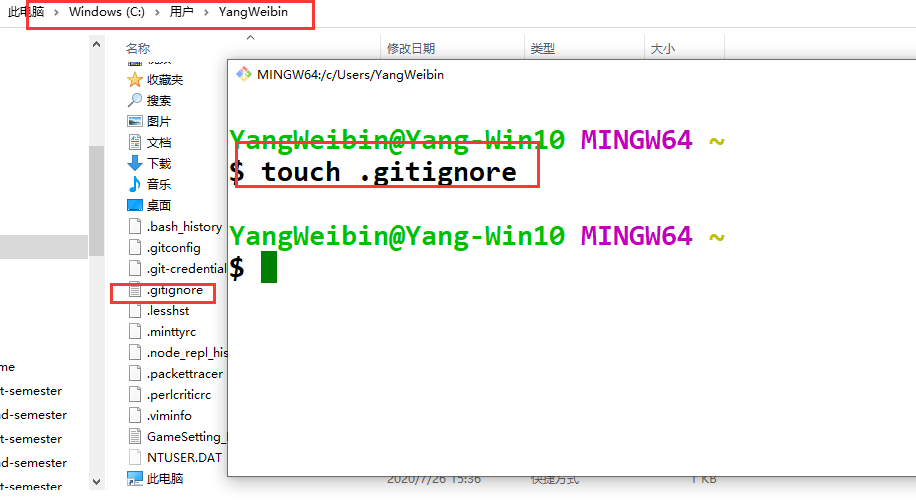
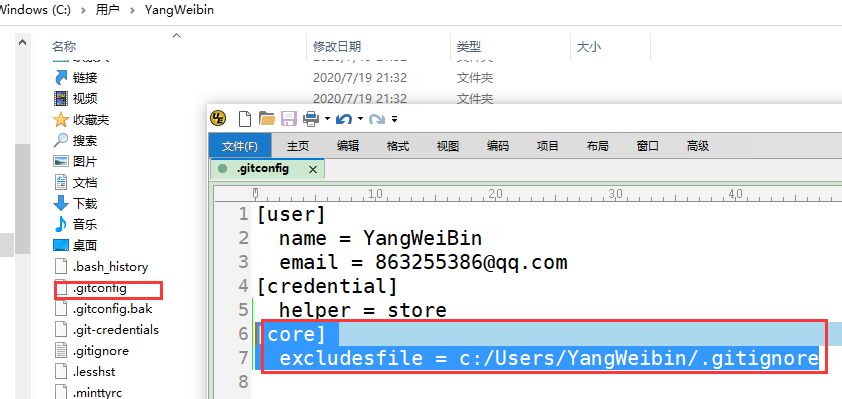

# 建立全局区的`ignore`文件  
- 对于仓库中文件，有些是需要忽略上传的，通过`ignore`文件来实现，但是若有多个仓库，每个仓库忽略上传的文件类型有重叠，   
- 想让所有仓库都添加一种忽略的文件类型，需要在多个仓库的`ignore`文件进行添加，用起来比较麻烦  
- 因此，添加一种全局的忽略文件，让共有部分，都放在全局忽略文件中进行统一管理    
- 添加的方式和添加全局用户名和邮箱类似，可以手动创建也可以git命令创建   
## 1 手动添加   
### 1.1 创建全局忽略文件    
1. 打开`C:\Users\用户名`目录    
2. 在此处右击选择`git Bash`输入命令`touch .gitignore`   
   
### 1.2 全局忽略文件添加值配置文件   
1. 打开`C:\Users\用户名\.gitconfig`文件     
2. 添加全局忽略文件，注意斜杠的方向   

```bash
[core] 
  excludesfile = c:/Users/YangWeibin/.gitignore
```
  

## 2 命令实现   
```bash
git config --global core.excludesfile ~/.gitignore   
```

## 3 修改忽略文件   
1. 将共有要忽略的都忽略了    
2. 每个仓库的忽略文件，只需根据具体情况，看是不是需要额外添加   


## 4 参考资料   
1. https://www.cnblogs.com/Yiutto/articles/4678578.html    
2. https://www.cnblogs.com/bigtreei/p/9670716.html  
