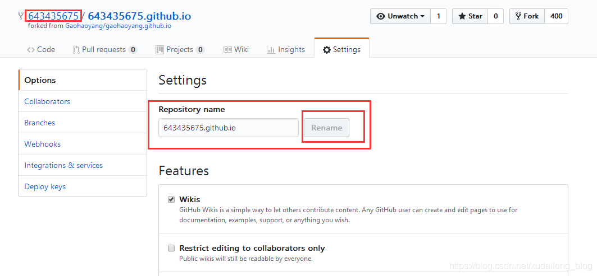
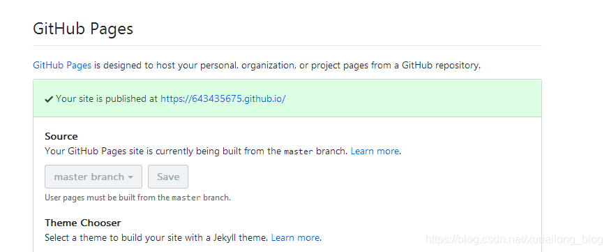
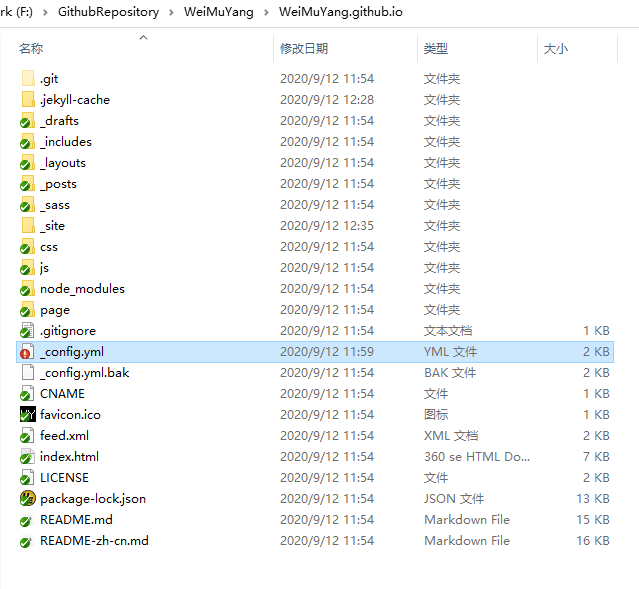
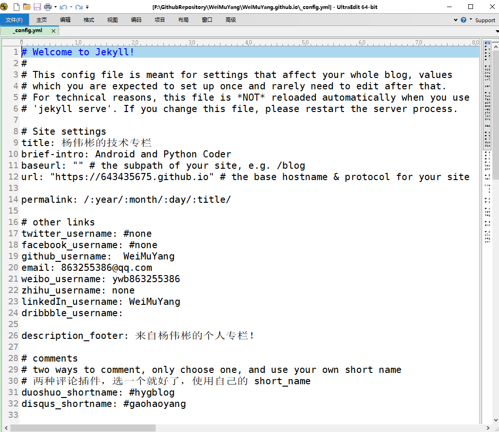
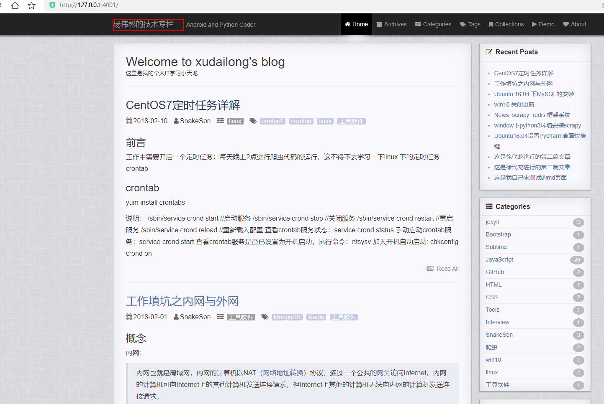
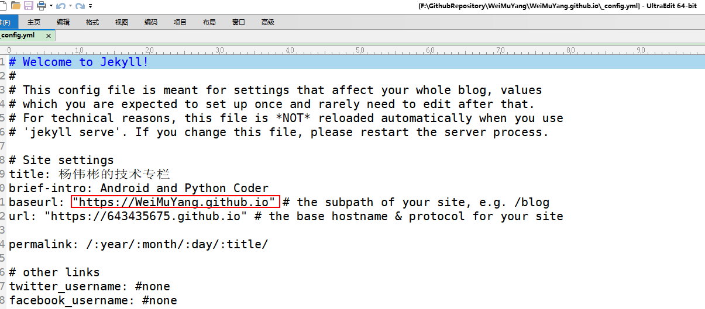
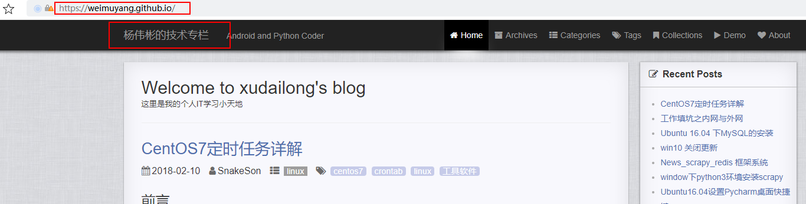

# 用github搭建个人博客   

## 1 注册Github账号   
- 略   

## 2 拉取博客模板    
- Fork（拉取）博客模板到自己的仓库    
- https://github.com/WeiMuYang/WeiMuYang.github.io   
- 点击红色的Fork后，就可以变成我们自己的仓库了。   
- Fork成功后，就成我们自己的名下了，这时候，我们需要进行博客的简单设置。    
- 找到Settings点击，进行页面的设置。   
- 这里我们找到Rename下的前面的框内的内容，我们要改成与我们自己的github一样的；用户名，这里我已经改过了，一定要记得用户名与仓库名要一致，就是两处画红线的地方。
	- 当rename完后，我们在当前页面往下拉，直到出现GitHub Pages：  

  

  

## 3 搭建GitHub Pages +jekyll   

- 用Git工具将整个项目Git clone下来，可以看一下现在的目录结构：  

  

  

- 这里进行一下各个文件（夹）的用途    
- `_config.yml` ：全局配置文件  
- `posts` :放文章的文件夹   
- 其他的文件夹是各页面的HTML文件，你可以点进去看看，尝试改变一下
其中：`_config.yml`文件中的配置内容    

```css
# paginate
plugins: [jekyll-paginate]
paginate: 6  # 每页显示6篇文章
port: 4001   # jekyll启动端口号  

# statistic analysis 统计代码
# 百度统计 id，将统计代码替换为自己的百度统计id，即
# hm.src = "//hm.baidu.com/hm.js?xxxxxxxxxxxx";
# xxxxx字符串
baidu_tongji_id: 1cc1fc4b4b456bf7c99ce80aec5bf009
google_analytics_id: UA-72449510-4 # google 分析追踪id
```

## 4 Jekyll搭建静态博客    
- https://643435675.github.io/2015/02/15/create-my-blog-with-jekyll/   

### 4.1 安装Ruby   
- Ruby的[官网地址](https://rubyinstaller.org/downloads/)     
- Ruby的[本地位置](E:/00-software-installation/)      
- 安装好会弹出控制台，提示安装其他内容，我只选了其中第一个，后面没有选   
- 验证是否成功   

```cmd
C:\Users\YangWeibin>ruby -v
ruby 2.7.1p83 (2020-03-31 revision a0c7c23c9c) [x64-mingw32]
```
## 4.2 安装RubyGems   
- RubyGems的[官方地址](https://rubygems.org/pages/download)     
- 下载zip文件即可   
- RubyGems的[本地位置](E:/00-software-installation/)    
- 下载完成后解压缩到rubygems     
- 通过下面的命令进行安装   

```cmd
C:\Users\YangWeibin>E:
E:\>cd E:\360DownLoad\rubygems
E:\360DownLoad\rubygems>ruby setup.rb
# Successfully built RubyGem 底下若干行
```

## 4.3 通过RubyGems安装Jekyll    
```cmd
E:\360DownLoad\rubygems>gem install jekyll   
# 网不好的话等好久，没有卡顿 ，最后提示如下： 
# Done installing documentation for public_suffix, addressable, colorator, http_parser.rb, eventmachine, em-websocket, concurrent-ruby, i18n, ffi, sassc, jekyll-sass-converter, rb-fsevent, rb-inotify, listen, jekyll-watch, kramdown, kramdown-parser-gfm, liquid, mercenary, forwardable-extended, pathutil, rouge, safe_yaml, unicode-display_width, terminal-table, jekyll after 20 seconds
# 26 gems installed
```

## 4.4 创建博客工作区   
```cmd
E:\360DownLoad\rubygems>d:
D:\>md jekyllWorkspace
D:\>cd jekyllWorkspace
D:\jekyllWorkspace>jekyll new yourname
```

## 4.5 检测文件变化   
- 命令报错   

```cmd
F:\GithubRepository\WeiMuYang\WeiMuYang.github.io>jekyll serve --watch   
# 报错：Dependency Error: Yikes! It looks like you don't have jekyll-paginate or one of its dependencies installed.  
```

- [解决思路](https://blog.csdn.net/wyc12306/article/details/51504885)   

```cmd
F:\GithubRepository\WeiMuYang\WeiMuYang.github.io>gem install jekyll-paginate
```

- 再次使用命令   
```cmd
F:\GithubRepository\WeiMuYang\WeiMuYang.github.io>jekyll serve --watch  

#  最后显示：
# Auto-regeneration: enabled for 'F:/GithubRepository/WeiMuYang/WeiMuYang.github.io'
# Server address: http://127.0.0.1:4001/
# Server running... press ctrl-c to stop.
```

## 5 启动博客    
```cmd
C:\Users\YangWeibin>f:
F:\>cd F:\GithubRepository\WeiMuYang\WeiMuYang.github.io
F:\GithubRepository\WeiMuYang\WeiMuYang.github.io>jekyll s
# Configuration file: F:/GithubRepository/WeiMuYang/WeiMuYang.github.io/_config.yml
# Source: F:/GithubRepository/WeiMuYang/WeiMuYang.github.io
# Destination: F:/GithubRepository/WeiMuYang/WeiMuYang.github.io/_site
# Incremental build: disabled. Enable with --incremental
# Generating...
#                   done in 2.086 seconds.
# Auto-regeneration: enabled for 'F:/GithubRepository/WeiMuYang/WeiMuYang.github.io'
#    Server address: http://127.0.0.1:4001/
#  Server running... press ctrl-c to stop.
```
## 6 访问方式  
1. 可以内网访问，但是终端不能关闭    
   

2. 通过外网访问的话，可以输入你设置的网址：`https://weimuyang.github.io/ `   

   

   

 


## 7 参考资料   

1. https://blog.csdn.net/xudailong_blog/article/details/78762262?utm_medium=distribute.pc_relevant.none-task-blog-BlogCommendFromMachineLearnPai2-1.channel_param&depth_1-utm_source=distribute.pc_relevant.none-task-blog-BlogCommendFromMachineLearnPai2-1.channel_param  
2. https://643435675.github.io/2015/02/15/create-my-blog-with-jekyll/  
3. https://rubyinstaller.org/downloads/   
4. https://rubygems.org/pages/download  
5. https://blog.csdn.net/wyc12306/article/details/51504885   