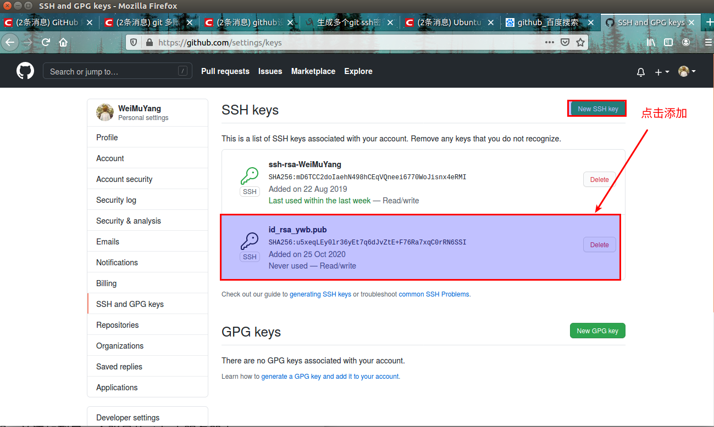

# linux下如何实现一个设备多个git账户  


## 1 github上使用ssh协议  
### 1.1 配置ssh key   
```shell
# 之前的账户
863255386@qq.com
# 自己账号
34140...@qq.com
```
```bash
# 先进入~/.ssh
cd ~/.ssh 
# 注意：因为我的ssh是在root的Ubuntu账户开通的，因此我的先 sudo su  
# 生成SSH Key 
ssh-keygen -t rsa -C "863255386@qq.com"
```

- 最好不要敲三次回车，因为你用两个账号的话，可能会出现同名文件覆盖情况，在第一次时，输入文件名`id_rsa_ywb`，然后敲两次回车。  
此时会出现两个文件：`id_rsa_ywb`和`id_rsa_ywb.pub`
打开`id_rsa_ywb.pub`文件里面的内容就是ssh公钥，将公钥配置到github服务器上：  
   

- 打开`id_rsa_ywb.pub`文件里面的内容就是ssh公钥，将公钥配置到github服务器上：  

   


## 参考资料  
1. https://www.cnblogs.com/zhangceblogs/p/8488384.html    
2. https://blog.csdn.net/m0_37592397/article/details/78664757   
3. https://www.cnblogs.com/ayseeing/p/4445194.html   
4. [010_github实现一台设备多账户.md](./010_github实现一台设备多账户.md)  

