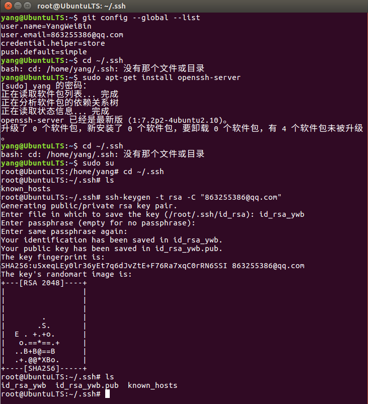

# linux下如何实现一个设备多个git账户  

- 建议从头到尾看完再操作，尤其是从第2小节内容      

## 1 github上使用ssh协议  
### 1.1 配置ssh key   
```shell
# 之前的账户
863255386@qq.com
# 自己账号
34140...@qq.com
```
```bash
# 先进入~/.ssh
cd ~/.ssh 
# 原因是因为没有用root用户ssh登录过，执行一下ssh操作就会自动生成了，因此我的先 sudo su  
# https://blog.csdn.net/weixin_34233618/article/details/86346247?utm_medium=distribute.pc_relevant.none-task-blog-BlogCommendFromMachineLearnPai2-1.channel_param&depth_1-utm_source=distribute.pc_relevant.none-task-blog-BlogCommendFromMachineLearnPai2-1.channel_param  
# 因为这一步错了，后面在root账户下开启的ssh key 导致，每次克隆和提交只能在root用户下   
# 生成SSH Key 
ssh-keygen -t rsa -C "863255386@qq.com"
```

- 最好不要敲三次回车，因为你用两个账号的话，可能会出现同名文件覆盖情况，在第一次时，输入文件名`id_rsa_ywb`，然后敲两次回车。  
此时会出现两个文件：`id_rsa_ywb`和`id_rsa_ywb.pub`
打开`id_rsa_ywb.pub`文件里面的内容就是ssh公钥，将公钥配置到github服务器上：  
   

- 打开`id_rsa_ywb.pub`文件里面的内容就是ssh公钥，将公钥配置到github服务器上：  

   

- 重复以上步骤，继续将下一个帐号的SSH  key 添加到自己的github目录   

## 1.2 添加新的ssh key    
```shell
# 添加 id_rsa_ywb
ssh-add ~/.ssh/id_rsa_ywb
# 可能会提示“Could not open a connection to your authentication agent.”  
eval `ssh-agent -s`  # 或者 先执行ssh-agent bash命令后再执行ssh-add
# 添加 id_rsa_wmy
ssh-add ~/.ssh/id_rsa_wmy
```

### 1.3 配置config   

- 新建配置文件   
```shell
touch config
vim config
```

- 添加配置文件内容   

```shell
#Default 第一个账号(863@xxxx.com)
Host ywb
HostName github.com
PreferredAuthentications publickey
IdentityFile ~/.ssh/id_rsa_ywb

#second 第二个账号（341@xxxx.com）
Host wmy
HostName github.com
PreferredAuthentications publickey
IdentityFile ~/.ssh/id_rsa_wmy  
```

### 1.5 测试   
```shell  
ssh -T git@ywb  # 如果有提示输入:yes
```

   

### 1.6 注意事项   
- 克隆仓库时，由于全局区的账户是863的，因此若要克隆341的需要进行如下修改：  

```shell
# 将 git clone https://github.com/账户名/仓库名.git 改为：  
git clone git@wmy:账户名/仓库名.git
```

## 2 出现问题及解决    
### 2.1 问题   
- 每次push只能在root下进行，用起来不方便    

### 2.2 原因   
- 原因是因为我在root账户下开启的ssh key 导致，每次克隆和提交只能在root用户下      
- https://blog.csdn.net/weixin_34233618/article/details/86346247?utm_medium=distribute.pc_relevant.none-task-blog-BlogCommendFromMachineLearnPai2-1.channel_param&depth_1-utm_source=distribute.pc_relevant.none-task-blog-BlogCommendFromMachineLearnPai2-1.channel_param  
- 因为第1.1步错了，所以运行下面命令，再在yang目录下，重复一遍即可   
- 解决办法：在ssh生成id_rsa.pub密钥时实际上有两个，根目录的.ssh文件夹里有一个，用户.ssh文件夹里有一个，当初在github上传时使用的是若是前者，必须要root权限才能clone或者push，将后者上传即可解决问题。

### 2.3 解决方案   
- 先解决用户目录没有.ssh的问题   
```shell
cd ~/.ssh
# bash: cd: /home/yang/.ssh: 没有那个文件或目录  
# 登录SSH  
ssh localhost
# 进入自动生成的.ssh目录
cd ~/.ssh
# 生成"863255386@qq.com"的ssh key
ssh-keygen -t rsa -C "863255386@qq.com" 
# 退出 SSh登录 
exit
```

   

- 再解决用户生成并配置ssh key 的问题  
	- 在yang用户下，重复上面的1.1 ～ 1.5    

## 参考资料  
1. https://www.cnblogs.com/zhangceblogs/p/8488384.html    
2. https://blog.csdn.net/m0_37592397/article/details/78664757   
3. https://www.cnblogs.com/ayseeing/p/4445194.html   
4. [010_github实现一台设备多账户.md](./010_github实现一台设备多账户.md)    
5. https://blog.csdn.net/WoBenZiYou/article/details/101730699?utm_medium=distribute.pc_relevant.none-task-blog-BlogCommendFromMachineLearnPai2-3.channel_param&depth_1-utm_source=distribute.pc_relevant.none-task-blog-BlogCommendFromMachineLearnPai2-3.channel_param     
6. https://blog.csdn.net/weixin_34233618/article/details/86346247?utm_medium=distribute.pc_relevant.none-task-blog-BlogCommendFromMachineLearnPai2-1.channel_param&depth_1-utm_source=distribute.pc_relevant.none-task-blog-BlogCommendFromMachineLearnPai2-1.channel_param   
7. https://www.cnblogs.com/amojury/p/9144129.html   

