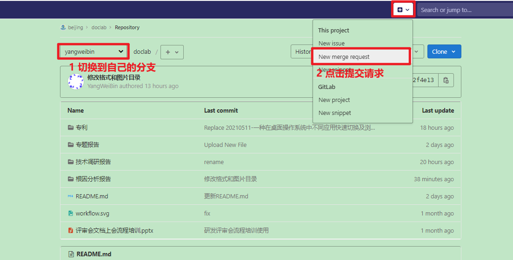
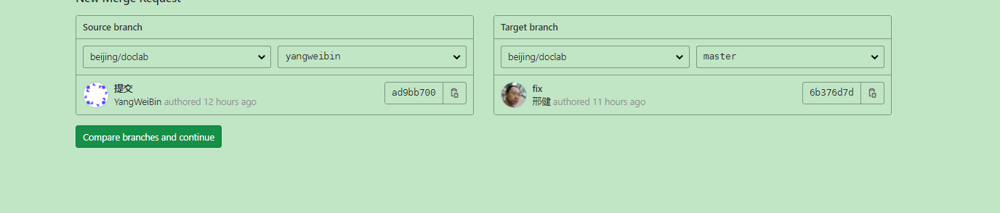
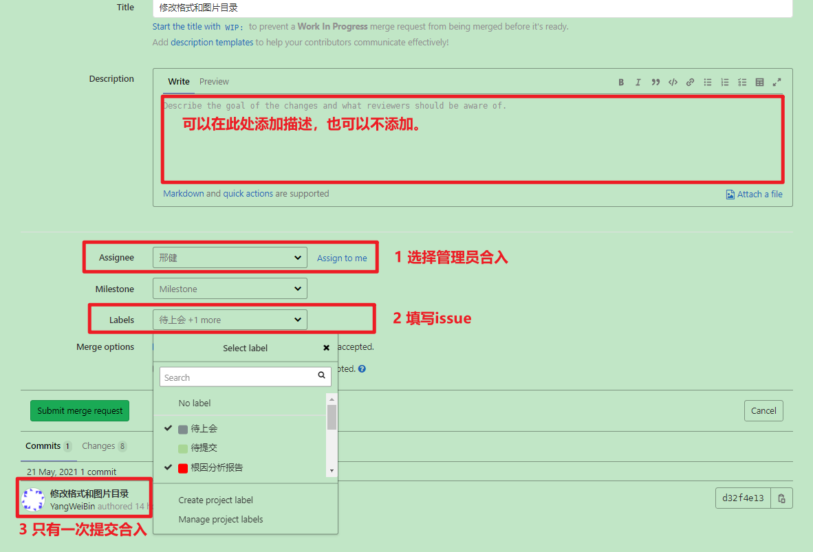

# git 合并分支    

## 切换分支  

```shell
git branch yangweibin
git checkout yangweibin
git add .
git commit -a "修改格式和图片目录"
git commit -am "修改格式和图片目录"
git push
```

## 合并提交     
```shell
git add .
git commit -am "修改文档图片"
git push
git status
# 查看所有版本号
git log
# 切换到固定分支
git reset --hard 135b32a239a2b18ee3aaf512457e9b2389ef7ed7
git status
clear
git status
git checkout .
git status
clear
git branch -v
git reset --hard 135b32a239a2b18ee3aaf512457e9b2389ef7ed7
git status
git add .
git commit --amend  # 修改上次提交内容 以后每次没有merge的话，更新都用这个命令     重要 
clear
git log
git push origin master
clear
git status
git push origin yangweibin
git push -f origin yangweibin # 强行推，可以将之前的记录冲掉   
```


## 添写合并请求  

### 申请合入  



  







