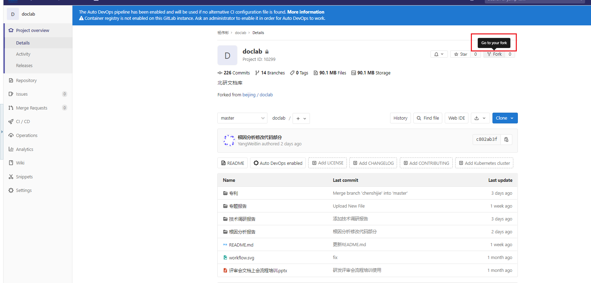
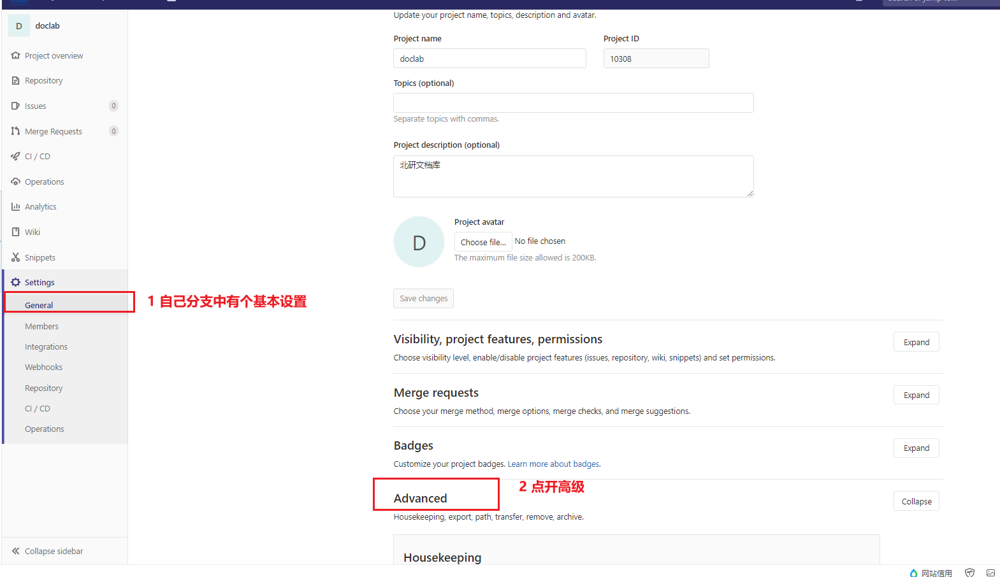
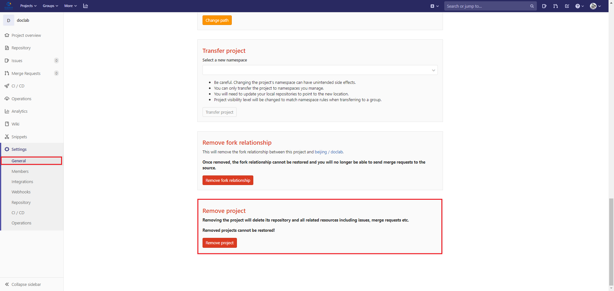
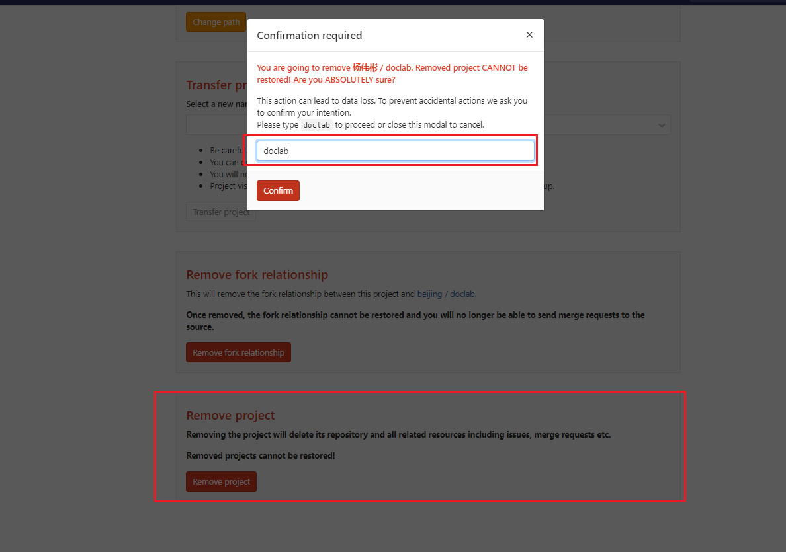
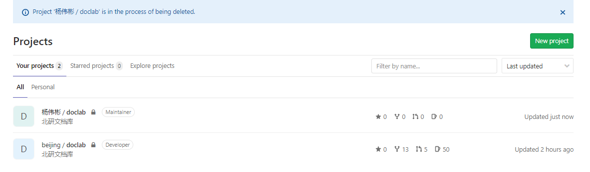
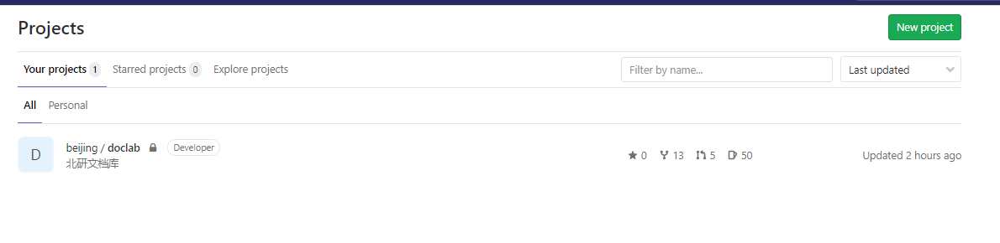
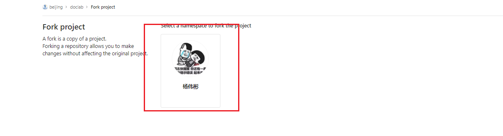
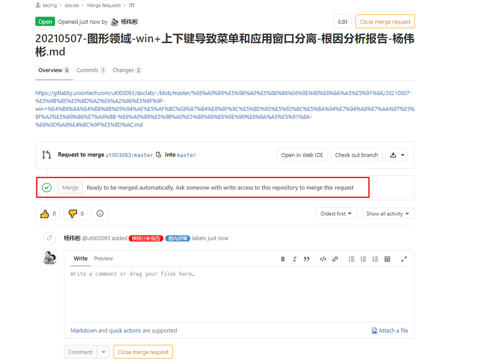
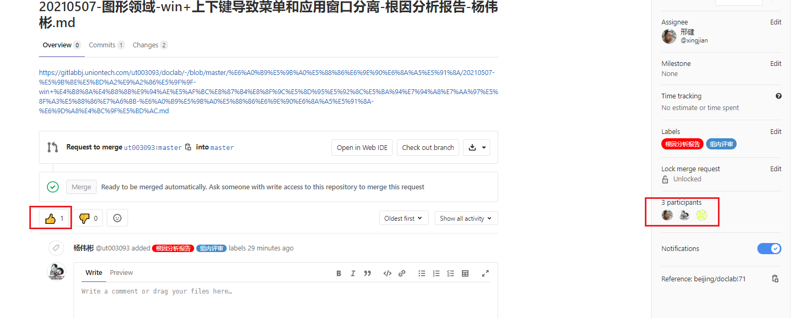

# 北研仓库提交     [img](./img)

## 概述

​       北研最近提交文档的方式发生了些许的变化，一开始使用的新建分支的方式，但是后来合入的时候，一直出现冲突，据说是由于没有获取最新的内容进行合入导致的；但是小组的同事基本都是使用的fork分支的方式实现的，所以后来就开始使用fork的分支的方式来更新文档。

## 基本步骤   
### 1 删除之前Fork的分支    

#### 1.1  Fork自己的分支   

  

#### 1.2 删除现有分支    
1. 在自己的分支里面进行设置，打开高级设置



2. 删除相应分支  




3. 删除成功，还是显示两个项目，刷新只剩下一个项目   

   

  

>###### *总结：*
>a). 通过上面的操作，可以保持每次fork的分支都是最新的，然后，可以在最新的分支上面进行修改和更新，这个过程可能需要快速完成，因为可能很多人都在提交，这可能导致你提交的分支又不是最新的产生冲突；  
>
>b). 最后剩下的一个分支其实是隶属于北研下的分支，并不是自己fork的分支，因此不用管；
>
>c). 查看project所有分支：https://gitlabbj.uniontech.com/dashboard/projects   。

### 2 重新Fork        

1. 在北研仓库的首页，重新点击Fork，在将该分支克隆到本地 ；   

     

2. 点击自己的头像  
   

2. 克隆到本地；   

```shell
git clone  git@uos:ut003093/doclab.git
```
3. 进行文档的更新和合入 。    

### 3 文档更新   

1. 将修改好的文档更新到相应位置    

```shell
 cd doclab/
 cd 根因分析报告/
 git add .
 git commit -am "修改文档格式"
 git push
```

2. 修改好了去仓库看看是否合适，添加合入请求，如果不合适的话，需要在仓库修改好，**然后将文档下载下来，再把之前文档替换掉，删除仓库，重新fork**即可 ，重新提交即可       

### 4 请求合入   

1. 新建合入请求，请求合入到master分支         

   

2. 填写请求信息
序号|项目|内容  
:-:|:-:|-
1|title|文件名
2|description|文档在自己fork分支上链接  
3|请求人|邢健
4|标签|组内评审、根因分析


### 5 专家审核  

1. 将链接发到群里，请专家审核，点赞   


2. 点赞后的效果   

   

### 6 遗留问题   

1. 合入分支后，是否可以上会   
1. 分支的状态是由谁来改变的   
1. 描述里面的链接是否需要改成合入后的链接分支   
1. 弄完后一定找博羽确认一下  

## 参考资料  

1. [Git仓库Fork分支](https://blog.csdn.net/norminv/article/details/108019286)      

   