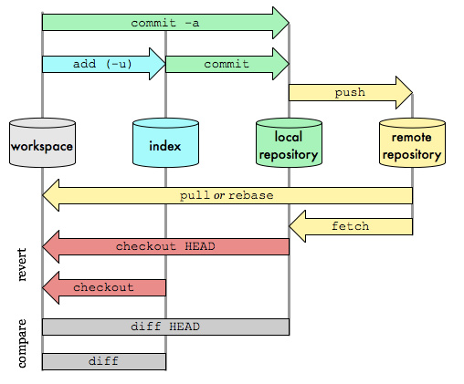

# git命令补充   

## 概述  
在平时使用git命令虽然比较多，可是基本上都是常用的命令，但是在工作中，用到的是Git Review + Gerrit实现代码的上传和更新，因此现在补充一些工作中常用的命令。 

## git命令  

>##### git commit
>
>a. `git commit -m "修改文档1"`：这个命令比较常见，是提交到本地仓库的常用命令   
>
>b. `git commit --amend`：如果刚才提交的备注信息不对，可以通过这个命令来修改  
>
>c. `git commit -am`: 则可以省略git add a.txt这一步，因为git commit -am可以提交跟踪过的文件，而如果有文档一开始已经被跟踪过了，可以使用该命令  

> ##### git add   
>
> a. 添加未跟踪过的文件，也就是新创建的文件   

> ##### git review 
>
> a. `git review maintain/v20sp2_0102 -r origin`：进行代码的合入之前，需要先进行review，提交到Gerrit分支，进行比较    

>##### git branch
>
>a. `git branch`：查看当前分支   
>
>b. `git branch -a`：查看所有分支      

>##### git merge 
>
>a. `git merge`:合并分支    
>
>b. `git merge --abort`：取消合并分支   

>##### git diff
>
>a. `git diff`:是查看 workspace（工作区） 与 index（暂存区） 的差别的。  
>
>b. `git diff --cached`：是查看 index（暂存区） 与 local repositorty（本地仓库） 的差别的。  
>
>c. `git diff HEAD`:是查看 workspace 和 local repository 的差别的。（HEAD 指向的是 local repository 中最新提交的版本）  
>
>d. git diff 后跟两个参数，如果只写一个参数，表示默认跟 workspace中的代码作比较。git diff 显示的结果为 第二个参数所指的代码在第一个参数所指代码基础上的修改。如，git diff HEAD 表示 workspace 在 最新commit的基础上所做的修改   

    

## 参考资料  

1. https://blog.csdn.net/chenpuzhen/article/details/92003363   
1. https://blog.csdn.net/Aifore/article/details/80314909?utm_medium=distribute.pc_relevant.none-task-blog-2%7Edefault%7EBlogCommendFromMachineLearnPai2%7Edefault-1.control&depth_1-utm_source=distribute.pc_relevant.none-task-blog-2%7Edefault%7EBlogCommendFromMachineLearnPai2%7Edefault-1.control   
1. https://blog.csdn.net/haihaa/article/details/77028152    
1. https://zhuanlan.zhihu.com/p/140447659    
1. https://www.cnblogs.com/taohuaya/p/11107264.html  