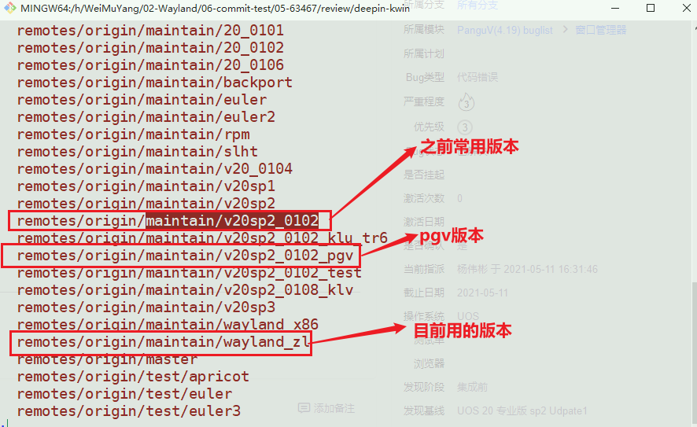

# [Code Review](./)  [img](./img)

## 概述  

​        Code Review和提测可以同时进行，当提测通过了，Code Review才能通过，但是Code Review一般需要多次反复，包括代码的风格，和代码的逻辑结构。  

## Code Review步骤     

### 0 配置git  

 ```shell
 sudo apt install git
 git config --global user.name "yangweibin"
 git config --global user.email "yangweibin@uniontech.com"
 ```

### 1 克隆仓库    

​       仓库克隆的方式可以是ssh方式，也可以是http的方式。如果通过的是，ssh的话需要配置公钥，如果是http的话需要在网站获取密码。

- [仓库地址](https://gerrit.uniontech.com/admin/repos/deepin-kwin)  

#### 1.1 SSH 

```shell
git clone ssh://gerrit.uniontech.com:29418/deepin-kwin   
```

#### 1.2 HTTP  

```
git clone "http://gerrit.uniontech.com/deepin-kwin"
```

### 2 更新版本  

```shell
cd deepin-kwin 
git status
git branch -a
git checkout maintain/v20sp2_0102  # 对于代码的分支，问下吴刚  
```

   

### 3 修改代码    

1. 严格按照如下格式填好，提交的内容，和修改的过程     

   ```
   fix: When the menu bar appears, filter out the operation of maximizing and minimizing the window.
       
   When the menu bar appears, filter out the operation of maximizing and minimizing the window.
       
   Log: 在菜单栏出现的时候，将窗口最大化和最小化的操作过滤掉
   Task: https://pms.uniontech.com/zentao/bug-view-63467.html  
   ```


2. 打开相应的代码位置，对代码进行修改，代码的风格需要是qt的代码风格，并保存。  

3. 代码对比   

   ```shell
   git diff 
   # 注意不能有多余的空格和换行，如果有标红的地方，需要重新修改
   ```
   
4. 代码review    

   ```shell
   git add geometry.cpp  # 提交添加的修改
   git commit -a  
   # 复制第一步的填写好的注释内容 ctrl+s  ctrl+x 保存  
   git log # 查看注释信息
   # 打开网址 https://gerrit.uniontech.com/settings/ 
   # 登录 
   # 设置  
   # HTTP Credentials
   # 生成http密码  
   git review maintain/v20sp2_0102 -r origin 
   # review：ut003093   
   # 复制和粘贴http密码  
   # 等待约一分钟即可成功  
   ```

   ### 4 代码分享修改   

   ​        当代码review成功后，可以登录https://gerrit.uniontech.com/的相关目录，将代码修改的链接发到群里，让亮哥和朝江以及吴刚确认一下，加1。

   ​        这个过程可能需要反复修改，才能不断的完善，最终可能提交上去。如果再次修改的话，可以在之前的仓库里面修改相应的代码，然后执行下面步骤。

   ```shell
   git add geometry.cpp  # 提交添加的修改
   git commit --amend # 第二次不用改注释， ctrl+s  ctrl+x 保存
   git log # 查看注释信息
   # 打开网址 https://gerrit.uniontech.com/settings/ 
   # 登录 
   # 设置  
   # HTTP Credentials
   # 生成http密码  
   git review maintain/v20sp2_0102 -r origin 
   # review：ut003093   
   # 复制和粘贴http密码  
   # 等待约一分钟即可成功  
   ```

