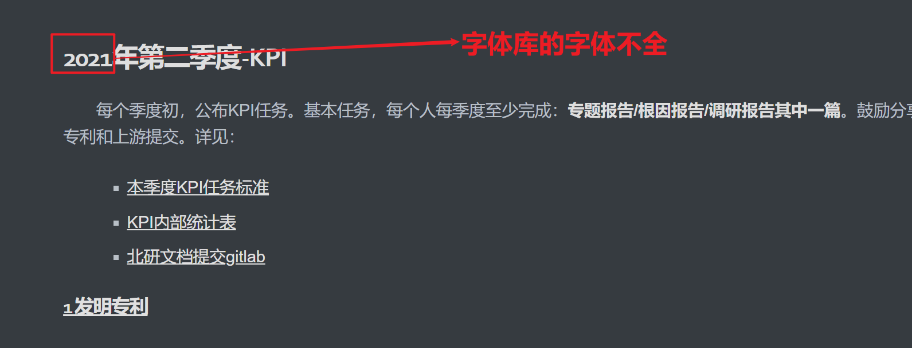
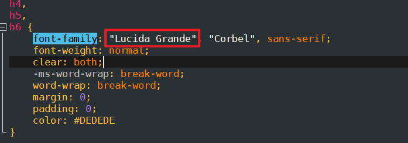
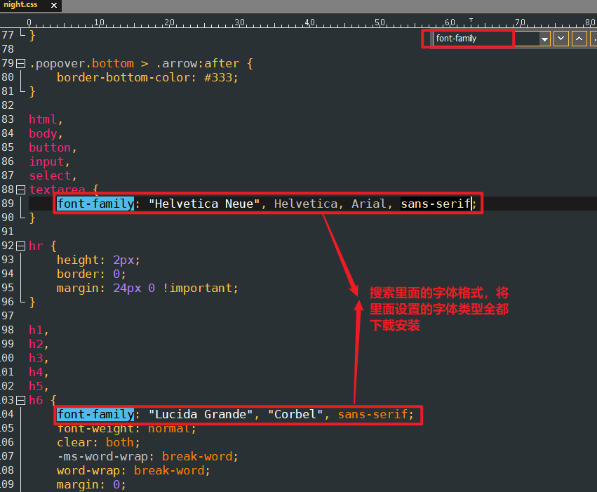

# Typroa字体主题字体不对  

## 问题描述  

当在Typroa中进行主题切换时，常常遇到主题中字体不对应的情况，主要原因是当前电脑中没有安装对应的字体导致的，例如：当切换到night主题模式时，字体格式如下 ：

 
  

## 解决方案  

可以打开对应的css主题文件，查看里面的字体是不是都全了，如果有没有安装的可以将对应的字体进行安装配置：

 
   

 
   