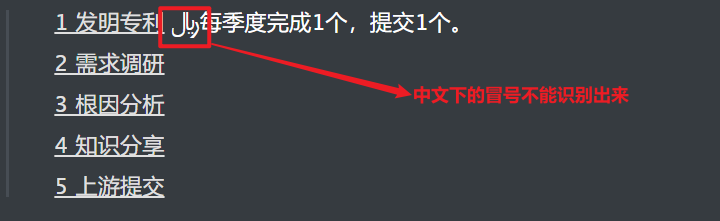
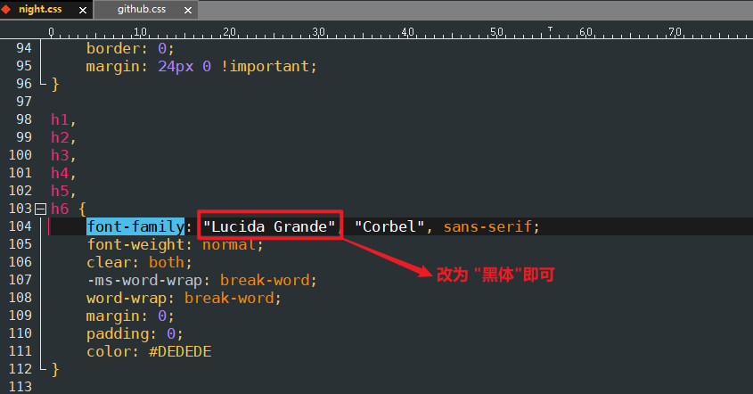
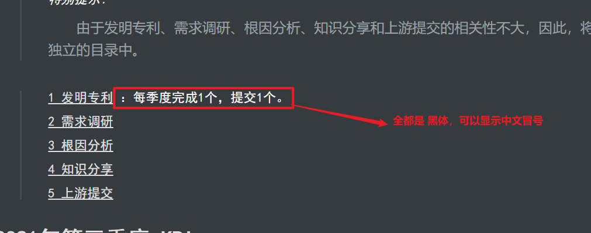
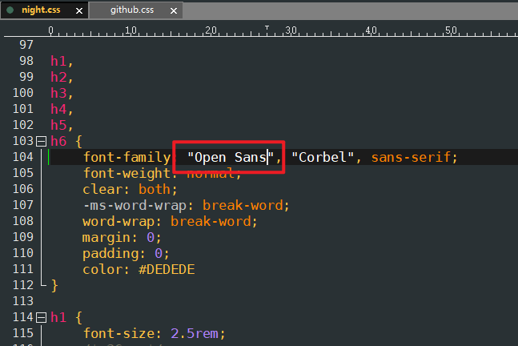

# Typroa字体主题字体乱码  

## 问题描述  

在使用night主题时，字体中的冒号无法正常识别，如下所示

 
  

## 解决方案  

修改主题的字体格式，说明这种字体无法支持中文下的冒号。

 
   

改完后的效果：

 
  

但是感觉还是不好看，因此，经过多次尝试，参考了Github的主题风格，使用了 `Open Sans`字体，需要下载安装，

 
  

[本地位置](E:\00-software-installation)        

[Open Sans字体链接](https://cn.ffonts.net/Open-Sans.font.download)

