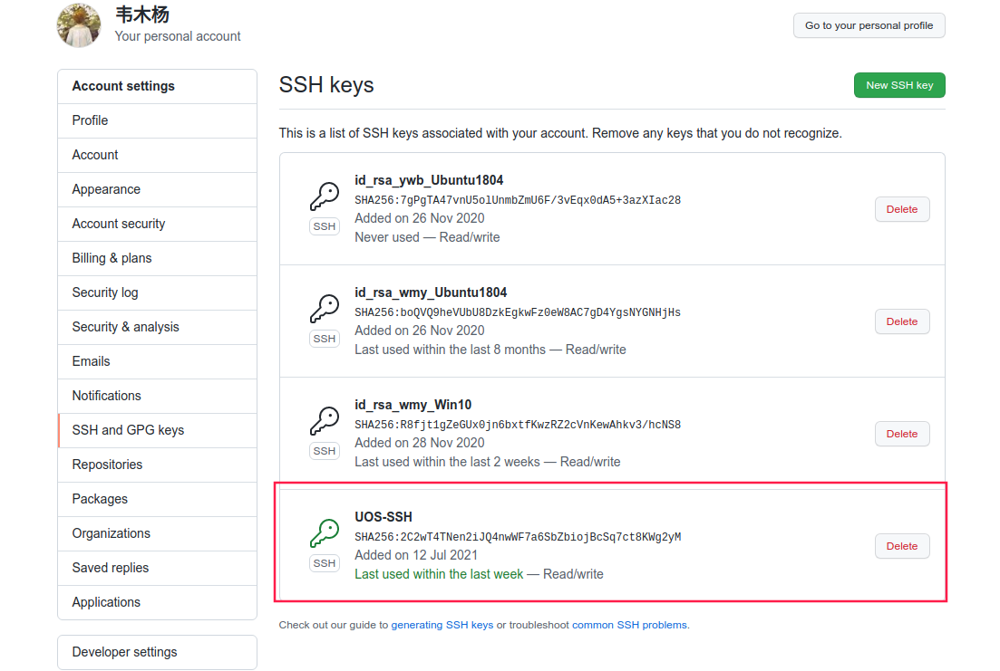
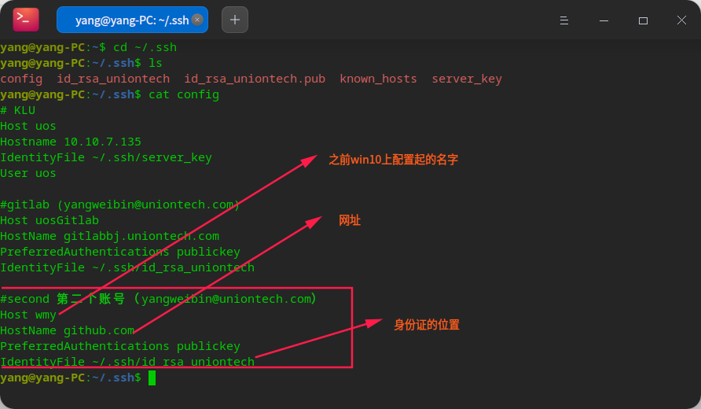

# 一个账号多个Git  
## 概述   

在工作中有一种场景是只有一个邮箱账号，但是需要登录git和gitlab，如何解决这个问题呢？对于之前一个git账号多个邮箱登录的问题在本目录10号文档和LinuxStudy的54号文件讲过的内容有一定的相关度。  

- [10 github实现一台设备多账户](./010_github实现一台设备多账户.md)  
- [54 配置ssh免密码登录](../LinuxStudy/054-配置ssh免密码登录.md)  

## 本地公钥放入Github授权密钥  



## 修改配置文件  

```shell
yang@yang-PC:~/.ssh$ cat config 
# KLU
Host uos
Hostname 10.10.7.135
IdentityFile ~/.ssh/server_key
User uos

#gitlab (yangweibin@uniontech.com)
Host uosGitlab
HostName gitlabbj.uniontech.com
PreferredAuthentications publickey
IdentityFile ~/.ssh/id_rsa_uniontech   

#github-wmy （yangweibin@uniontech.com）
Host wmy
HostName github.com
PreferredAuthentications publickey
IdentityFile ~/.ssh/id_rsa_uniontech   
yang@yang-PC:~/.ssh$ 
```


