# 北研仓库提交     [img](./img)

## 概述

北研最近提交文档的方式发生了些许的变化，一开始使用的新建分支的方式，但是后来合入的时候，一直出现冲突，据说是由于没有获取最新的内容进行合入导致的；但是小组的同事基本都是使用的fork分支的方式实现的，所以后来就开始使用fork的分支的方式来更新文档。

**合入之后再分享，要不他们可能看不到。**如果提交了合入请求发现改的不好，可以重新将走1~7步骤。重新再来一遍。

## 基本步骤   
### 1 删除之前Fork的分支    

#### 1.1  Fork自己的分支   

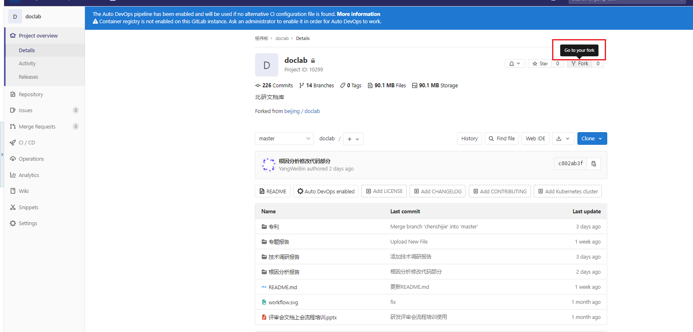

#### 1.2 删除现有分支    
1. 在自己的分支里面进行设置，打开高级设置

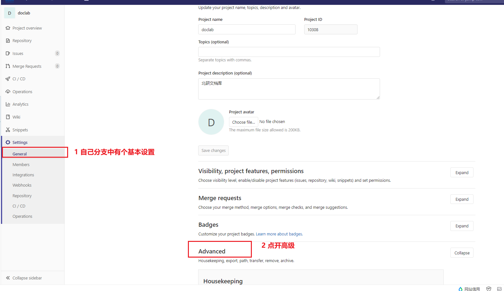

2. 删除相应分支  
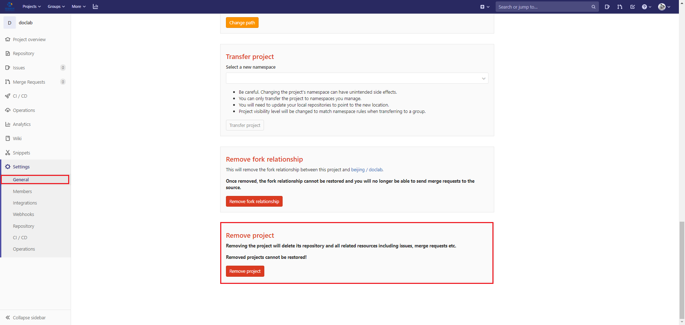

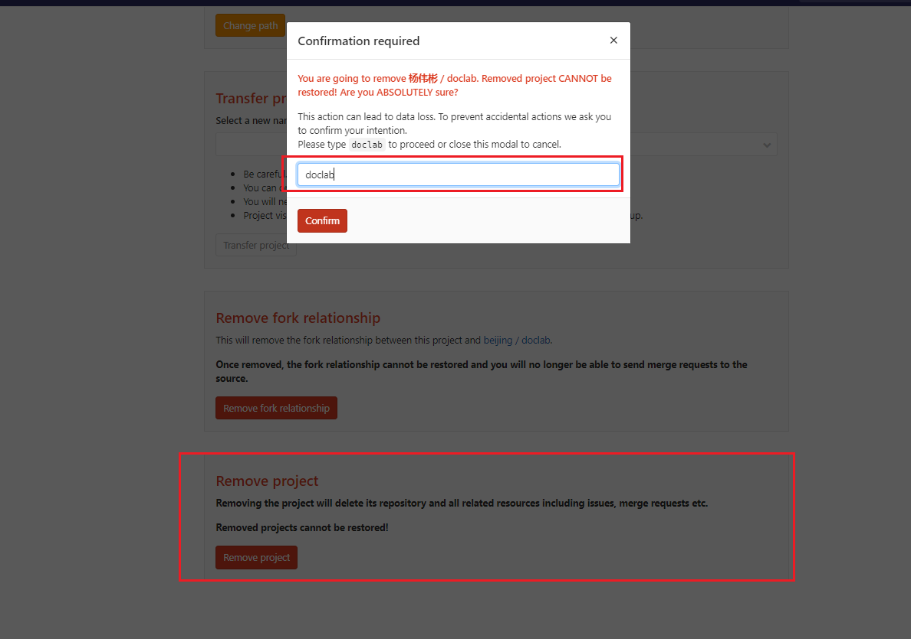

3. 删除成功，还是显示两个项目，刷新只剩下一个项目   

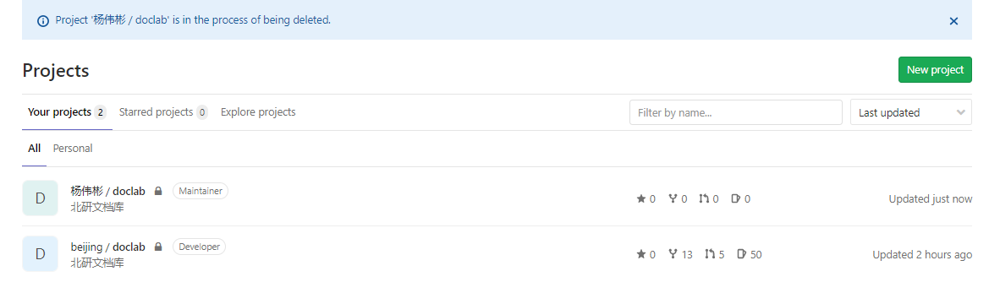

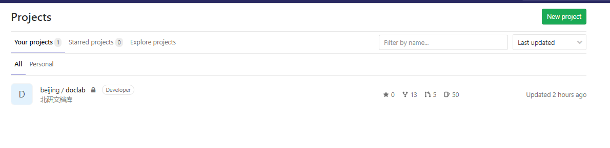

>###### *总结：*
>a). 通过上面的操作，可以保持每次fork的分支都是最新的，然后，可以在最新的分支上面进行修改和更新，这个过程可能需要快速完成，因为可能很多人都在提交，这可能导致你提交的分支又不是最新的产生冲突；  
>
>b). 最后剩下的一个分支其实是隶属于北研下的分支，并不是自己fork的分支，因此不用管；
>
>c). 查看project所有分支：https://gitlabbj.uniontech.com/dashboard/projects   。

### 2 重新Fork        

1. 在北研仓库的首页，重新点击Fork，在将该分支克隆到本地 ；   


2. 点击自己的头像  
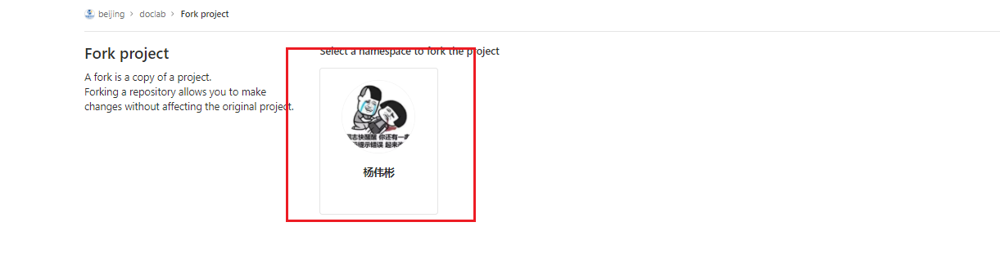

2. 克隆到本地；   

```shell
git clone  git@uos:ut003093/doclab.git
```
3. 进行文档的更新和合入 。    

### 3 文档更新   

1. 将修改好的文档更新到相应位置    

```shell
 cd doclab/
 cd 根因分析报告/
 git add .
 git commit -am "修改文档格式"
 git push
```

2. 修改好了去仓库看看是否合适，添加合入请求，如果不合适的话，需要在仓库修改好，**然后将文档下载下来，再把之前文档替换掉，删除仓库，重新fork**即可 ，重新提交即可       

### 4 请求合入   

1. 新建合入请求，请求合入到master分支         

   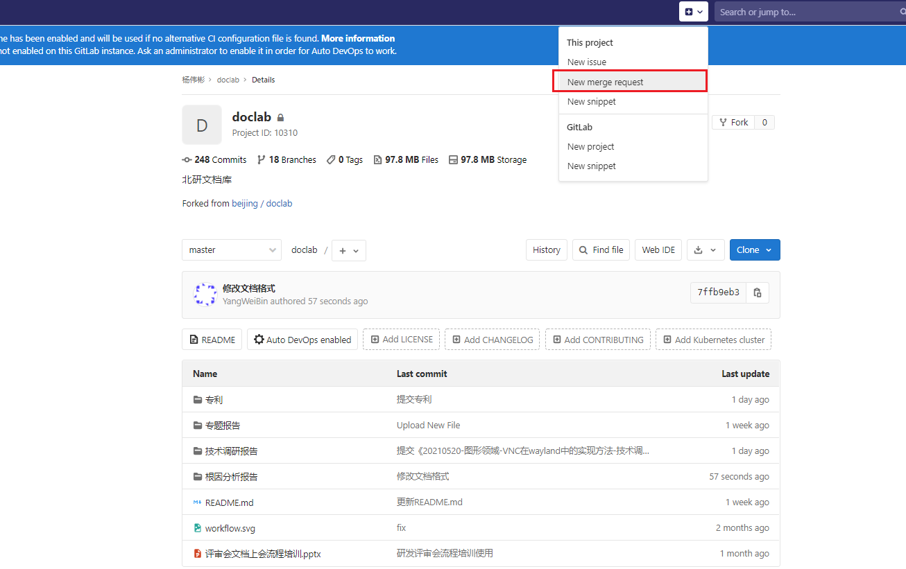

2. 填写请求信息
序号|项目|内容  
:-:|:-:|-
1|title|文件名
2|description|文档在自己fork分支上链接  
3|请求人|邢健
4|标签|组内评审、根因分析
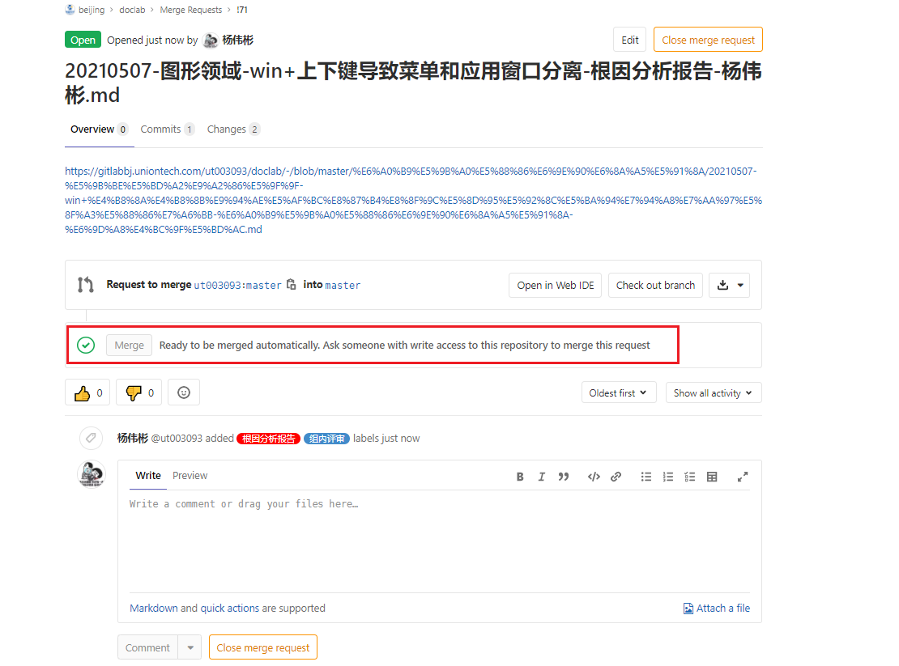

### 5 专家审核  

1. 将链接发到群里，请专家审核，点赞   

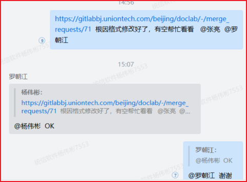

2. 点赞后的效果   

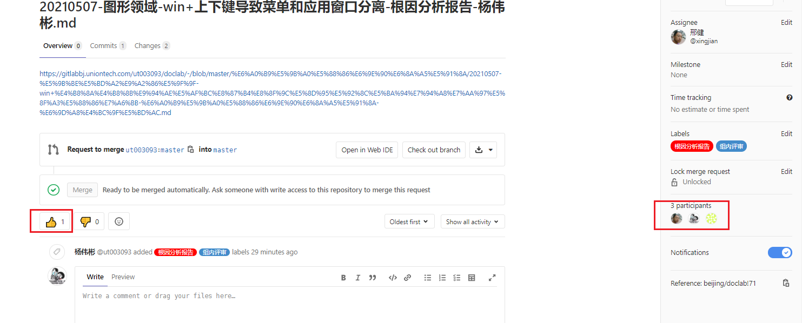

### 6 合入主分支     

1. 合入分支后，会收到邮件

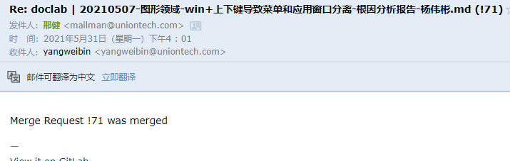

2. 合入成功后，可以在master分支中，issues也会找到相应的变化     

   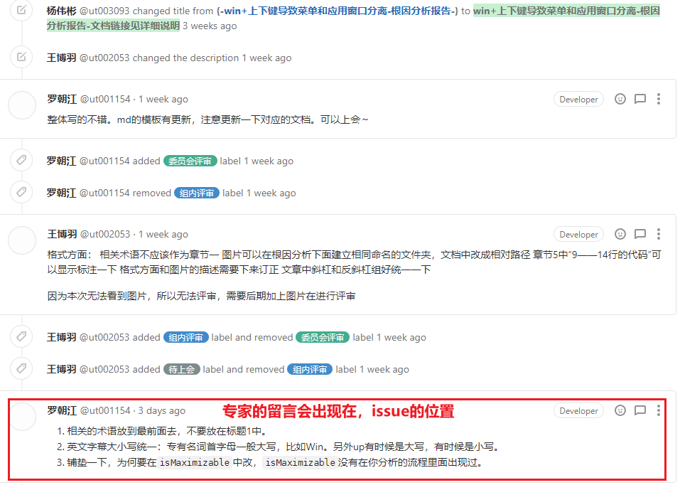

### 7 修改文档地址        

1. 合入文档后，在仓库中，找到自己文档的位置       

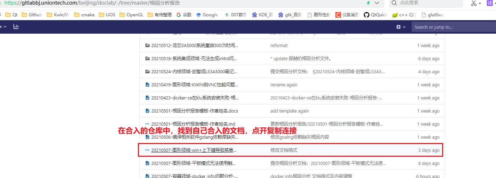

2. 复制文档网址链接   

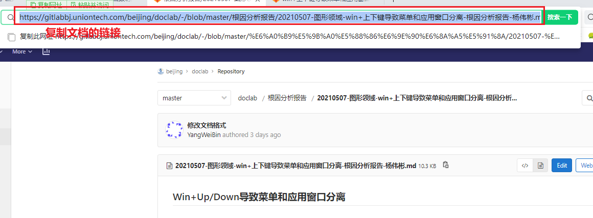

3. 修改Issues里面的链接信息   

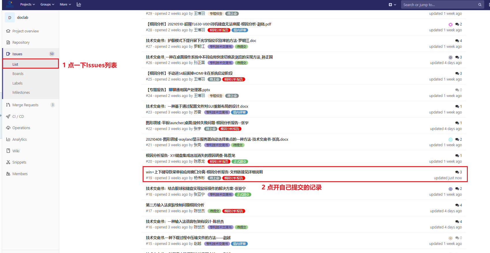

4. 将之前复制的链接，修改到issues里面   

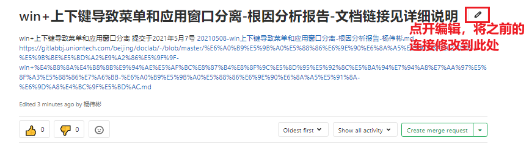

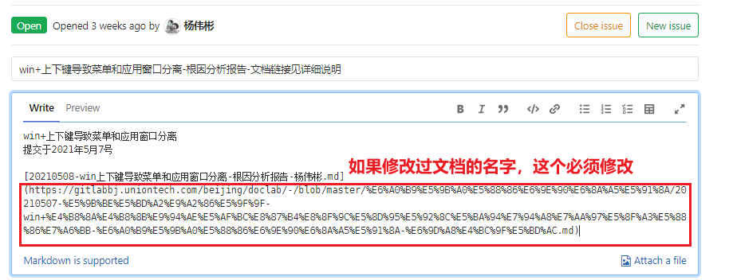

5. 为了避免不必要的麻烦，最好自己再留言一次，让专家方便寻找    

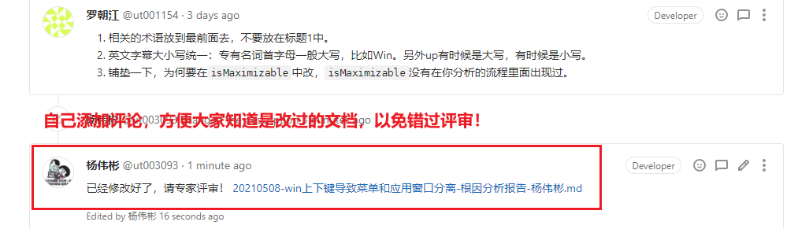


### 8 遗留问题   

1. 弄完后一定找博羽确认一下  

## 参考资料  

1. [Git仓库Fork分支](https://blog.csdn.net/norminv/article/details/108019286)      

   
