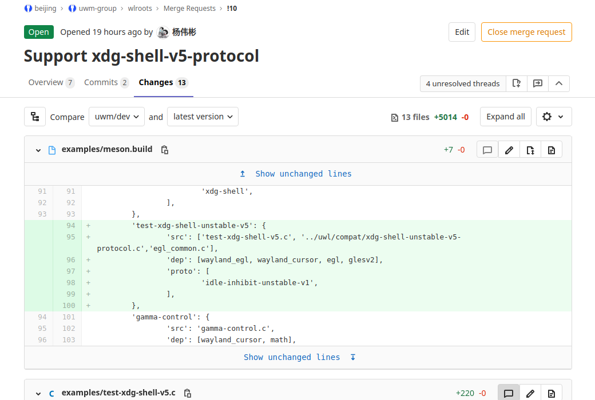
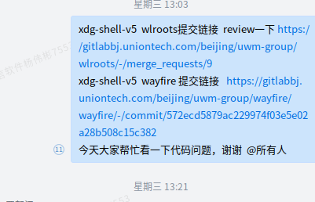
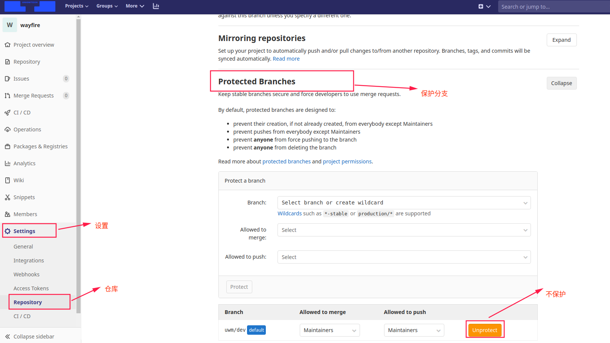

# [UWin代码合入](./)  

## 1 概述  

最近在做UWin的项目，代码可能需要反复修改才能合入。这个过程和提交文档的过程不太一样，提交文档每次提交都能顺利合入，代码涉及到的一个过程是反复修改。因此，步骤不太一样。  

## 2 代码格式 

需要通过vscode的快捷键`Ctrl+Shift+I`，进行文档的格式化，这个格式化过程会自动加载当前目录下的`.clang-format`代码格式说明，并将代码的格式与`.clang-format`规定的代码格式一致。

这个过程要反复几次，先把代码风格改一下，再使用快捷键`Ctrl+Shift+I`，实现文档的格式化。确认格式化起作用了。

## 3 fork分支并提交    

1. fork分支方法参考文档——[63 fork分支及合入](./63-fork分支及合入.md) 。此处不再赘述。  
2. 提交代码时需要**使用`git log -p` 命令**看一下是不是有**多余空格**。   
3. 可以**通过`git diff`命令**看一下改了哪里  
4. fork完了分支之后，可以创建合入请求，然后将链接发到群里。



  <div align=center></div> 

## 4 再次提交  

### 4.1 基于现有修改 

**基于现有代码的修改即可，不要重新fork**，这样还能使用git命令看一下是不是根据专家的建议修改完成。而且对于文件的添加过程也比较繁琐。如果重新fork的话，修改的过程比较麻烦，增加很多没必要的工作。可能用到的命令：

```shell
# 1 查看前后的代码变化 
git log -p 
# 2 添加修改文件
git add .
# 3 提交修改内容 
git commit -m "修改代码格式"
```

### 4.2 编译运行  

   修改好代码之后，可以先验证代码是不是可以编译通过，验证时需要注意的问题如下：

- 不要将整个workspace都进行备份拷贝，只需要将原来的wlroots修改一个名作，修改的wlroots代码拷贝进去进行编译即可；
- 如果编译不过去，提示的是编译过程目录的问题，可能是配置文件出现了变化，需要编译整个Wlroots的依赖，运行`clear && ./build.sh`   

### 4.3 强推提交  

编译和运行都没有问题后，可以将代码再次提交到仓库，但是此次提交的话，由于和上游分支保持不一致，可能提交不上去，需要强推，步骤如下：

1. 修改fork分支的设置 -> 仓库 -> 保护分支 -> 不保护 -> 确定

<div align=center></div> 

2. 使用git命令强推  

```shell
# 4 强推到自己fork的分支 
git push -f
```

3. 查看之前的合入链接，代码已经完成了修改，此时不用再新建merge请求了，只需要告诉专家，代码更新了即可。


