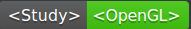
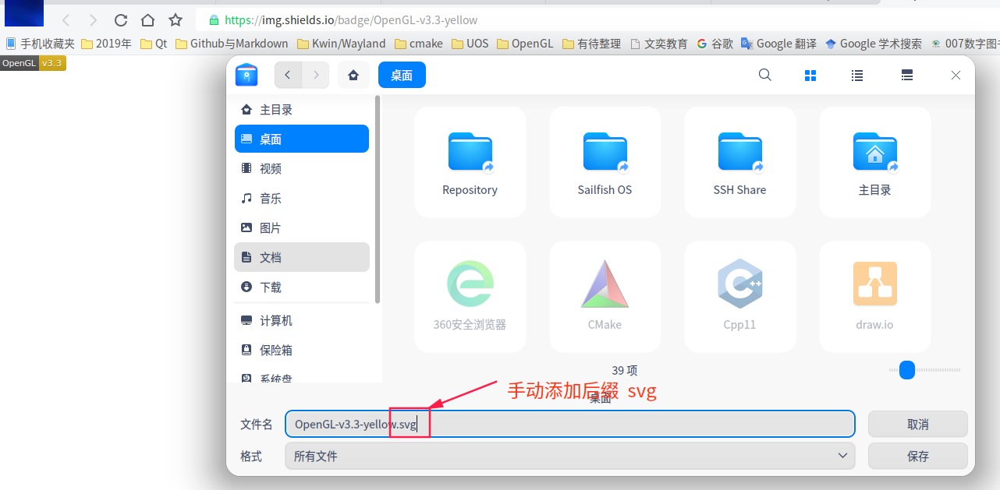

# [Github中添加徽章](./)  [img](./img)    

- [GitHub 项目徽章的添加和设置 ](https://lpd-ios.github.io/2017/05/03/GitHub-Badge-Introduction/)  
- [为你的Github仓库添加徽章](https://yinguobing.com/adding-badges-to-your-github-repository/)   
- [为你的Github README生成漂亮的徽章和进度条](https://shikieiki.github.io/2017/03/01/为你的Github生成漂亮的徽章和进度条/)    
- [GitHub项目徽章的添加和设置 ](http://www.mdslq.cn/archives/b687dd8f.html)   
- https://cloud.tencent.com/developer/article/1450399  

## 1 概述 

我们在很多开源项目的 README 都能看到大量的徽章（badge），这些徽章大都挺漂亮的，最重要的是，通过这些徽章，我们可以快速的获取项目的状态信息，例如：开源协议、版本、单元测试覆盖率等。

## 2 插入图片    

本质是插入图片，再给图片添加链接，可以自己提前将图片设计好。

```markdown
# 1 插入图片的链接
[](https://baidu.com)    
# 2 插入图片、链接、标题、缩放  
[](https://baidu.com)  
```
[](https://baidu.com)  

 [](https://baidu.com)     

徽章其实也只是一些图片，只不过它看起来会很小，包含了一些信息，并且**一般是 svg 格式**的。也就是说我们只要在 README.md 中引入这种风格的图片就可以了。  

## 3 网站生成      

目前徽章生成的网站是 [shields.io](https://shields.io/)。  看到的很多徽章都是在这个网站生成的，该网站提供了数以百计的徽章可以选择，并且你还可以自定义徽章，这足以满意绝大部分开发者的需求。**生成的图片都会有一个唯一地址**：   

- 可以直接引用该图片   
- 也可以下载图片，将其保存到项目中，再通过相对目录引用图片     

无论如何，我们需要做的只是生成想要的图片，在 markdown 中引入它。   

### 3.1 开源徽章  

shields.io 提供了大量的静态徽章，这里我们以 `开源协议` 系列的徽章为例。使用方法参考：

- [如何为你的 GitHub 项目添加 badge](https://3ks.dev/2020/07/17/github-badges/)     

### 3.2 自定义徽章  

徽章由左右两部分组成，你完全可以自定义其中的文字内容以及颜色。例如我想在项目的首页添加TensorFlow的版本信息，可以在网站的静态徽章生成页面上依次填写左侧文字`TensorFlow`，版本`v2.2`，并选择色彩`brightgreen`，然后点击"Make Badge"。
#### 3.2.1 静态徽章      

需要传递的参数: `<LABEL>`、`<MESSAGE>`和`<COLOR>`：

```
https://img.shields.io/badge/{徽标标题}-{徽标内容}-{徽标颜色}.svg
```

- {徽标标题：徽标左半部分的文本（短线：–，下划线：__，空格： 或_）；
- {徽标内容}：徽标右半部分的文本，同上；   
- {徽标颜色}：徽标右半部分背景颜色，可以是 red、green、blue 等颜色英文单词，也可以直接写十六进制的颜色值，如 ff69b4


```shell
# 写法1 
https://img.shields.io/badge/<LABEL>-<MESSAGE>-<COLOR>   
# 举例：https://img.shields.io/badge/OpenGL-v3.3-yellowgreen  
# 写法2 自定义参数 style label logo logoWidth link colorA colorB   maxAge
https://img.shields.io/static/v1?label=<LABEL>&message=<MESSAGE>&color=<COLOR>
# 写法3 
https://img.shields.io/endpoint?url=<URL>&style<STYLE>  
```
  

    

[](https://www.baidu.com)    

     

#### 3.2.2 动态徽章   

某些徽章的内容可以根据你指定的信息动态变化，例如不同代码的license不同，但是却可以使用相同的徽章代码。例如这串徽章代码可以根据我Github仓库的license自动生成对应的徽章：   
```markdown

```

   


#### 3.2.3 参数介绍    

> #### 1 色彩  
>
> |  名称   |                             颜色                             |  名称  |                            颜色                             |
> | :-----: | :----------------------------------------------------------: | :----: | :---------------------------------------------------------: |
> | 亮绿色  |  |  绿色  |              |
> | 黄绿色  |  |  黄色  |           |
> |  橙色   |            |  红色  |                    |
> |  蓝色   |                  | 浅灰色 |  |
> | #ff69b4 |            |  9cf   |                    |

>#### 2 信息警告  
>
>|  名称  |                           颜色                           |   名称   |                             颜色                             |
>| :----: | :------------------------------------------------------: | :------: | :----------------------------------------------------------: |
>|  成功  |     |  重要的  |   |
>|  危急  |  | 信息性的 |  |
>| 不活跃 |  | 紫罗兰色 |  |
>

>#### 3 风格  
>
>| `?style=plastic&logo=appveyor`       |  |
>| ------------------------------------ | ------------------------------------------------------------ |
>| `?style=flat&logo=appveyor`          |  |
>| `?style=flat-square&logo=appveyor`   |  |
>| `?style=for-the-badge&logo=appveyor` |  |
>| `?style=social&logo=appveyor`        |  |


## 4 引用徽章    

1. 直接引用链接:   

2. 网页另存为,再修改文件后缀为svg,保存即可将徽章保存下来:     

   

## 5 其他徽章 

使用[progressed.io](https://github.com/fehmicansaglam/progressed.io)很简单就能生成!，不好用建议不要用，无法识别      
```
http://progressed.io/bar/<数字>?scale=<最大值>?title=<名字>?suffix=<后缀>
```

- 数字：代表比例值  
- 最大值：区间最大值，可以省略，默认是100   
- 名字：做半部分的显示内容，可以省略   
- 后缀：默认是`%`      

   