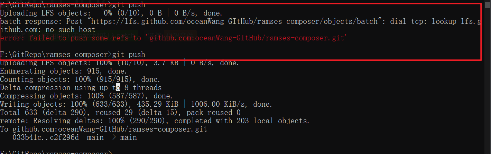

# [git中合入patch](./)  [img](./img)     

> ######  _标签:_    [](https://learnopengl-cn.github.io/01%20Getting%20started/04%20Hello%20Triangle/) [](../02-code/)        
>

## 问题描述      

```bash
F:\GitRepo\ramses-composer>git push
Uploading LFS objects:   0% (0/10), 0 B | 0 B/s, done.
batch response: Post "https://lfs.github.com/oceanWang-GItHub/ramses-composer/objects/batch": dial tcp: lookup lfs.github.com: no such host
error: failed to push some refs to 'github.com:oceanWang-GItHub/ramses-composer.git'
```




## 解决方法   

关闭VPN即可        


## 参考链接    

1. https://github.com/golang/go/issues/41425
