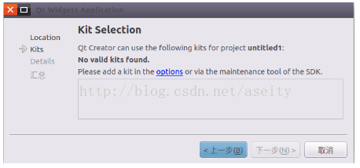

# 安装完ubuntu 需要安装的软件

[TOC]

## 1 先更新系统  
```shell
sudo apt-get update
```
## 2 安装IDE  

```shell
sudo apt-get install qt5-default qtcreator
```
### 2.1 首次安装qtcreator容易出现的问题：  
* 1.点开option  
    

* 2.原因是qt版本的问题  
    

* 3.解决思路  
  ① 点击 Qt版本右侧的Manage，选择你的qmake目录位置，例如：/usr/lib/qt5/bin/qmake   
  ②然后 Qt版本就由 无 -> 当前安装的qt版本  
  ③点击“Ok”保存  
    
## 3 安装搜狗(不推荐)   
* 先安装fcitx
* 百度 ：sougou for linx  
* 下载Ubnutu版本的搜狗输入法  
* 直接通过Ubuntu软件中心安装  
* 安装完成后在设置->区域和语言->键盘输入法系统->fcitx  
*   
*   
*   
* 注销、重新登录   
* 如果还不行就重启电脑   
* 同时，也可更新完源之后，调整成双拼，这样可以**不用安装搜狗也能使用双拼**    
  

## 4 配置source  list源  
Ubuntu 16.04下载软件速度有点慢，因为默认的是从国外下载软件，那就更换到国内比较好的快速更新源（就是这些软件所在的服务器），一般直接百度Ubuntu更新源就能出来一大堆，这时候最好是找和自己Ubuntu版本一致的更新源，我的Ubuntu版本是16.04，下面是我找到的一个比较好的更新源。  
1. 搜索国内源  
推荐[清华大学的源](https://mirrors.tuna.tsinghua.edu.cn/help/ubuntu/)   
选择自己的Ubuntu版本：  
   
复制框中的网址。  
2. 配置自己的源文件  
sources.list系统自带的，源是来Ubuntu的官网！安装包比较慢，所以最好切换成国内的  
```shell
cd /etc/apt
sudo cp sources.list sources.list.bak
vim sources.list  
```
将自带的源注释掉，清华大学的源地址拷贝进去。  
   

3. 更新源  
```shell
sudo apt-get update 
```
4. 其他命令  
```shell
sudo apt-get update  # 更新源
sudo apt-get install package # 安装包
sudo apt-get remove package # 删除包
sudo apt-cache search package # 搜索软件包
sudo apt-cache show package  # 获取包的相关信息，如说明、大小、版本等
sudo apt-get install package --reinstall  # 重新安装包
sudo apt-get -f install  # 修复安装
sudo apt-get remove package --purge # 删除包，包括配置文件等
sudo apt-get build-dep package # 安装相关的编译环境
sudo apt-get upgrade # 更新已安装的包
sudo apt-get dist-upgrade # 升级系统
sudo apt-cache depends package # 了解使用该包依赖那些包
sudo apt-cache rdepends package # 查看该包被哪些包依赖
sudo apt-get source package  # 下载该包的源代码
sudo apt-get clean && sudo apt-get autoclean # 清理无用的包
sudo apt-get check # 检查是否有损坏的依赖
```
[参考博客](https://www.linuxidc.com/Linux/2017-11/148627.htm)      


## 5 安装其他   
1. 安装新立得  
```shell
apt-get install synaptic
```

2. 通过新立得安装qt4    

3. 安装ssh   
```shell 
sudo apt-get update  
sudo apt-get install openssh-client 
sudo apt-get install openssh-server 
sudo service ssh start  
```

4. 安装vim   

```shell
sudo apt install vim
```

5. 安装gcc，g++，gdb，make   
```shell
sudo apt update
sudo apt install build-essential
gcc --version
sudo apt-get install gdb 
```

6. 安装smb   

```shell
sudo apt-get install samba  
```


## 6 安装WIFI驱动  
1. 无WiFi：  
```shell
sudo touch /etc/modprobe.d/ideapad.conf
sudo gedit /etc/modprobe.d/ideapad.conf # 或 sudo gedit ideapad.conf
```
在文件中添加：  
```txt
blacklist ideapad_laptop
```
2. 运行   
```shell
sudo modprobe -r ideapad_laptop
```
3. 注销重启  
```shell
reboot
```
## 7 更新软件  
1. 打开软件更新器：  
   
2. 检查更新  
第一次更新可能时间会比较长，但是在=耐心等待  
3. 重启系统   
更新完成后，会提示重启系统  
## 8 安装Typroa  
```shell    
# sudo apt-key adv --keyserver keyserver.ubuntu.com --recv-keys BA300B7755AFCFAE  
wget -qO - https://typora.io/linux/public-key.asc | sudo apt-key add -

# add Typora's repository  
sudo add-apt-repository 'deb https://typora.io/linux ./'
sudo apt-get update

# install typora  
sudo apt-get install typora

# upgrade all packages include Typora
sudo apt-get upgrade
```
## 9 安装Git   
1. 安装Git软件  
```shell
sudo apt install git
```
2. 配置用户信息  
[参考GITbook](https://git-scm.com/book/zh/v2/%E8%B5%B7%E6%AD%A5-%E5%88%9D%E6%AC%A1%E8%BF%90%E8%A1%8C-Git-%E5%89%8D%E7%9A%84%E9%85%8D%E7%BD%AE)  
```shell
git config --global user.name "YangWeiBin"
git config --global user.email 863255386@qq.com
```
3. 查看是否配置成功  
```shell
git config --list
```
## 10 获取root  
```shell
su - 
```
