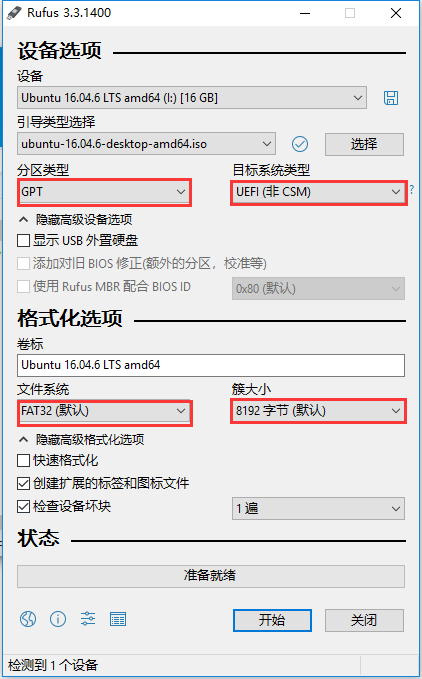
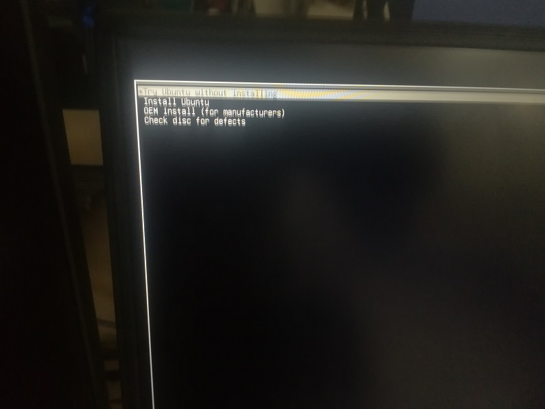
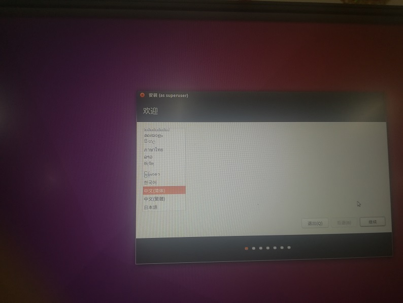
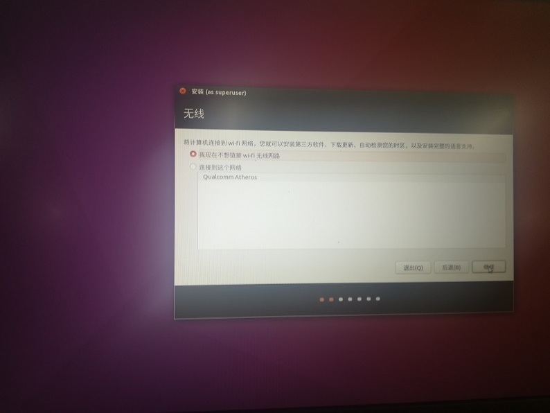
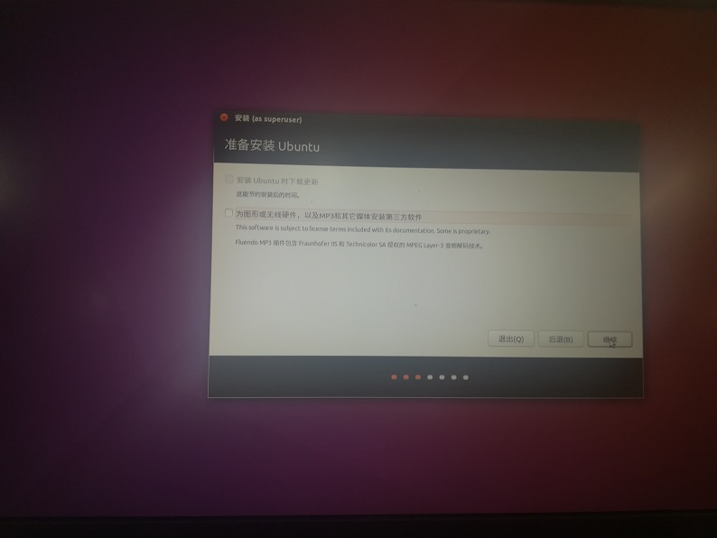
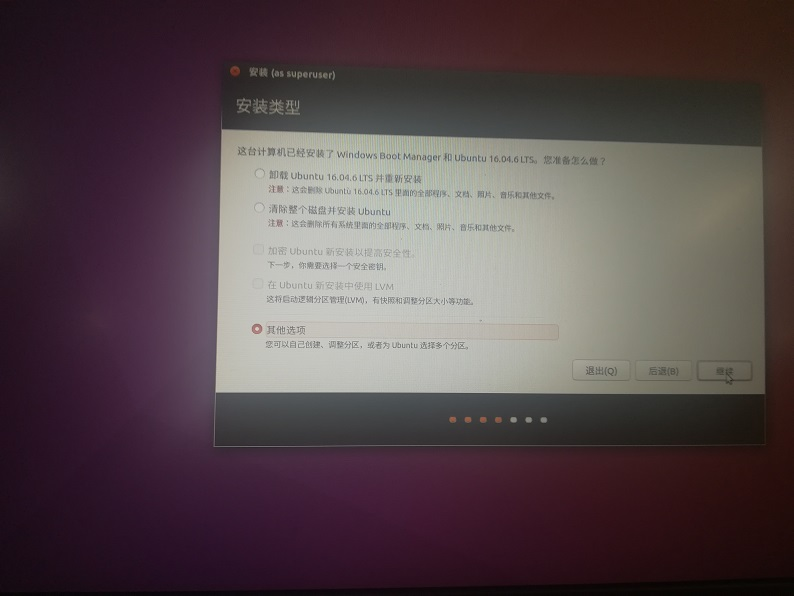
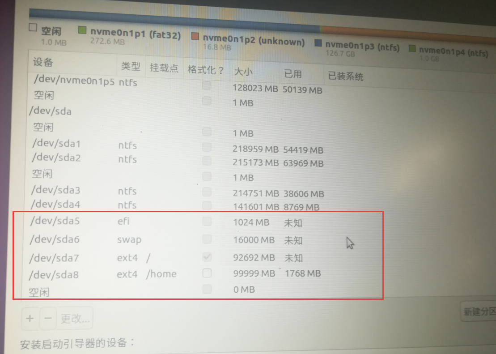
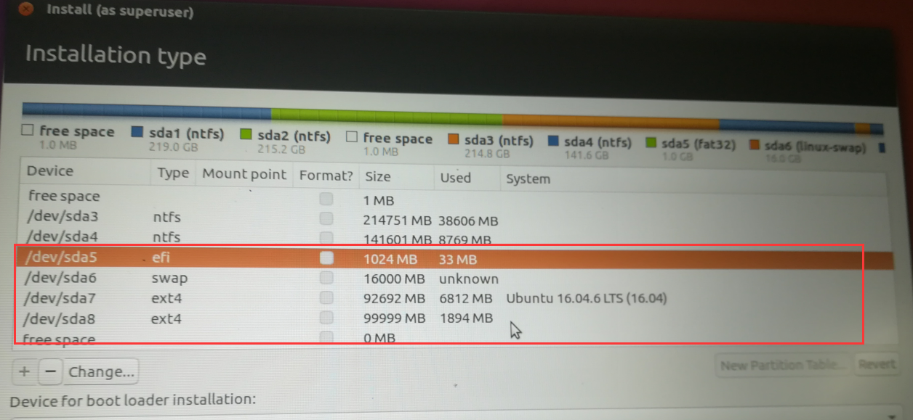
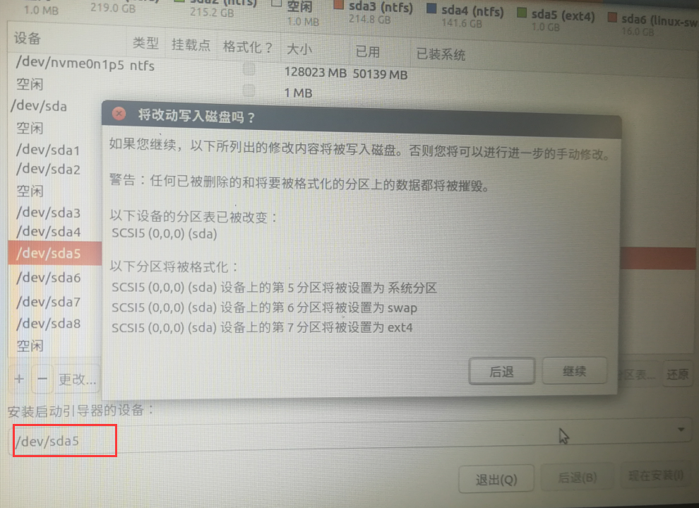

# Y7000+UEFI启动+Ubuntu16.04和Win10  

## 1 做好系统盘  
1. 准备一个4G大小的U盘；  

2. 打开[链接](https://pan.baidu.com/s/1f9TMtP67ZZ95QB5Auy5Cng)，提取码：bgq2，下载 Ubuntu 16.04 LTS镜像和rufus软件；      

3. 打开rufus软件，将Ubuntu 16.04 LTS镜像写入U盘，设置如下：  
      
    **注意：** 你自己硬盘的分区格式要是GPT分区，目前多数笔记本电脑都是GPT分区，因为对于多数自带的win10系统安装在GPT分区，这也需要需要主板支持UEFI模式，UEFI模式开机时间更快，比Legacy模式性能更好。  
    
4. 开机界面易出现，按F2进入bios设置，Fast Boot –Disable || Security Boot–Disable；按F10保存，退出；  

5. 插入U盘按F12，选择界面选择带有：**USB disk**（或者根据自己的U盘名字识别）；  

6. 进入如下界面，选择第二个：**Install Ubuntu**：  
      
    
7. 进入安装界面，在选择语言上，强烈建议选择:**English**，本人选择的简体中文，但是在进入系统tty命令行模式，无法中文，显示乱码，所以建议选择英文，以后工作需要的话再换成中文；  
      
    
8. 我们不需要wifi更新，为了节约安装的时间    
      
    
9. 这一页不用选  
       
    
10. 这一页我们选**其他选项**，自己进行分区安装  
       
    
11. 点左下角的 + 号，对你事先空出来得分区，进行重新划分（仅供参考）：   
    名称|挂载点|分区类型|位置|大小    
    -|-|-|-|-  
    EFI |EFI系统分区|逻辑分区|起始位置| 大于500M  
    swap交换空间|交换空间|主分区|起始位置| 等于本机内存的2倍  
    /|ext4|主分区|起始位置|主分区| 大于40G（尽量大一些）  
    /home|ext4|主分区|起始位置|主分区| 大于40G（尽量大一些）   
    

**注意：**  
-  这里需要解释的是EFI分区是引导启动的，一般设置不会大于300M；后面的/ 和 /home分区一般是将剩下的空间平分即可（但是不可＜40G），如果还剩下200G，则每个分100G。  
- 可能还有人提出EFI分区是主分区，其他分区是逻辑分区，我没验证过，应该也行。  

实际分区如下图：  
  
如果是英文的话，大概是这样的：  
     
12. 此时**不要着急安装**，还要选择引导设备，就是你EFI分区的设备名称：我的是 /dev/sda5 ，然后再点现在安装，如下图所示：  
  
13. 点继续，然后进入安装界面，安装完成后，点现在重启，可能会卡住，没关系，长按电源键强制关机。
14. 如果你的电脑重新开机后，卡到登录界面，或者黑屏或者无限循环的让你登录，此时不要慌，你的电脑是双显卡，驱动有冲突，请参阅[下一篇](./008_双显卡+Y7000+Ubuntu.md)，帮你解决双显卡问题。   
## 参考链接  
1. https://blog.csdn.net/sizaif/article/details/79399130  
2. https://blog.csdn.net/DeMonliuhui/article/details/77483523  