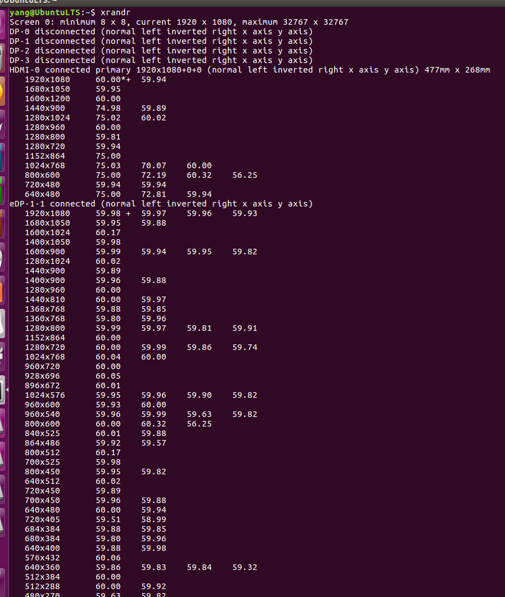

# Ubuntu和Win10双系统修改开机次序和选择时间     
1. 首先直接运行xrandr命令，查看显示器设备信息  
```shell
xrandr
```
  
可以看出：  
- 目前链接的有两个：HDMI-0   和  eDP-1-1  
- 主显示器是：HDMI-0  因为有 primary 注释  

2. 关闭一个显示器  
```shell
 xrandr --output eDP-1-1 --off 
```
3. 切换另一显示器  
```shell
xrandr --output eDP-1-1 --auto --output HDMI-0 --off
```
4. 两台显示器都使用  
```shell
 xrandr --output HDMI-0 --same-as eDP-1-1 --auto
```
**注意：**使用时是HDMI-0显示器要和eDP-1-1 一样，因此，你要保证eDP-1-1 开着。  
5. 设置主显示器  
```shell
xrandr --output HDMI-0 --auto --primary           #（将显示屏设置为主屏幕）
xrandr --output eDP-1-1 --right-of HDMI-0 --auto  #（设置电脑在显示屏右边）
```
## 参考内容  
1. https://blog.csdn.net/tianmaxingkong_/article/details/50570538  
2. https://blog.csdn.net/qq_34706266/article/details/80995218  