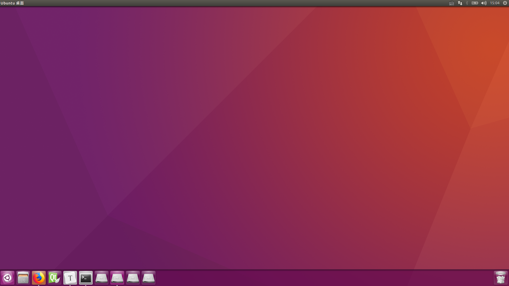
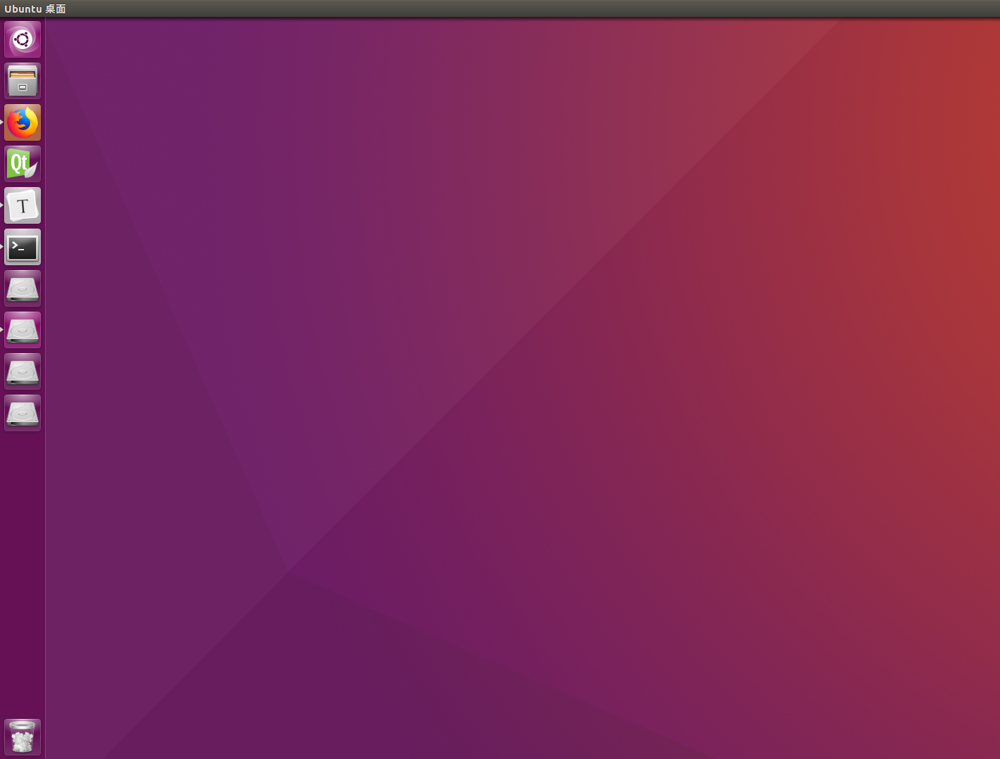
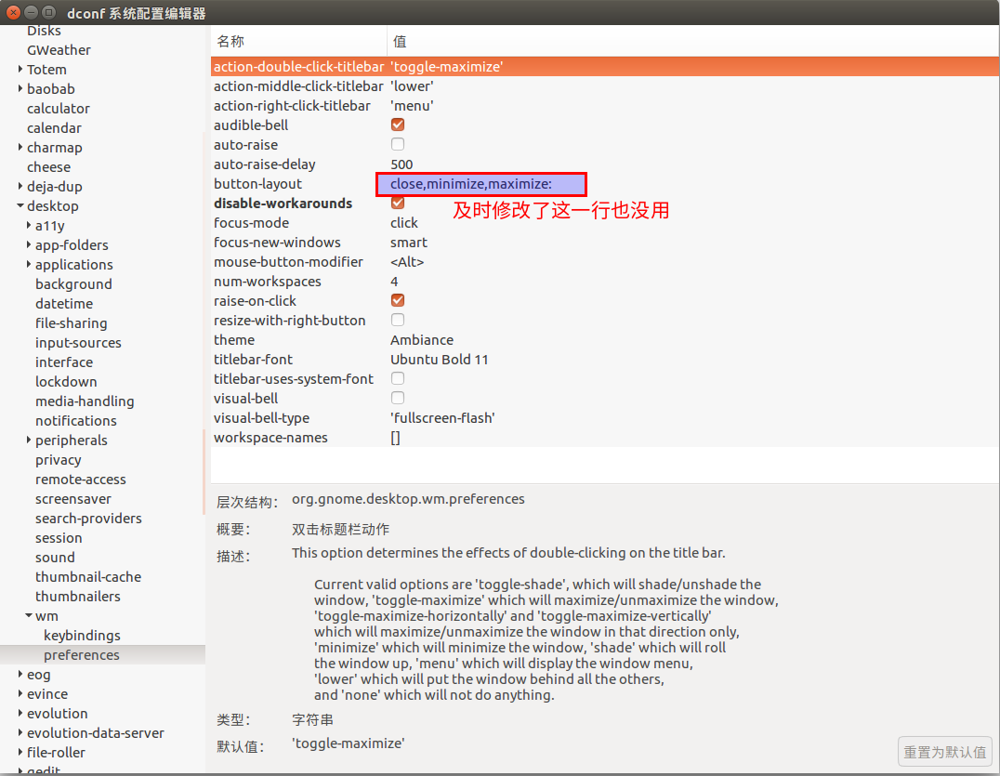

# Ubuntu设置快捷方式以及桌面  
## 1 程序启动器  
传统的 Unity 桌面环境，其应用程序启动器的容器——Launcher，一直坚定地待在屏幕的左侧。  
```shell
# 将启动器移动到下方  
gsettings set com.canonical.Unity.Launcher launcher-position Bottom
```
  
同时你还可以移动回去  
```shell
# 将启动器移动到左侧   
gsettings set com.canonical.Unity.Launcher launcher-position Left  
```
  
**注意：**不支持右侧和上方。  
## 2 Ubuntu 把最小化、最大化和关闭按钮放到右边  
1. 借助于以下命令，改不了：  
```shell
gsettings set org.gnome.desktop.wm.preferences button-layout ':minimize,maximize,close'
```
2. 借助于 dconf-editor也不行  
   
**总结：**貌似Ubuntu16.04不能修改，但是感觉不修改的话也不错，看着界面比较饱满，就暂且不改了。  

## 参考内容  
1. https://jingyan.baidu.com/article/e52e36154e6af340c60c518c.html  
2. https://blog.csdn.net/candcplusplus/article/details/78357224

