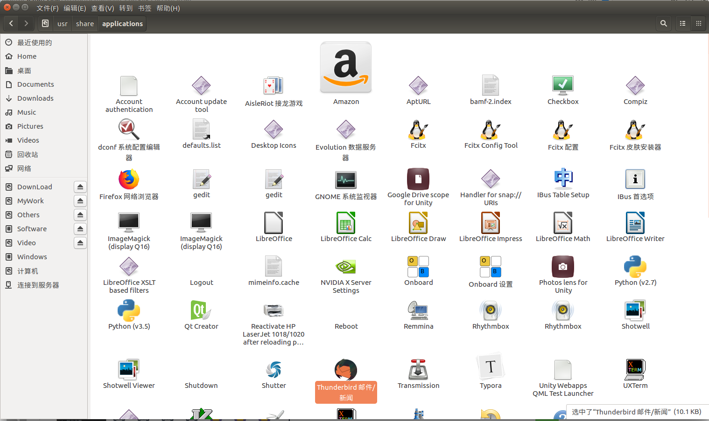
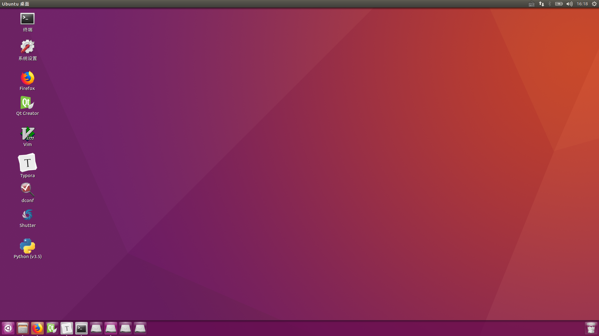
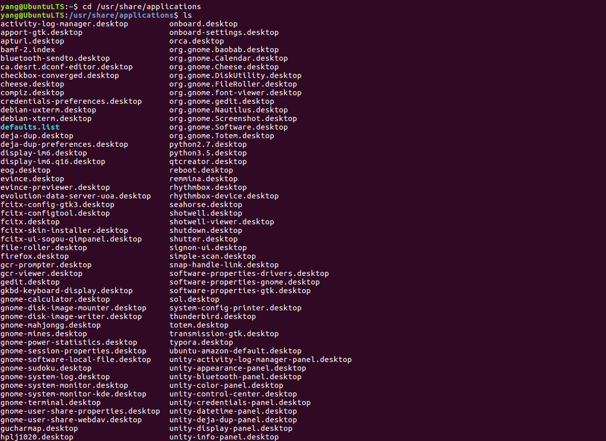
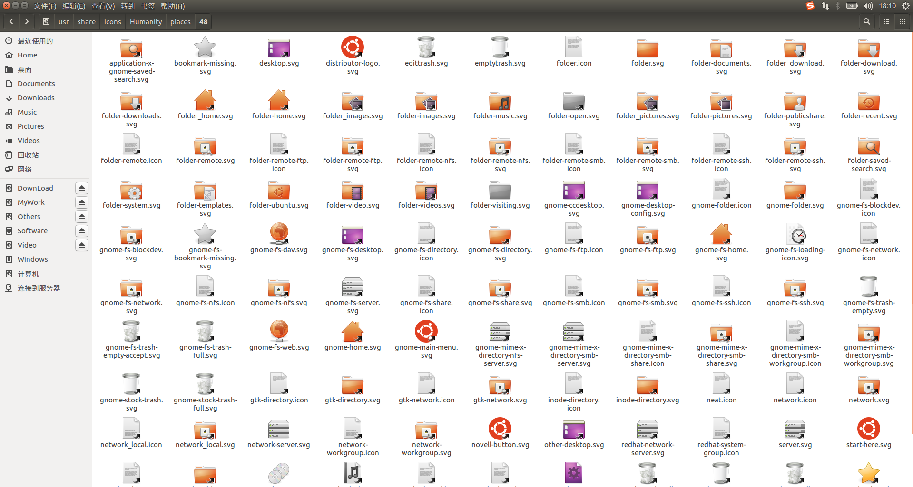
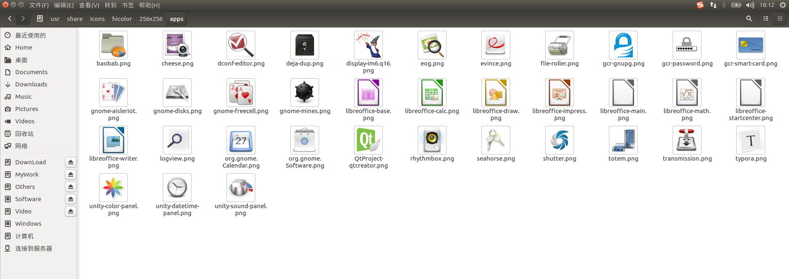
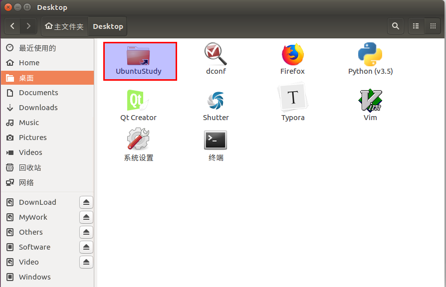
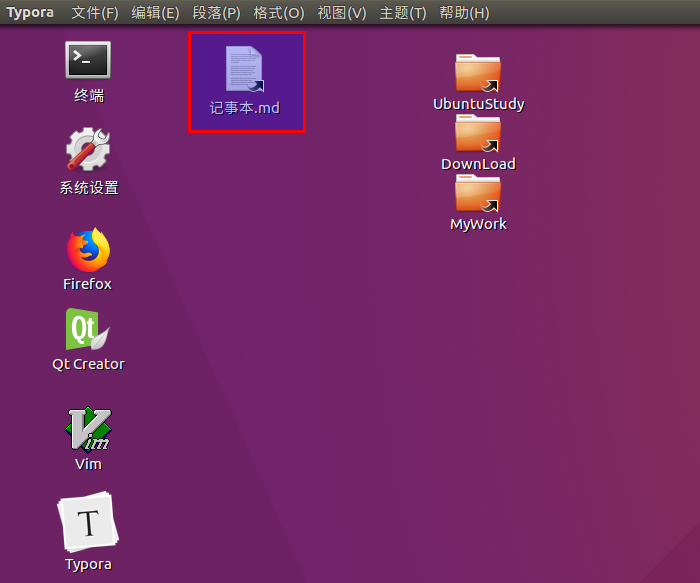

# Ubuntu设置快捷方式  
## 1 对于APP  
### 1.1 直接粘贴  
1. 进入/usr/share/applications 目录，打开如下文件：  
   
2. 直接复制粘贴到桌面上。  
  
3. 进一步看写里面文件的类型：\*.desktop  
  
**注意：**:在linux下快捷方式的类型就是如此，因此我们针对一些不在目录下的文件，创建快捷方式，实际上就是创建一个这样的\*.desktop文件。  

### 1.2 创建desktop文件  
```shell
cd /usr/share/applications
sudo  vim GithubRepository.desktop
```
复制如下内容：  
```shell
[Desktop Entry]	#指定文件类型
Encoding=UTF-8		#编码方式
Name=Visual Studio Code		#应用名称
Comment=Visual Studio Code	#鼠标放在上面显示的内容
Exec=/home/xujin/.local/share/umake/ide/visual-studio-code/code	#应用程序执行路径
Icon=/home/xujin/.local/share/umake/ide/visual-studio-code/resources/app/resources/linux/code.png		#应用程序图片路径
Terminal=false		#打开应用时是否打开终端	
StartupNotify=false		#该关键字只有在"Type"类型是"Application"时才有意义。其数值的含义由规范"Startup Notification Protocol Specifications"定义。
Type=Application	#分类
Categories=Application;Development;	#菜单所属类别，可以确定该菜单的位置
```
**注意：**以上仅对于应用程序有效。  
对于如何查找图标：  
- 文件浏览器使用( 当前版本 15.04 )的默认图标放在文件夹中:  
/usr/share/icons/Humanity/places/48  
    
- 安装的APP图标：  
   
当然可能不全，也可以去安装的APP目录下找。  

## 2 对于文件夹或文件  
### 2.1 给文件夹创建快捷方式：  
```shell
sudo ln -sT [文件夹路径] [桌面文件夹路径]

# 例如：
sudo ln -sT  /media/yang/MyWork/GithubRepository/YangWeiBin/YangWeiBin.github.io/UbuntuStudy   /home/yang/Desktop/UbuntuStudy
```
  
### 2.2 给文件创建快捷方式：  
```shell
sudo ln -sT  /media/yang/Windows/Users/YangWeibin/Desktop/记事本.md      /home/yang/Desktop/记事本.md
```
   

## 3 软链接问题思考  
对于软链接创建时候，一定要注意，你写的路径是否是开机自动挂载的，如果不是，那么开机后，链接无效，需要挂载重新创建链接。如何实现手动自动挂载，请参考后面两篇博客。  


## 4 参考内容  
1. https://jingyan.baidu.com/article/fb48e8bee5aabf6e622e14c8.html  
2. https://blog.csdn.net/xujin0/article/details/83276094  
3. https://blog.csdn.net/jdliyao/article/details/80622076  
4. https://blog.csdn.net/baidu_37503452/article/details/79041577  


