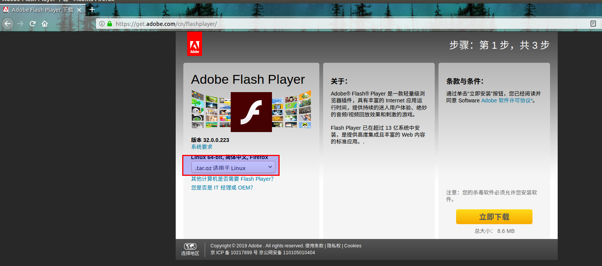

# 安装Flash      

## 1 下载aodbe官方下载软件包  
下载即可 https://get.adobe.com/cn/flashplayer/  
  
或者百度云盘  

## 2 进入DownLoad  
```shell
cd Downloads
tar -zxvf install_flash_player_11_linux.x86_64.tar.gz
sudo cp libflashplayer.so /usr/lib/firefox/browser/plugins
sudo cp -r usr/* /usr
```
## 3 安装ffmpeg  
```shell
sudo apt-get install ffmpeg
```
## 4 重启火狐  
## 5 参考资料  
1. https://blog.csdn.net/ljheee/article/details/52968551  
2. https://blog.csdn.net/ZT0518/article/details/82117747  
3. https://blog.csdn.net/weixin_40522162/article/details/80287296  


