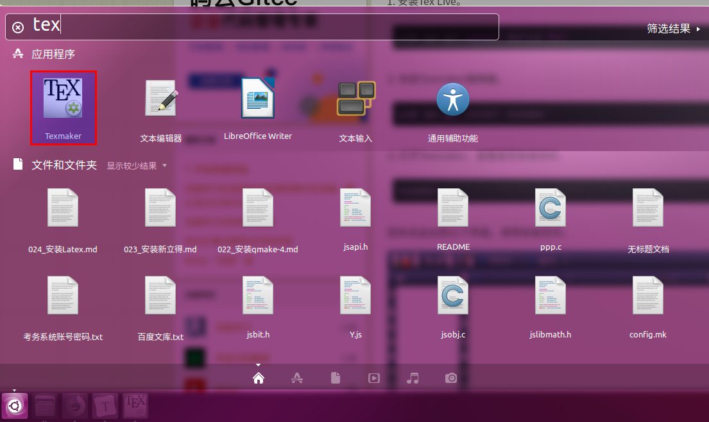

# Ubuntu安装Latex  
## 1 Latex简介  
LaTeX（ LATEX，音译“拉泰赫”）是一种基于TeX的排版系统，由 美国 计算机学家 莱斯利·兰伯特（Leslie Lamport）在20世纪80年代初期开发，利用这种格式，即使使用者没有排版和程序设计的知识也可以充分发挥由TeX所提供的强大功能，能在几天，甚至几小时内生成很多具有书籍质量的印刷品。 
## 2 安装Latex软件系统    
TeX Live  或 CTeX 套装 2.9 以后版本。不管新手还是老手，都不建议用CTeX套装，CTeX好几年前就不再更新了，版本太老，会莫名其妙的出现各种错误。**推荐 Tex Live**    
TeX Live是 LaTeX 的分发版的一种，是可以作为Tex文件生成的软件系统，提供了在Unix（包括LInux）环境下的完整Tex 系统。   
```shell
sudo apt-get install texlive-full
```
## 3 安装Latex文档编辑器  
推荐Texmaker  
Texmaker是一个免费易于使用的高度功能和强大的LaTeX的编辑器，它集成了所需的开发工具，许多LaTeX文档。  
```shell
sudo apt-get install texmaker
```
## 4 安装成功  
   


## 5 参考资料  
1. https://www.cnblogs.com/banwagong/p/7841262.html  
2. https://blog.csdn.net/wuguangbin1230/article/details/78017013  
3. https://blog.csdn.net/zzc15806/article/details/82113759  