# Ubuntu16.04的svn客户端用法          

[toc]

## 1 创建仓库目录   
1. 创建目录   
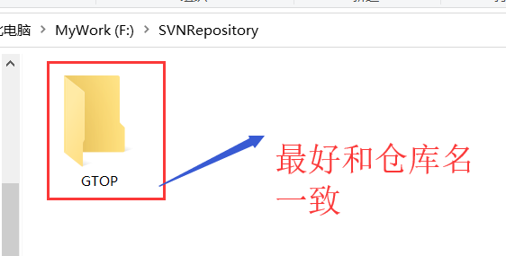  

2. 检出仓库  
   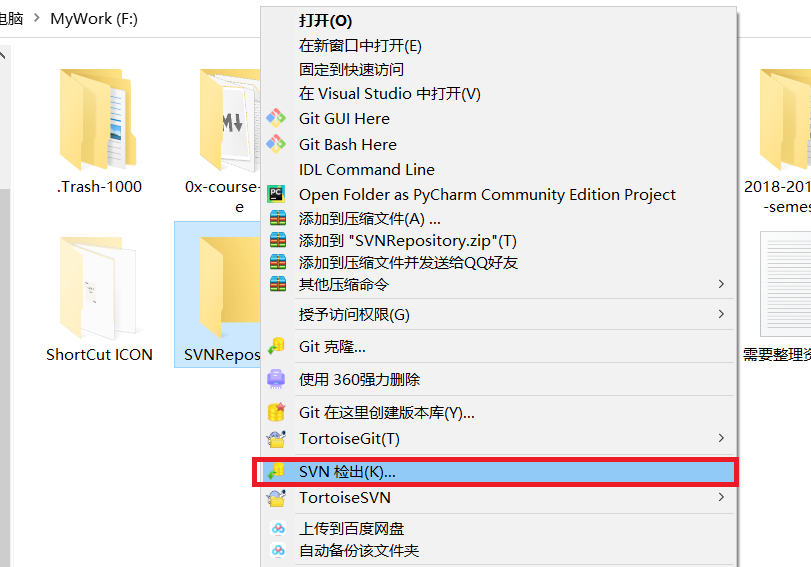  

3. 服务器地址   
   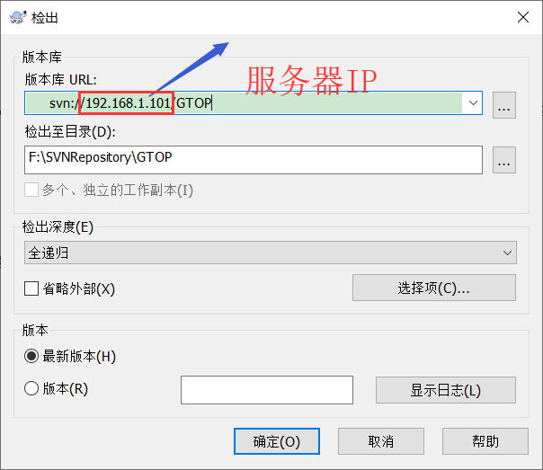  

4. 用户信息    
   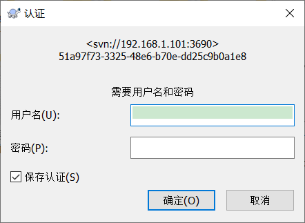  

5. 检出成功   
   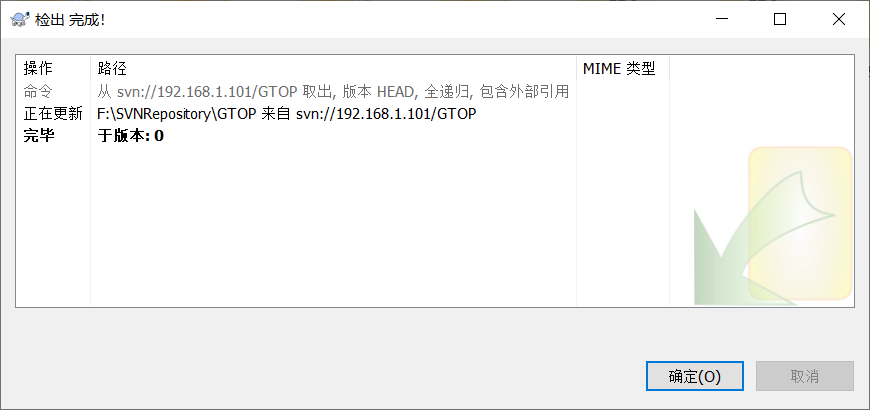  
   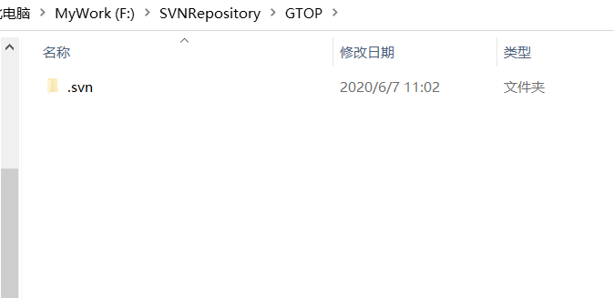  

6. 本地修改  
   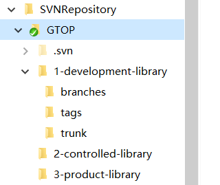  

7. 添加修改内容   
   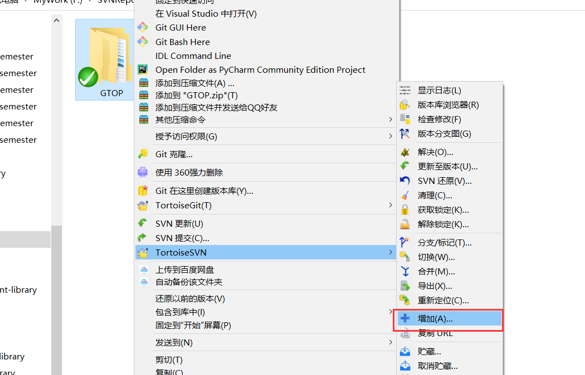  
   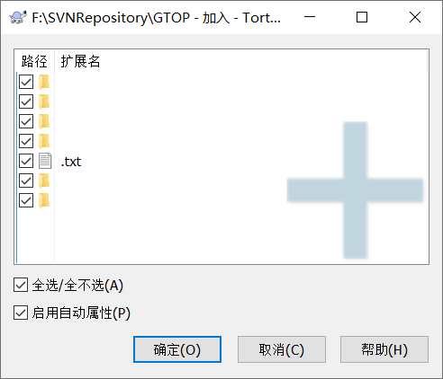  

8. 提交远程仓库   
   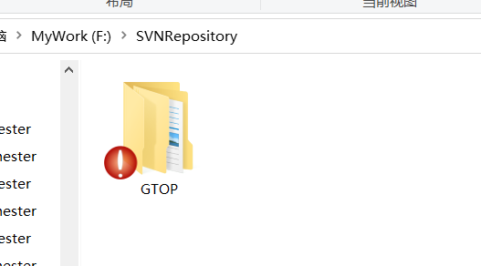  
   
   
   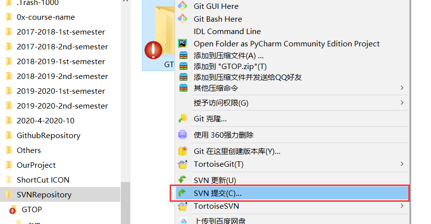  
   
9. 输入账号密码，第一次必须是管理员，因为修改了仓库根目录   
   

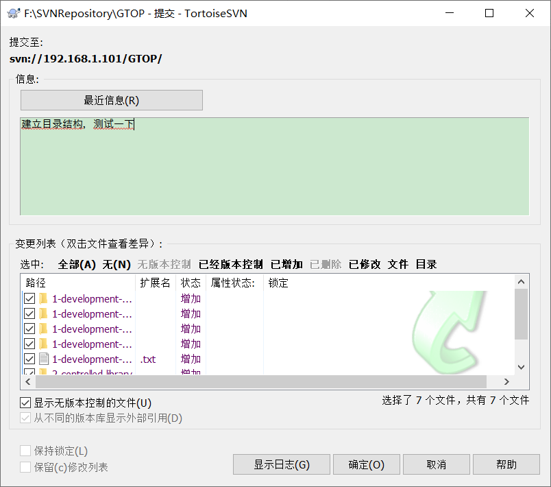  
10. 管理员权限        
 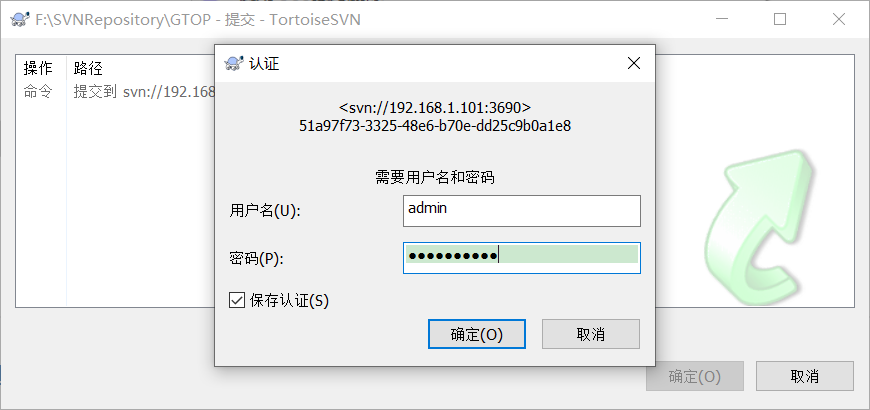  
 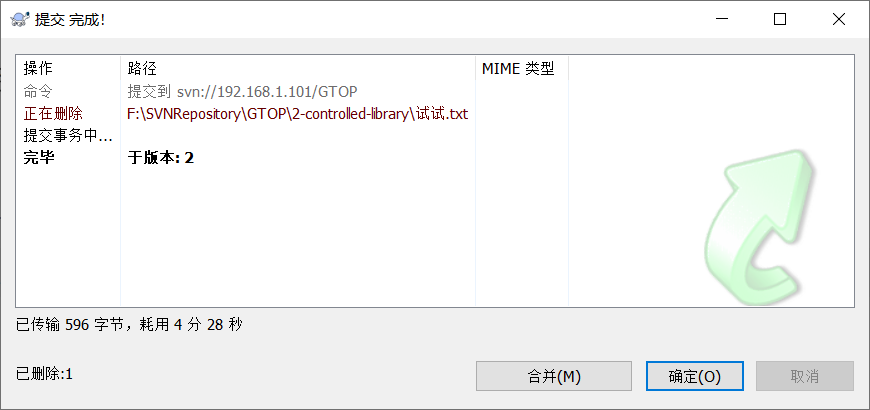  

11. 查看效果 `http://192.168.1.101/svn/GTOP/`，输入Apache2设置的密码112233-       

 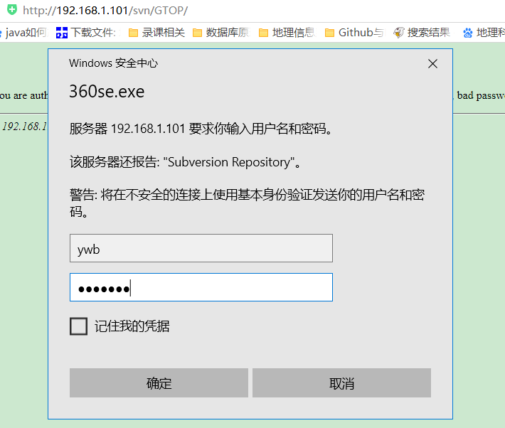  
 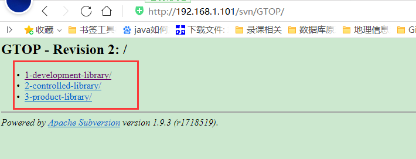  

## 10 参考资料   

1. https://blog.csdn.net/weixin_30449453/article/details/98276121   
2. 

