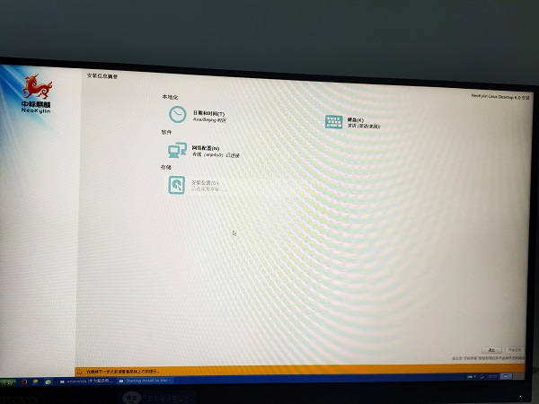
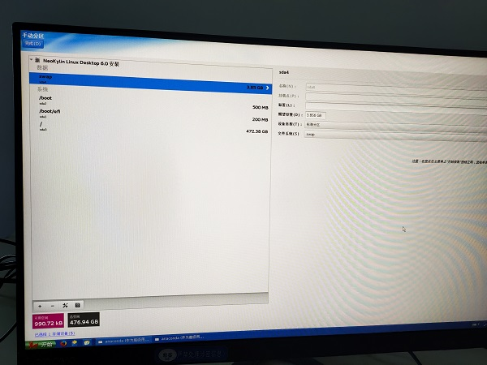
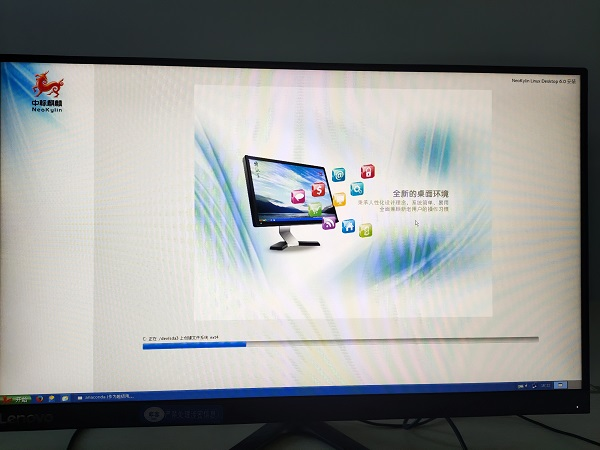

# 中标麒麟在联想主机安装    

## 1 做系统盘    

- 需要[rufus软件](./007_UEFI启动安装Ubuntu16和win10双系统.md)镜像安装软件   
- [中标麒麟V6.0版本](http://www.kxdw.com/soft/5031.html)   
- rufus软件设置[参考文件](./007_UEFI启动安装Ubuntu16和win10双系统.md)    

## 2 设置启动项    
- 在出现**Lenovo画面按下F1**   
- 出现BOIS界面   
- 选择中文   
- 设置启动项为U盘启动，修改启动次序  
- 设置 UEFI 启动    
- 插入启动盘(U盘)，重启  

## 3 安装中标麒麟   
- 按照如下步骤   

   
  
  
  

## 4 注意事项   
- 若出现没有足够可用空间[参考](https://www.yuanmas.com/info/l3zdX9bz9k.html) ，减去空间调整    
- 若无法减去空间，那个说明系统有系统保护，可以将备份分区删除，再操作，我的是30G的分区先减去，才能进行安装    

## 5 参考资料  
1. https://jingyan.baidu.com/article/b2c186c8d0f864c46ef6ffaf.html   
2. http://www.kxdw.com/soft/5031.html   
