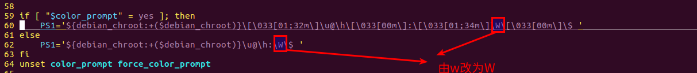

# 如何缩短终端显示的路径   

## 1 问题描述   
- 平时我们使用linux终端命令行的时候，常常会被一个问题困扰，那就是文件路径过长，有时候甚至超过了一行，这样看起来非常别扭   

## 2 问题解决   
```bash  
vim ~/.bashrc
```

   


## 3 修改后的效果   
```bash 
yang@UbuntuLTS:01-Helloworld$ pwd
/home/yang/Desktop/UNIX-advanced-programming/03-UNIX-code/01-Helloworld
yang@UbuntuLTS:01-Helloworld$ 
```

## 4 补充资料   
- 下面简单说说环境下默认的特殊符号所代表的意义：   
	- \d ：代表日期，格式为weekday month date，例如："Mon Aug 1"  
	- \H ：完整的主机名称。例如：我的机器名称为：fc4.linux，则这个名称就是fc4.linux  
	- \h ：仅取主机的第一个名字，如上例，则为fc4，.linux则被省略  
	- \t ：显示时间为24小时格式，如：HH：MM：SS  
	- \T ：显示时间为12小时格式  
	- \A ：显示时间为24小时格式：HH：MM  
	- \u ：当前用户的账号名称  
	- \v ：BASH的版本信息   
	- \w ：完整的工作目录名称。家目录会以 ~代替  
	- \W ：利用basename取得工作目录名称，所以只会列出最后一个目录  
	- \# ：下达的第几个命令  
	- \$ ：提示字符，如果是root时，提示符为：# ，普通用户则为：  


## 5 参考资料   
1. https://blog.csdn.net/sftxlin/article/details/8686992?utm_medium=distribute.pc_relevant.none-task-blog-title-5&spm=1001.2101.3001.4242   
2. http://www.mamicode.com/info-detail-2507870.html    
3. https://jingyan.baidu.com/article/3d69c5516c129df0ce02d77b.html   
4. https://blog.csdn.net/weixin_30245867/article/details/95743351    
5. https://www.cnblogs.com/eos666/p/9904746.html  