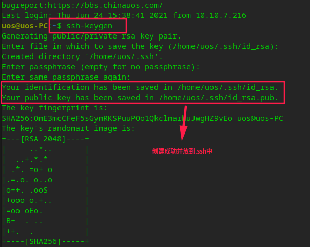
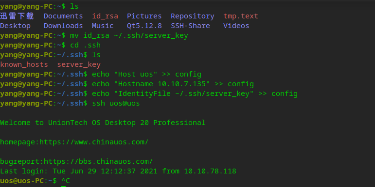
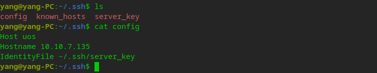
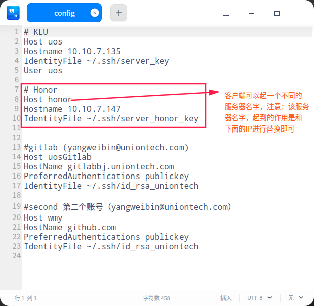
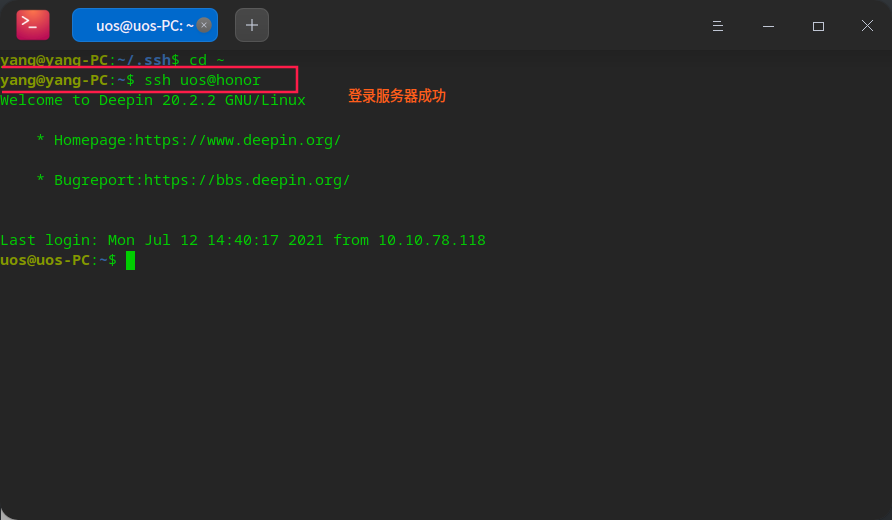

# [配置SSH免密码登录](./)  
## 概述   

因为工作需要，在使用SSH进行登录时，每次都验证密码的话，非常麻烦，因此在此处写下如何配置ssh密钥，实现免密码登录，并且在本地可以脚本化配置过程。  

## 操作步骤  

### 1 在远程机器上建立身份证和公钥  

```shell
# 远程登录服务器  
ssh uos@10.10.7.135 
# 生成加密对与秘钥
ssh-keygen # 敲三个回车  
```

 

### 2 公钥放入授权密钥，身份证放入本地ssh  

```shell
cd .ssh
cat id_rsa.pub >> authorized_keys
mv id_rsa.pub my_id_rsa.pub
mv id_rsa my_id_rsa
```


### 3 本地配置服务器   

```shell
scp uos@10.10.7.135:~/.ssh/my_id_rsa ./
# 将身份证复制到本地的服务器公钥文件
mv my_id_rsa ~/.ssh/server_XXXX_key
# 配置远程服务器的名字和IP
cd .ssh 
# 编辑config文件 
dedit config

# 给远程服务器配置一个名字 
echo "Host uos" >> config 
# 远程服务器的IP  
echo "Hostname 10.10.7.135" >> config
# 服务器身份信息进行标记
echo "IdentityFile ~/.ssh/server_XXXX_key" >> config
# 免密码登录成功 用户名@远程服务器名字
ssh uos@uos
```



## 本地配置文件    



>#### 总结   
>
>1. 远程服务器中建立身份证和公钥   
>2. 身份证复制到本地，公钥放入服务器的授权公钥 
>3. 本地配置服务器相关信息以及公钥的位置  
>4. 如果要设置多个server的秘钥，只需要重复步骤1-3，并在步骤3中将`server_key`，`server_name`与`server_ip`改为相应的值即可 
>5. **可以实现脚本化**  

## 登录多台服务器设置    






## 参考资料  

1. https://www.jianshu.com/p/58712db3f6a5   

