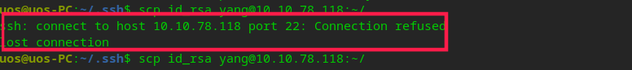
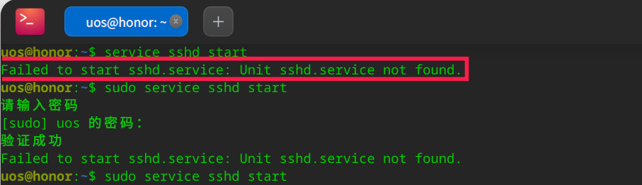
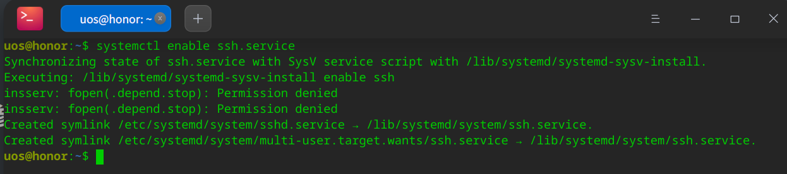

# SSH连接远程报错       

[toc] 

## 问题描述     

使用SSH登录时，发现登录被拒绝     



## 解决方案 1     

```shell
# 1 安装SSH 
sudo apt install openssh-server
# 2 开启服务 
sudo /etc/init.d/ssh start # 如果此处报错，见解决方案2  
# 3 开启密钥  
ssh-keygen -A
```

## 解决方案 2    



```shell
systemctl enable ssh.service
```




## 参考资料   
1. https://blog.csdn.net/qq_35203425/article/details/100658746     
2. <https://blog.csdn.net/TanCairo/article/details/104363915>  