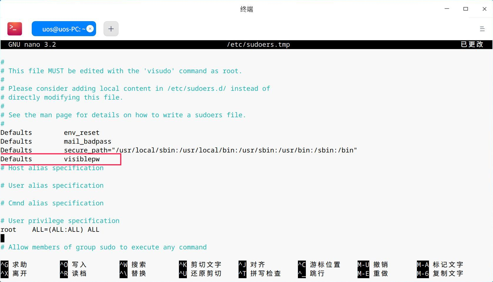
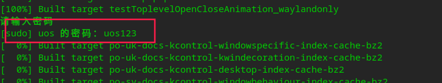

# SSH远程使用sudo报错  

## 概述  

远程ssh在使用sudo权限时报错：出现 sudo: no tty present and no askpass program specified。  

## 解决方案  

```shell
sudo visudo 

```

添加如下行:

```txt
Defaults   visiblepw
# ctrl + s &&  ctrl + x
```

  最终效果是在本机输入远程服务器计算机的密码即可：



## 参考资料  

1. https://blog.csdn.net/drift_away/article/details/82983724 

