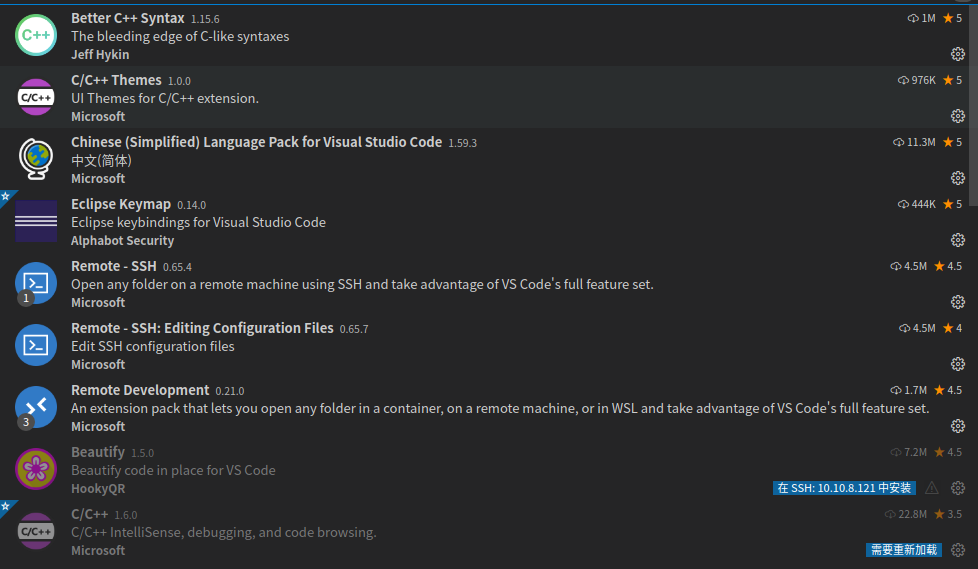
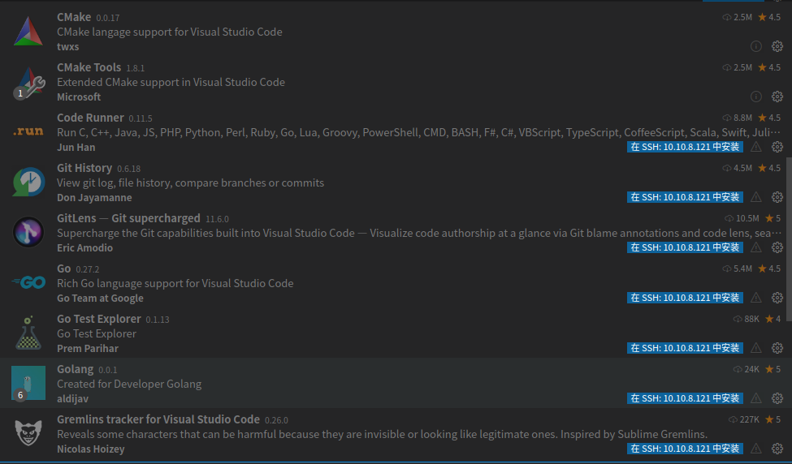
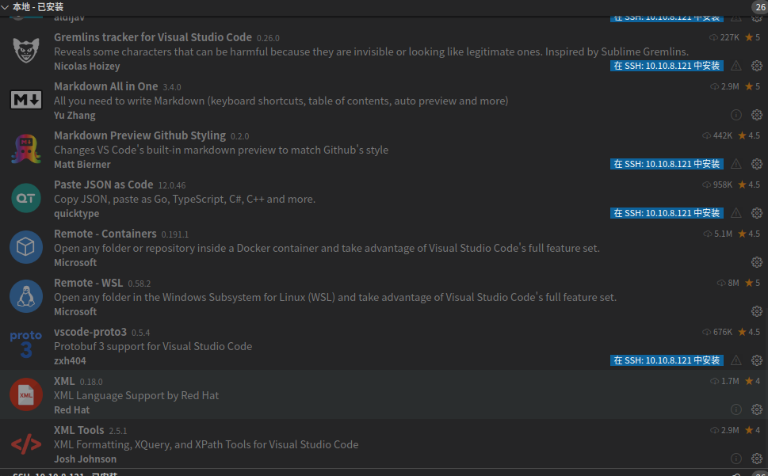

# [VS Code需要配置的插件](./)  

## 1 概述  

平时做qt开发一般使用的是qtcreator，但是在做窗管等系统级别的开发时，往往有时候出现没有窗口的情况，这时候往往需要使用VSCode配置一下远程的开发方式。通过远程修改代码，远程进行代码的编译，最终完成系统的开发。

## 2 配置环境  

VSCode的安装一般可以在官网即可找到最新的版本，下载安装最新版本即可，安装完成之后，一般需要配置的插件如下：







## 3 提示错误     

### 3.1 远程SSH配置方法-带补充  

[参考资料](https://blog.csdn.net/lenfranky/article/details/89972889?utm_medium=distribute.pc_relevant.none-task-blog-2~default~baidujs_title~default-0.no_search_link&spm=1001.2101.3001.4242)  

建议以后配置ssh密钥实现免密登录 

### 3.1 Visual Studio Code远程SSH代码无法跳转  

对于远程打开的应用，必须在远程的电脑上也安装相应的插件，比如：C/C++的跳转，可以使用C/C++的插件实现，一般情况下，可以将本地的插件，全都安装在远程的机器上。 

### 3.2 Visual Studio Code 无法观察这个大工作区中的文件更改  

[参考资料](https://code.visualstudio.com/docs/setup/linux#_visual-studio-code-is-unable-to-watch-for-file-changes-in-this-large-workspace-error-enospc)  

Visual Studio Code 无法观察这个大工作区中的文件更改”（错误 ENOSPC）#

```shell
# 可以通过运行查看当前限制：
cat /proc/sys/fs/inotify/max_user_watches  
# 编辑 /etc/sysctl.conf
sudo vim  /etc/sysctl.conf
# 此行添加到文件末尾来将限制增加到最大值：
	fs.inotify.max_user_watches=524288
# 加载新值
sudo sysctl -p
```

