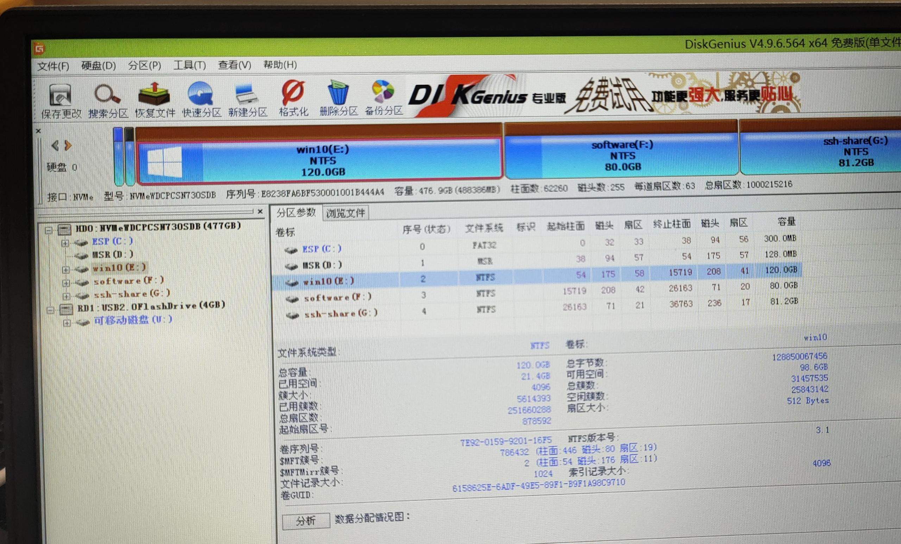
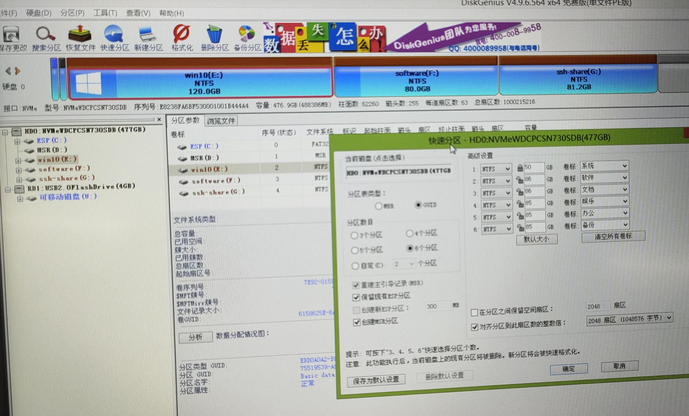

# Win10磁盘分区     

[toc]  

## 概述  
最近做了一件比较蠢的事，我把之前win10系统的C盘前面的了个引导盘给格式化了，导致装好系统后，系统无法识别出硬盘，后来让公司技术服务部门进行了解决，整理于此。    
## 磁盘分区  

C盘前面的两个小分区不能删除，否则进不去系统，识别不了驱动。如果误删了的话使用快速分区的方法来还原之前的状态。     

   
   

## 系统安装  

### 制作PE启动

对于Win10系统来说，可以下载**微PE工具箱**，制作出来PE系统，然后通过这个工具帮助安装Win10教程可以查看一下百度。  

### 网络驱动安装  

使用驱动总裁安装网络驱动，脱机安装即可   

### 系统激活  

使用HEU_KMS_Activator进行系统激活，这个工具是自动续期激活系统的  