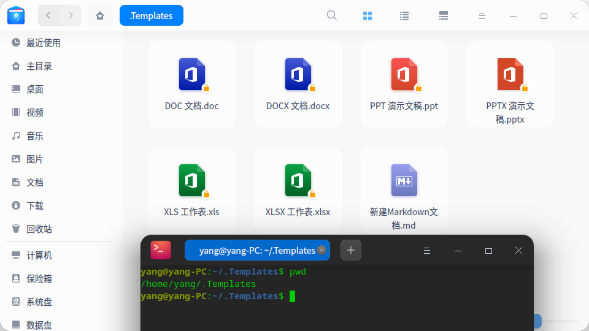

# Linux右击新建文件  [img ](./img) 

home目录下有个`.Temple`目录，将文件创建到这个目录即可，如果是Ubuntu的话，可以直接再模板目录中进行创建。下面重点介绍的是如何在UOS下添加markdown文档的模板。  

## 操作步骤  

1. 进入用户目录，设置文件管理系统，显示隐藏的文件目录  

   

2. 使用终端命令，`touch 新建markdown文档.md`创建模板  

3. markdown文档的模板需要添加一些必要的信息，方便平时使用   

```markdown
# 名称  [img](./img)
```

4. 重启系统生效   
