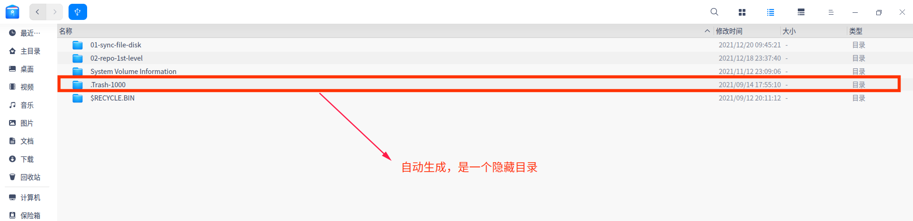
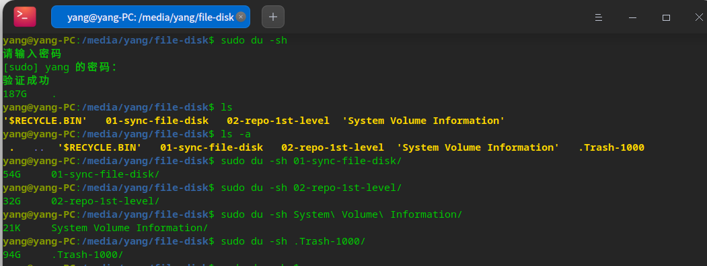
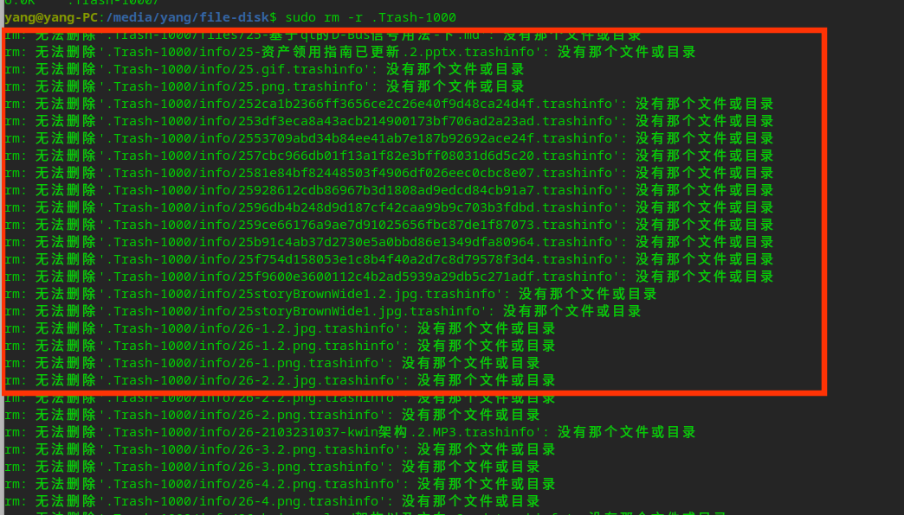

# [Linux硬盘管理 清空Trash-1000文件](./)  [img](./img)     

> ######  _标签:_     [](https://blog.csdn.net/qq_36201400/article/details/112850174)  
>

## 概述  

**Linux通过图形化界面delete的文件在./Trash-1000下面,需要手动删除。**如下图所示：  

    

## 问题原因    

在使用移动硬盘进行文件同步过程中，磁盘占用是的184G，但是本身文件并没有那么多，因此，使用`sudo du -sh`命令进行文件查询：  

 

 经过上面比较，发现是里面的隐藏文件.Trash-1000，占用了94G的空间，导致最终的磁盘占用比较高，那么.Trash-1000这个目录是怎么来的？

**Trash是指“垃圾” 1000是你的用户的uid**。在Linux系统中，有很多这样的文件，独立的放在磁盘的根目录下。也就是之前删除文件都放在了.Trash-1000目录下。回收站通过这个目录可以恢复相应删除的文件。方法如下：

如果删除的位置是在$HOME目录下，则回收站目录为：～/.local/share/Trash，其中的目录结构一致。只要是在$HOME目录外的独立的Linux分区中删除的文件都不会出现在Nautilus的回收站中，Nautilus的回收站仅显示～/.local/share/Trash/file中的文件。

```shell
mv /.Trash-1000/files/nr.04/nr.04.phd /home/sam # 然后单击右键删除后，nr.04.phd到了我的回收站这个位置
 
mv /.Trash-1000/files/nr.04/nr.04.phi /sam  # 然后，如果对nr.04.phi直接delete，该文件就到了/.Trash-1000
```

## 解决方法  

如果确认之前删除的文件基本没有任何作用的话，可以直接将改目录清空。

```shell
sudo rm -r .Trash-1000
```
可能会报错，目前不用管，可能清理不干净，**对于清理不干净的情况，可以将移动硬盘插入到Win10系统的计算机进行手动删除**：  
  


>#### 注意事项：
>
>非/home下的文件 可以用rm命令来就直接删掉了，文件不会跑到.Trash-1000/files 。 


