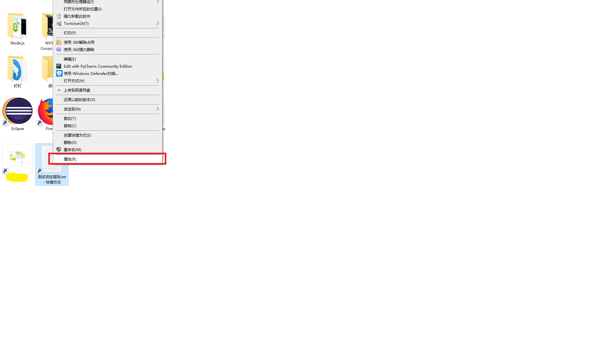
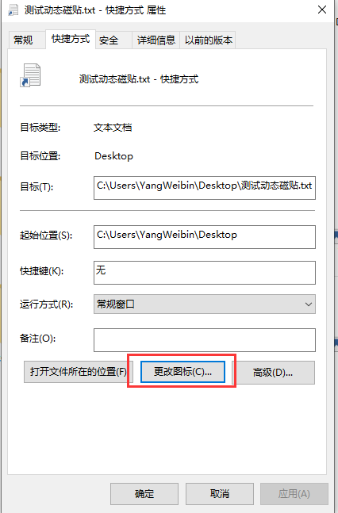
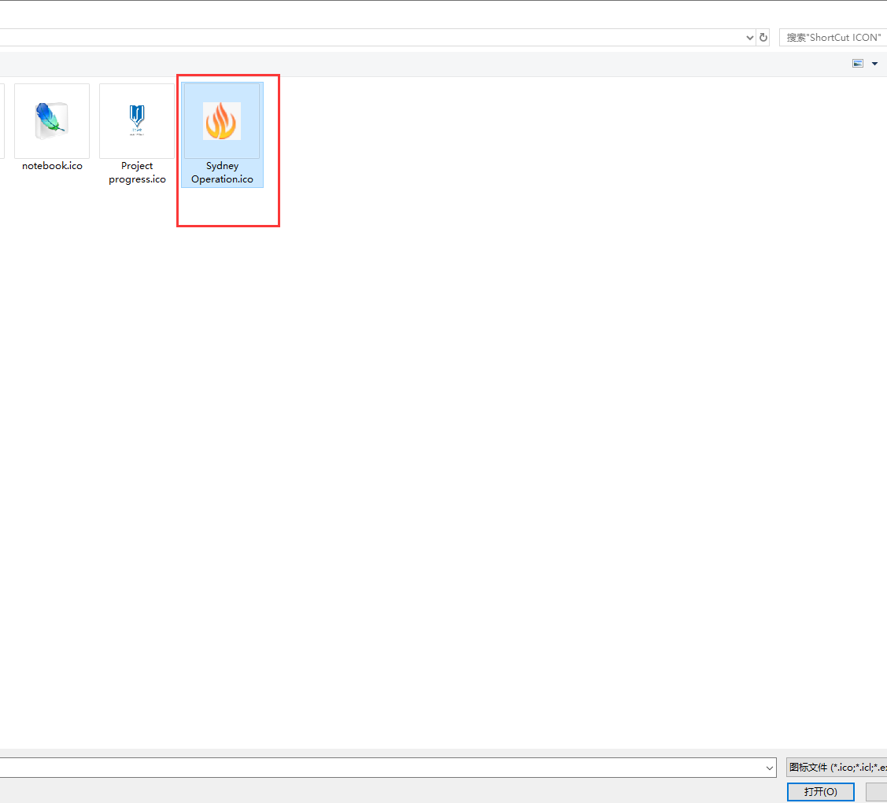
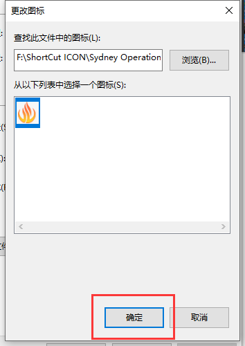
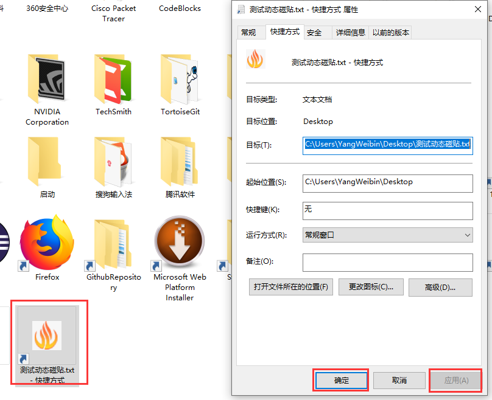
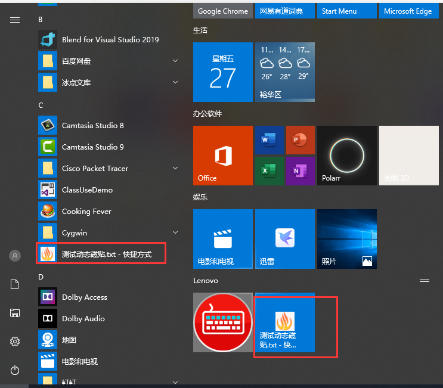

#  如何美化快捷方式图标        
参考：https://zhidao.baidu.com/question/1994074668310888107.html    
1. 在快捷方式上右击 -> 属性     
      
2. 选择更改图标    
        
3. 选择准备好的图标，一般是\*.icon 文件    
          
4. 确认添加图标    
      
5. 点击  应用，可以看到图标的变化，然后点击 确认   
        
6. 开始菜单和磁贴图标都跟着变化    
     
