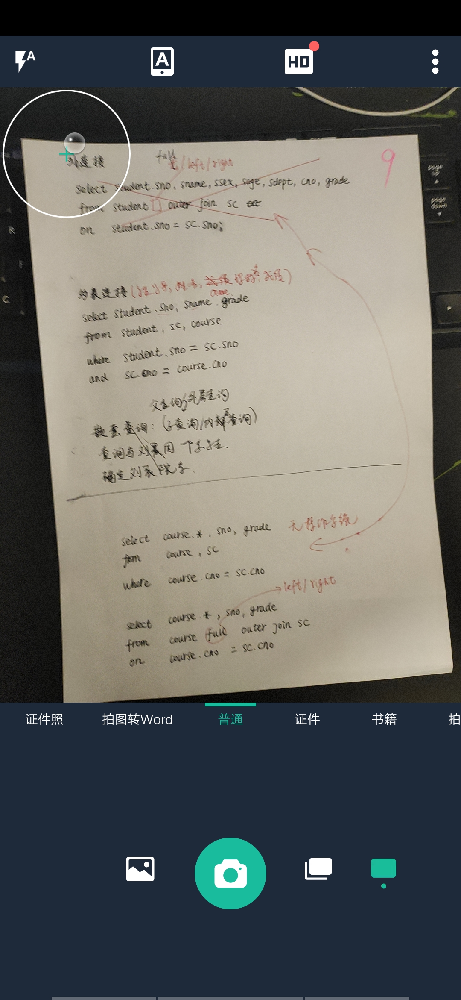
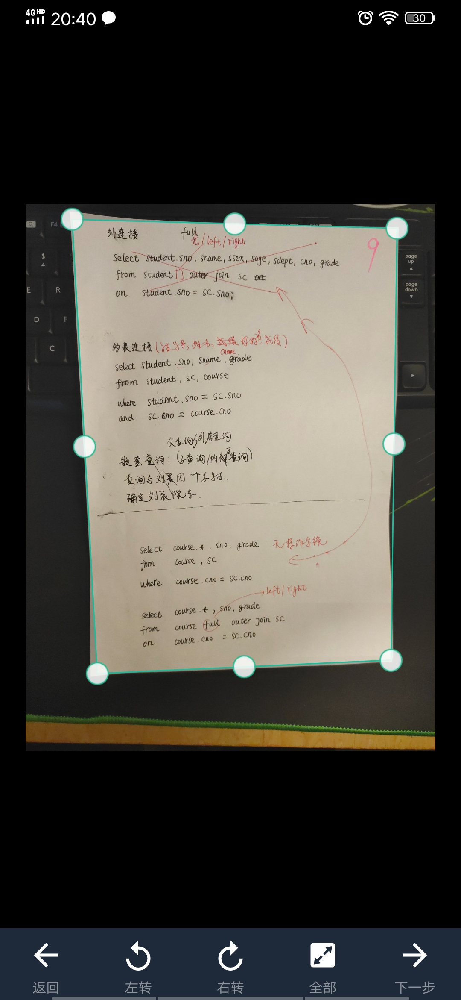
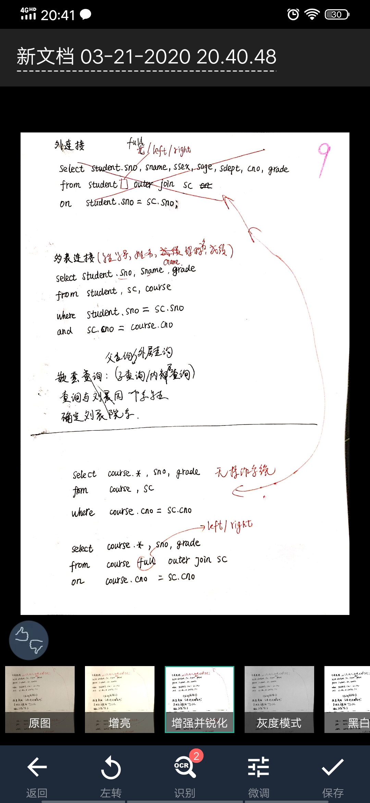
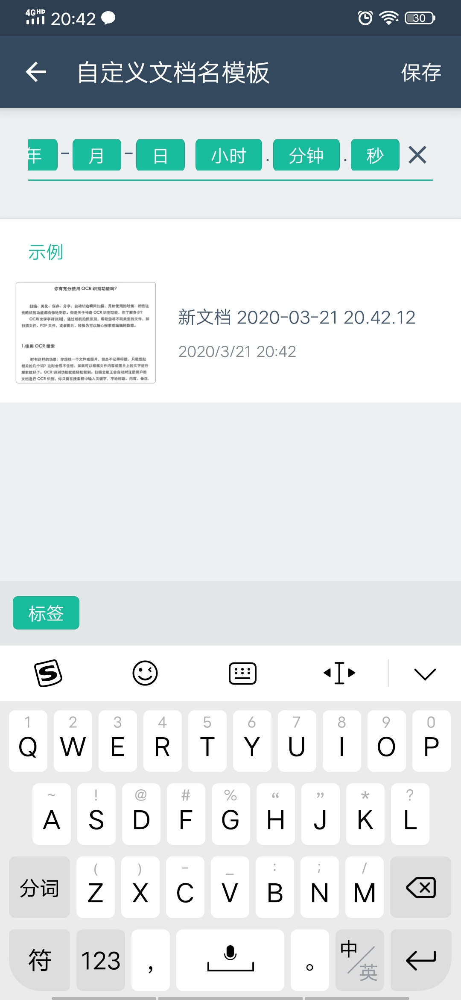
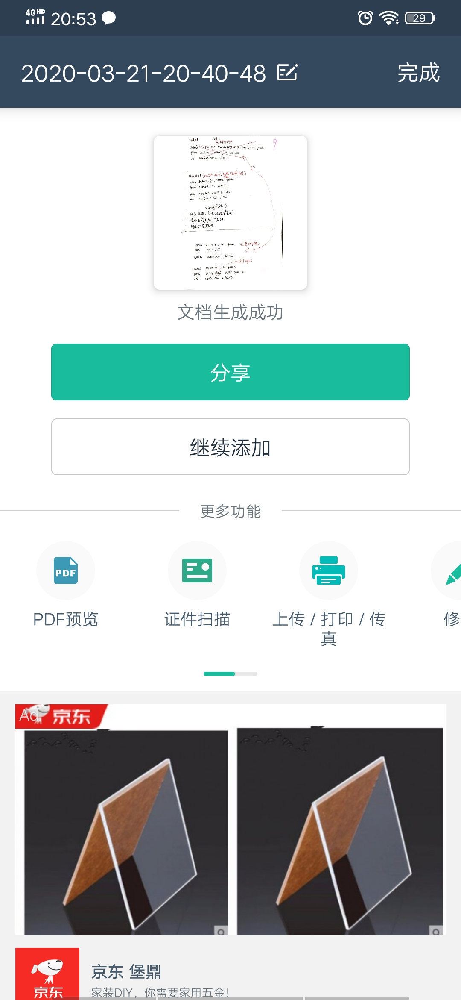
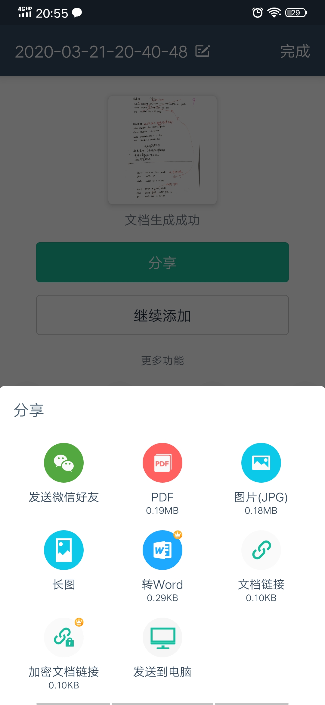
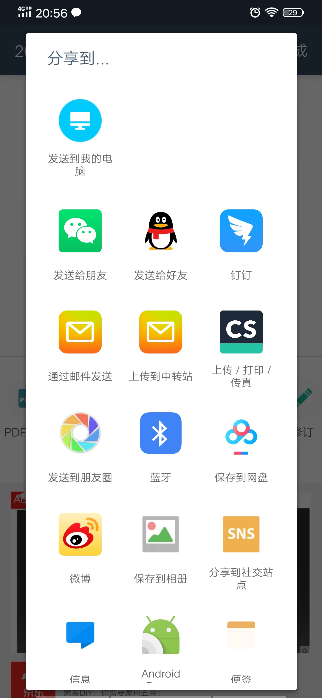
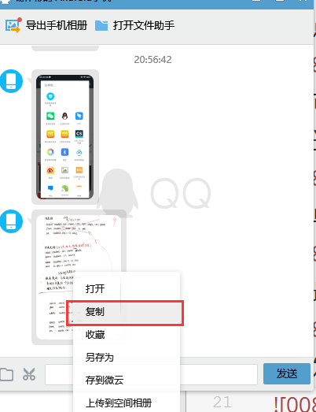

# 文件扫描高效办公  
[TOC]

## 1 软件环境  
1. [下载扫描全能王](https://www.camscanner.com/)    
2. 下载QQ   
## 2 操作方式  
### 2.1  注册登录扫描全能王   
### 2.2  打开右下角的摄像   
   
### 2.3  选择一个可以明显区分纸张边界的背景拍照，有利于自动识别边界  
   
   
### 2.4  点下一步，进行图片校正，默认是增强锐化  
    
### 2.5  可以重命名，也可以修改默认名的格式建议是：年-月-日-小时-分-秒.jpg    
     
### 2.6  单击保存，完成，若还要拍，则返回，重新拍照   
     
### 2.7  最后可以分享图片(分享PDF会有水印，分享图片会有下划线的页码，还要做修改即可) → JPG   
  
### 2.8  发送我的电脑   
  
### 2.9  电脑端接收，右击复制到相应的文件目录   
    

## 3 注意事项  
### 3.1 纸质文件要保存归档   
### 3.2 有利于管理纸质文件，以及后期的再利用   
### 3.3 每周至少一次，纸质文件的整理   
### 3.4 也可以选中拍完的照片分享图片，不要分享PDF，不方便整理  
### 3.5 手机快速截屏，三指向上滑，而三指向下滑是分屏  
### 3.6 定时清空不用的图片  
### 3.7 不同的文件，标注不同的页码，文件分类时要注意的问题    

