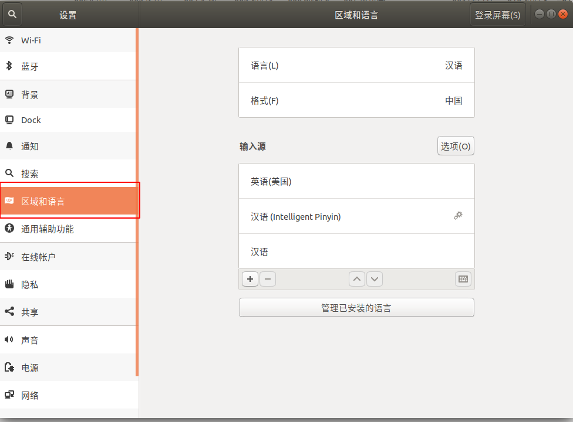

# 安装完ubuntu 需要安装的软件

[TOC]

## 1 先更新系统  
```shell
sudo apt-get update
```
## 2 安装IDE  

```shell
sudo apt-get install qt5-default qtcreator
```
### 2.1 首次安装qtcreator容易出现的问题：  
* 1.点开option  
    

* 2.原因是qt版本的问题  
    

* 3.解决思路  
  ① 点击 Qt版本右侧的Manage，选择你的qmake目录位置，例如：/usr/lib/qt5/bin/qmake   
  ②然后 Qt版本就由 无 -> 当前安装的qt版本  
  ③点击“Ok”保存  
    
## 3 安装搜狗  
* 百度 ：sougou for linx  
* 下载Ubnutu版本的搜狗输入法  
* 直接通过Ubuntu软件中心安装  
* 安装完成后在设置->区域和语言->键盘输入法系统->fcitx  
*   
*   
*   
* 注销、重新登录   
* 如果还不行就重启电脑    

## 4 获取root  
```shell
su - 
```
## 5 安装新立得  
* 在软件中心搜索Synergy  
* 点击安装即可  