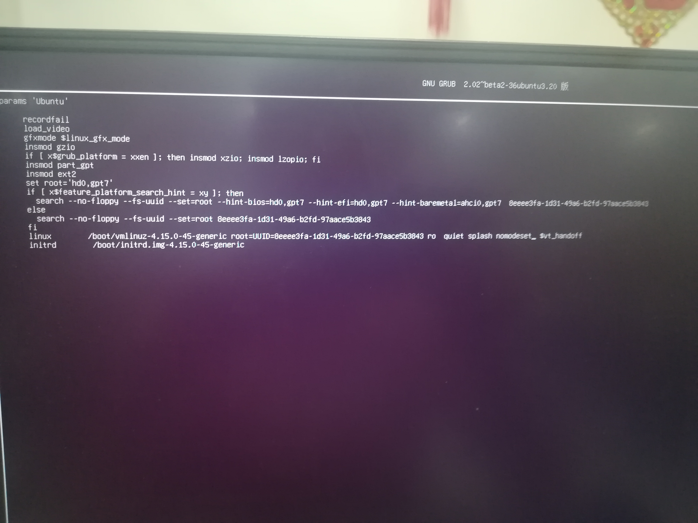
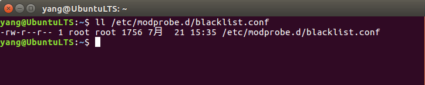
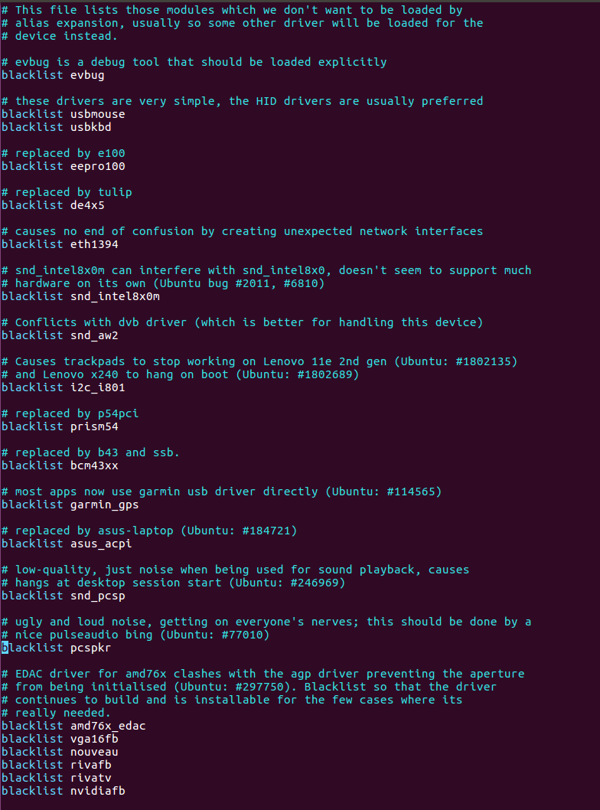
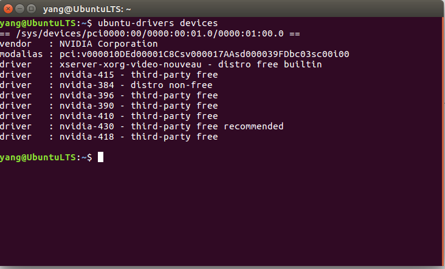
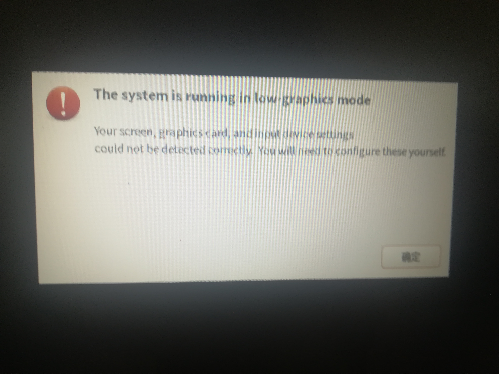
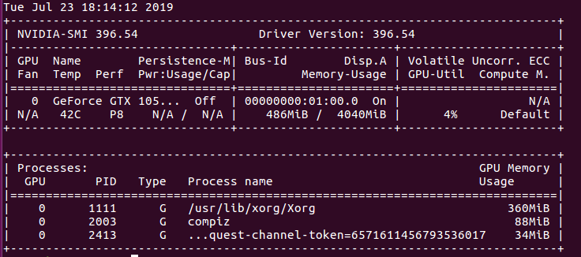

# 双显卡+Y7000+Ubuntu  
[TOC]

## 1 配置介绍  
1. Intel(R) Core(TM) i5-8300H CPU @ 2.30GHz (8 CPUs), ~2.3GHz （CPU）   
2. Intel(R) UHD Graphics 630 （集成显卡）  
3. NVIDIA GeForce GTX 1050 Ti （独立显卡)  
## 2 禁用Nouveau驱动  
1. 先启动Ubuntu保证能进入tty模式，进入GRUB引导界面时，快速按 e 进入编辑模式，在倒数第2行有个，*quiet splash*在它后面加上 空格+nomodeset，即修改内核参数。让内核不再去设置显示模式而保证系统还可以进入字符界面。 保存即可。如下图：  
  
2. 系统进入后，因为关闭了显示模式，因此系统是黑屏的，这时ctrl+alt+F1进入tty文本模式进行下面的操作；  
3. 先查看黑名单的权限：  
```shell
#后面要用到vim在此处先安装
sudo apt-get install vim
ll /etc/modprobe.d/blacklist.conf
```
如下所示：  
  
对于ll命令意思，查看[链接](https://blog.csdn.net/qq_34885598/article/details/83956870)  
第一个root表示这个问价的拥有者，第二个是这个拥有者所在组。  

4. 修改属性  
```shell
sudo chmod 666 /etc/modprobe.d/blacklist.conf
```
5. 用vim编辑器打开黑名单。  
```shell
sudo vim /etc/modprobe.d/blacklist.conf
```
在后面添加下面几行：  
```txt
blacklist vga16fb 
blacklist nouveau 
blacklist rivafb 
blacklist rivatv 
blacklist nvidiafb
```
   

6. 复原属性  
修改并保存文件后，记得把文件属性复原：  
```shell
sudo chmod 644 /etc/modprobe.d/blacklist.conf 
```
7. 更新内核并重启系统  
```shell
sudo update-initramfs -u
reboot
```
重启系统确认nouveau是已经被屏蔽掉，使用lsmod命令查看：
```shell
lsmod | grep nouveau
```
Nouveau是由第三方为NVIDIA显卡开发的一个开源3D驱动，也**没能得到NVIDIA的认可与支持**。 虽然Nouveau Gallium3D在游戏速度上还远远无法和NVIDIA官方私有驱动相提并论，不过确让Linux更容易的应对各种复杂的NVIDIA显卡环境，让用户安装完系统即可进入桌面并且有不错的显示效果，所以，很多Linux发行版默认集成了Nouveau驱动，在遇到NVIDIA显卡时默认安装。以上就是出现黑屏的原因，个人感觉英伟达很艹dan，无力吐槽。  
因为系统中不光有NVIDIA显卡还有一块集成intel显卡能正常驱动，所以经过上一步禁用nouveau驱动后，再次重启，已经系统可以**正常登录进入桌面**了。下面当然就是安装英伟达的显卡驱动了。    
## 3 安装NVIDIA官方驱动  
1. 使用如下命令添加Graphic Drivers PPA  
```shell
sudo add-apt-repository ppa:graphics-drivers/ppa
sudo apt-get update
```
2. 寻找合适的驱动版本  
```shell
ubuntu-drivers devices
```
显示如下：  
  
3. 安装驱动  
根据建议驱动是：nvidia-430，这时候要注意了，不要选这个建议的，这个是我要吐槽的第二个地方，这个太新了，有些地方不兼容，我的装上后，出现如下界面：  
    
后来系统重做的，我安装的驱动是：nvidia-396。   
按ctrl+alt+F1进入tty文本模式   
关闭(图形)桌面显示管理器LightDM  
```shell
sudo service lightdm stop
```
安装nvidia driver,如果网速度不好，可能要花比较长的时间   
安装完成后重启  
```shell
sudo apt-get install nvidia-396
sudo reboot
```
4. 检查是否成功  
重启系统后，执行下面的命令查看驱动的安装状态显示安装成功  
```shell
sudo nvidia-smi
sudo nvidia-setting
```
效果如下所示：  
  
安装NVIDIA驱动后，登录死机现象再没出现，一切正常了。  


## 4 参考链接  
1. https://blog.csdn.net/nwpushuai/article/details/79935740  
2. https://www.cnblogs.com/devilmaycry812839668/p/6867780.html  
