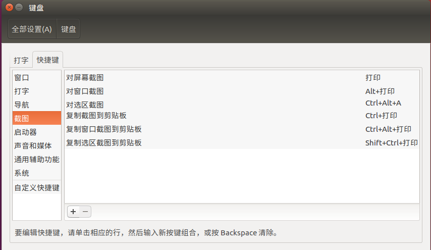
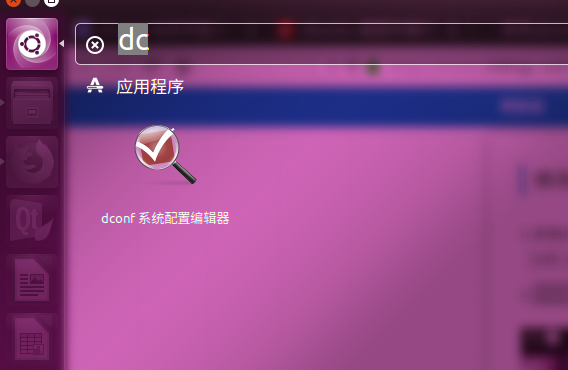
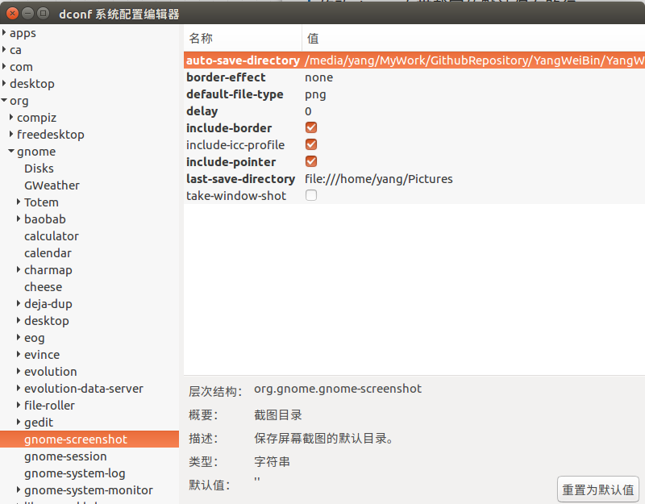
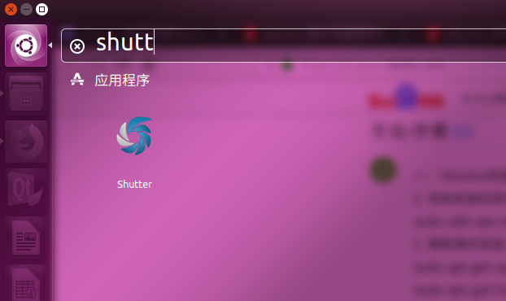
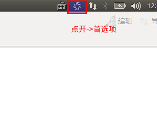
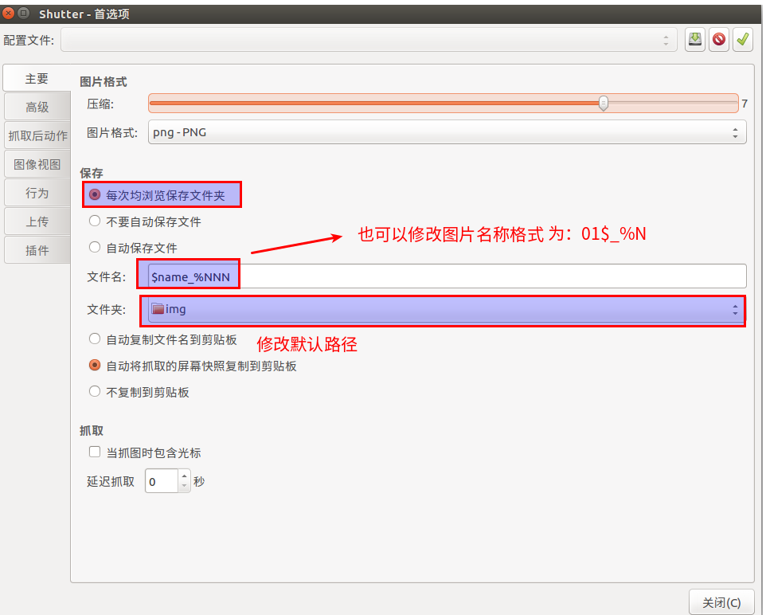
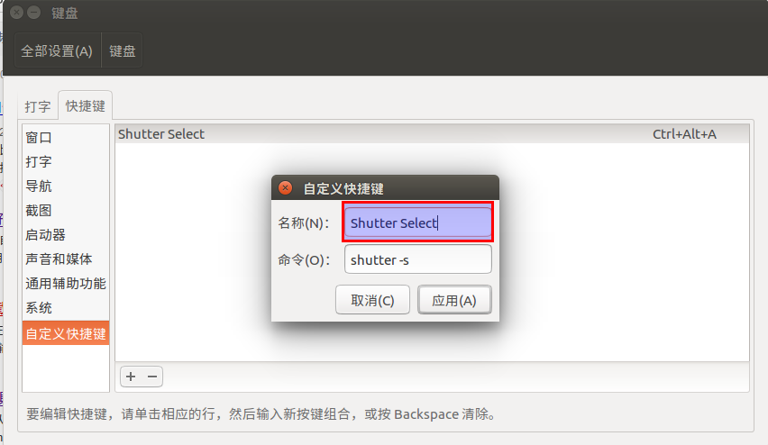
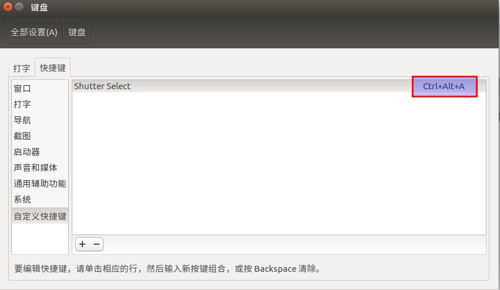

# Ubuntu设置截屏工具     
## Ubuntu自带的screenshot  
1. 设置截屏快捷键  
设置->键盘->快捷键  
  
这里可以**设置很多的快捷键功能**。  
2. 修改screenshot的默认目录  
- 安装dconf-editor：  
```shell
sudo apt-get install dconf-tools
```
- 打开系统自带搜索，搜dconf-editor    
  
- 找到org->gnome->gnome-screenshot->auto-save-directory，修改value为需要的路径，如图：      
  
这里可以修改默认路径。  
## 截图神器Shutter的使用  
1. 安装Shutter  
```shell
sudo add-apt-repository ppa:shutter/ppa
sudo apt-get update && sudo apt-get install shutter
```
可能安装需要一些时间2分钟多，两条命令还可以用 **&&**隔开，学习了！   
2. 搜索软件  
   
3. 修改默认路径  
   
点开后可以修改路径，以及图片命名格式：  
   

4. 设置快捷键  
添加应用：  
  
快捷键设置：Ctrl+Alt+A ，这是选取的区域：  
  
选定区域后，按**Enter**。  


## 参考内容  
1. https://blog.csdn.net/qq_38880380/article/details/78233687  
2. https://www.cnblogs.com/zhihaowu/p/8846479.html  
3. https://blog.csdn.net/yelangjueqi/article/details/56685104  
4. https://jingyan.baidu.com/article/4b52d702db5482fc5c774bf0.html  


