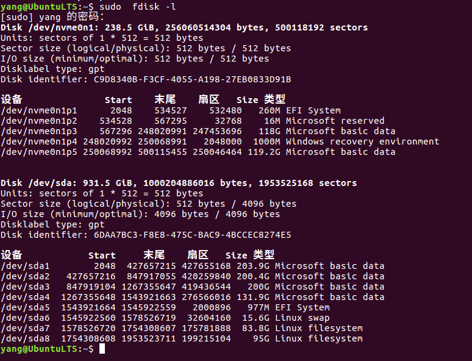
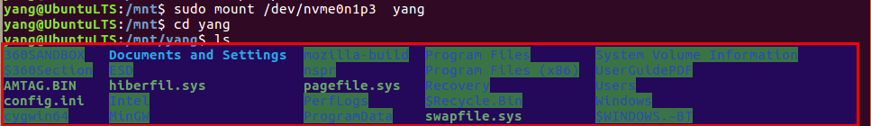
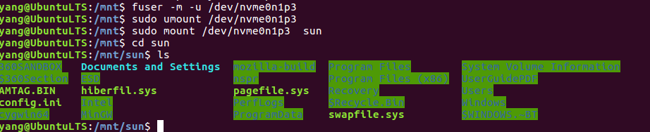
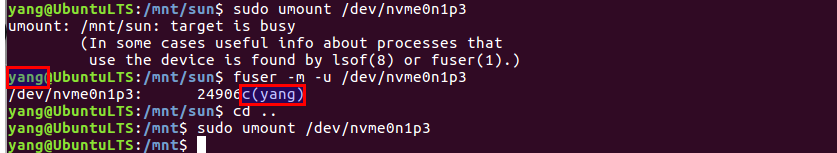
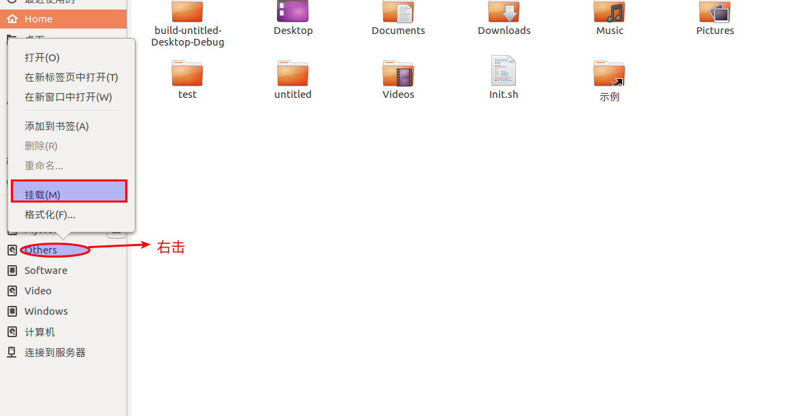
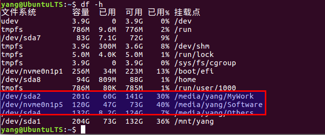
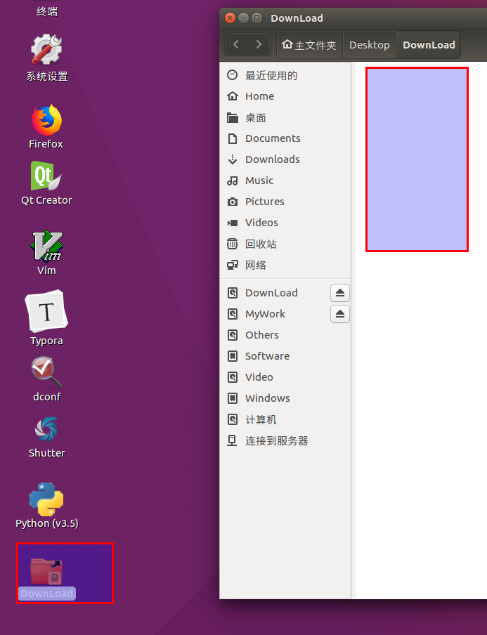
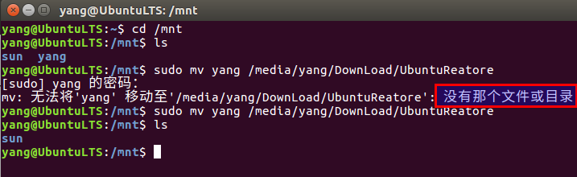

# Ubuntu挂载命令mount用法    
## 1 什么是挂载  
- Linux中的根目录以外的文件要想被访问，需要将其“关联”到根目录下的某个目录来实现，这种关联操作就是“挂载”，这个目录就是“挂载点”，解除次关联关系的过程称之为“卸载”。  
- 在linux系统下可以挂接(mount)光盘镜像文件、移动硬盘、U盘以及Windows网络共享和UNIX NFS网络共享。  
- 本文介绍挂载针对双系统下，Ubuntu挂载移动硬盘。因为双系统下Ubuntu将win10 的盘符以挂载的方式接入。  
- Linux就是把所有的一切都放到一颗“大树”下。如果你有另外的分区或者硬盘，它们就会“挂载”到枝干的子目录中，例如/media或者/mnt目录，这个子目录就是所谓的挂载点，你可以将分区挂载到任意的目录中。  
## 2 命令格式介绍  
1. 挂接(mount)命令的使用方法，mount命令参数非常多，这里主要讲一下今天我们要用到的。  
```shell
mount [-t vfstype] [-o options] device dir
```
其中：  

------
`[-t vfstype]`指定文件系统的类型，**通常不必指定**。mount 会自动选择正确的类型。常用类型有：  
文件|文件类型
:-|:-:
光盘或光盘镜像|iso9660
DOS fat16文件系统|msdos
Windows 9x fat32文件系统|vfat
Windows NT ntfs文件系统|ntfs
Mount Windows文件网络共享|smbfs
UNIX(LINUX) 文件网络共享|nfs  

-----
 `[-o options]`主要用来描述设备或档案的挂接方式。常用的参数有：  
参数|作用
-|-
loop|用来把一个文件当成硬盘分区挂接上系统
ro|采用只读方式挂接设备
rw|采用读写方式挂接设备
iocharset|指定访问文件系统所用字符集     

-----
3. `device`要挂接(mount)的设备。     
   
-----
4. `dir`设备在系统上的挂接点(mount point)。  

-----

## 3 挂接移动硬盘    
如果你使用的是桌面版的Ubuntu，并且是双系统，那么点击Linux中的“位置”->"计算机"，里面就列出了Windows中的分区，点击右键，选择“挂载”就可以了，默认是挂载在media目录下，我们可以通过命令设定想要挂载的分区及其要挂在到的位置。  
对linux系统而言，USB接口的移动硬盘是当作SCSI设备对待的。插入移动硬盘之前，应先用`fdisk –l 或 more /proc/partitions`查看系统的硬盘和硬盘分区情况。   

```shell
sudo  fdisk -l
```
如下所示：  
  
可以看到我的电脑，属于双硬盘，win10系统安装在，256G的固态硬盘：Disk /dev/nvme0n1  
而Ubuntu系统安装在1T的机械硬盘，盘符分别是：/dev/sda5 ，/dev/sda6，/dev/sda7，/dev/sda8  。  
接好移动硬盘后，再用`fdisk –l 或 more /proc/partitions`查看系统的硬盘和硬盘分区情况。    

---
- 挂载  
比如，我想要挂载/dev/nvme0n1p3分区，把它挂载在/mnt/yang目录下：  

```shell
cd /mnt         # 进入mnt目录  
sudo mkdir yang # 创建yang文件夹
sudo mount /dev/nvme0n1p3  yang  # 完成挂载 
cd yang 		# 进入yang目录
ls 				# 显示内容
```
如下所示：   
   
因为这是我的Win10系统文件夹。  

---
- 卸载  
```shell
cd ..
sudo umount /dev/nvme0n1p3  # sudo umount yang
```

---
- 验证  
```shell
cd yang
ls
```
  
此时，什么也没出现。说明卸载成功。  

---
**注意事项：**  
1. 你要挂载的硬盘（或者说目录更准确）没有挂载在其他地方，例如：  
```shell
sudo mount /dev/nvme0n1p3  yang # 先挂载在yang目录下
sudo mkdir sun 					# 创建sun目录
sudo mount /dev/nvme0n1p3  sun	# 再挂载在sun目录下
```
此时会报错：  
   
这时你要么取消挂载yang，要么取消挂载/dev/nvme0n1p3，然后在挂载到sun目录下：  
```shell
fuser -m -u /dev/nvme0n1p3 		# 可以查看哪个进程在用
sudo umount /dev/nvme0n1p3		# 取消之前的挂载
sudo mount /dev/nvme0n1p3  sun	# 重新挂载到sun目录
cd sun
ls
```
如下所示：   
   
2. 在卸载时，保证没有进程在使用这个挂载信息，比如：  
```shell
sudo umount /dev/nvme0n1p3  	# 我当前在sun目录下，再卸载这个硬盘此时报错
fuser -m -u /dev/nvme0n1p3 		# 这个命令是看哪个进程在使用
cd ..							# 退出sun目录
sudo umount /dev/nvme0n1p3		# 再次卸载，成功
```
    
当在sun目录下时，我当前进程占用这个目录，所以无法卸载，当我退出这个目录时，才能卸载。这里需要说明的时`fuser -m -u /dev/nvme0n1p3 `显示的进程信息有：24906c(yang)，这个yang是我当前的用户名，并不是刚才的文件目录yang。  
3. 自动挂载  
   
当我们在打开文件管理时，右击盘符有个挂载，这个属于自动挂载，我们有时候不用每次右击，只需要 单击 就可完成， 我的默认自动挂载到 /media/yang/磁盘名目录下，无论手动挂载还是自动挂载不要产生冲突，否则文件目录会出问题。   
为了避免冲突，可以采用以下命令查看，挂载信息：  

```shell
sudo df -h
```
   

4. 挂载自动取消  
- 每次重启电脑后，挂载会自动取消，这个在**创建软链接**时，一定要注意你的链接路径。     
    

- 还有就是在进行文件操作时，看你的目录是否被挂载，如下：
   


## 参考内容  
1. https://blog.csdn.net/daydayup654/article/details/78788310  
2. https://blog.csdn.net/qq_21794887/article/details/81019981  
3. https://blog.csdn.net/Json159/article/details/80595443  
4. https://blog.csdn.net/gymaisyl/article/details/86579204  


