# Ubuntu开机自动挂载      
我以实现开机自动挂载盘符的操作为例，为大家进行讲解：  
## 1 准备挂载命令    
1. 开机就运行挂载盘符操作，我先看看我的磁盘名称对应哪个分区，我先让所以的分区都被自动挂载在 /media/yang/路径下（其实就是每个磁盘单击一下），然后运行下面命令：    
```shell
sudo df -h
```
如下图所示：   
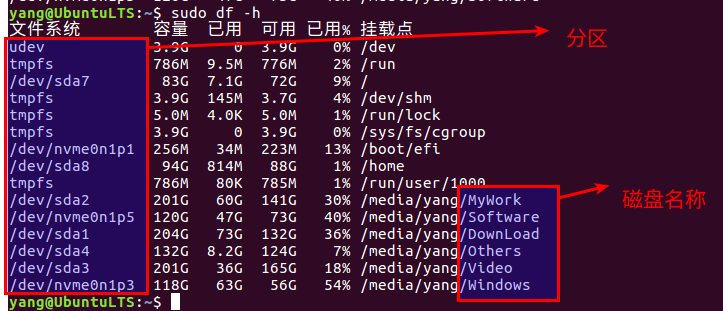  
因为我用的是双系统，因此有一些Win10系统下的分区，这样，可以找到我的磁盘名称和分区的对应关系。    

2. 取消几个盘符，为后面挂载做准备。  
取消之后再运行：`sudo df -h`  
如下图所示：   
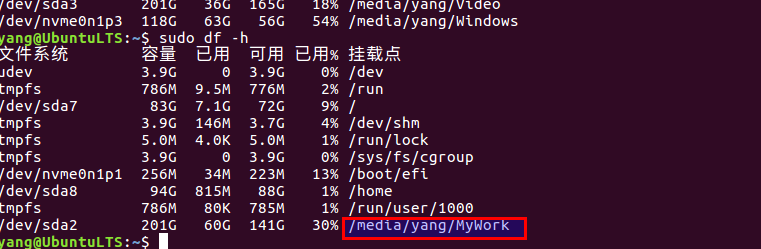    
此时，只有MyWork被挂载，我想挂载DownLoad到 /mnt/DownLoad下：  
则需要执行下面命令：  
```shell
cd /mnt
sudo mkdir DownLoad  # 先创建文件夹
sudo mount /dev/sda1 /mnt/DownLoad # 挂载
```
但是挂载在每次重启后，会取消掉，所以为了避免这样的事，我们每次开机都让计算机挂载一次。  
## 2 开机自动运行  
### 2.1 利用rc.local  
rc.local脚本是一个Ubuntu开机后会自动执行的脚本，我们可以在该脚本内添加命令行指令。该脚本位于/etc/路径下，需要root权限才能修改。  
利用vim打开rc.local    

```shell
sudo vim /etc/rc.local
```
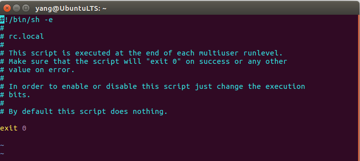   
需要执行的脚本写在exit 0前面。 
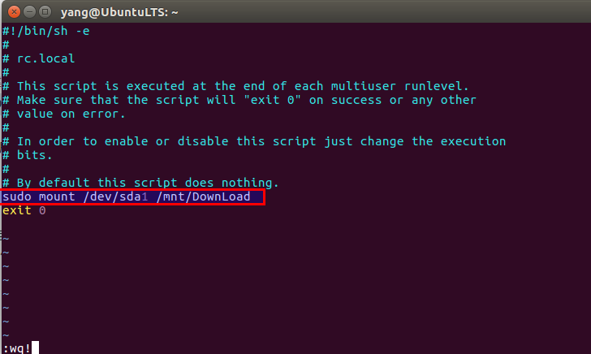   
重启电脑，Ubuntu16.04LTS，亲测有效：    
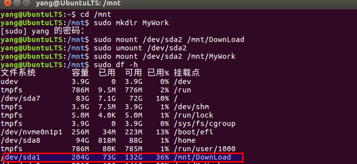     

### 2.2 增加开机启动服务  
编辑一个shell脚本，然后在shell脚本中写入自己开机之后需要执行的命令，然后把该脚本拷贝进**/etc/init.d/**文件夹下，赋予可执行的权限，然后一行命令sudo update-rc.d 你的脚本 defaults 90  
1. 编写脚本文件  
```shell
sudo vim /etc/init.d/mountDownLoad.sh
sudo vim /etc/init.d/mountGithubRepository.sh
```
添加以下内容：     
```shell

#!/bin/bash
### BEGIN INIT INFO
# Provides:          mountWin10Disk.sh
# Required-Start:    $remote_fs $syslog
# Required-Stop:     $remote_fs $syslog
# Default-Start:     2 3 4 5
# Default-Stop:      0 1 6
# Short-Description: start mountWin10Disk.sh
# Description:       start mountWin10Disk.sh
### END INIT INFO
# command content
sudo mount /dev/nvme0n1p4 /mnt/GithubRepository
sudo mount /dev/nvme0n1p3 /mnt/Software
sudo mount /dev/nvme0n1p2 /mnt/Win10
sudo mount /dev/sda1 /mnt/DownLoad
sudo mount /dev/sda2 /mnt/MyWork
sudo mount /dev/sda4 /mnt/Others
exit 0
```


```shell
#!/bin/bash
### BEGIN INIT INFO
# Provides:          mountDownLoad.sh
# Required-Start:    $remote_fs $syslog
# Required-Stop:     $remote_fs $syslog
# Default-Start:     2 3 4 5
# Default-Stop:      0 1 6
# Short-Description: start mountDownLoad.sh
# Description:       start mountDownLoad.sh
### END INIT INFO
# command content
sudo mount /dev/sda1 /mnt/DownLoad
exit 0     
```
**注意：**“XXX”代表文件名：mountDownLoad.sh 。  
 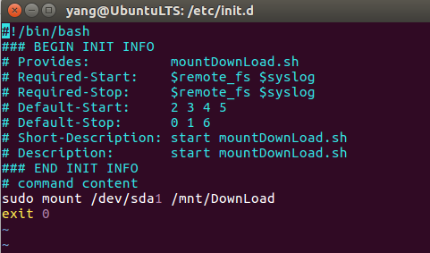 

2. 设置权限    
```shell
cd  /etc/init.d/     			# 进入目录  
ls                              # 查看是否成功，以及有哪些开机自启的服务
sudo chmod 755 mountDownLoad.sh # 设置权限 
```
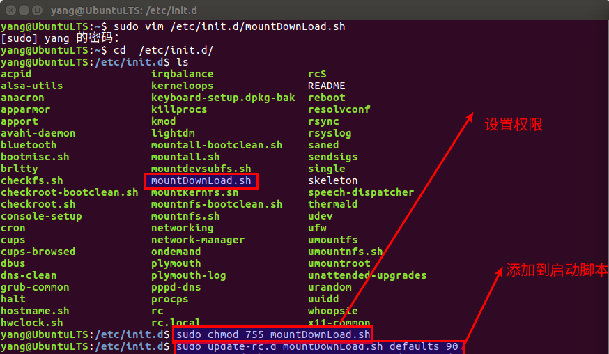   

3. 添加到启动脚本  
```shell
sudo update-rc.d mountDownLoad.sh defaults 90  
```
在这里90表明一个优先级次序，越大表示执行的越晚。  
4. 重启电脑测试以下  
```shell
sudo reboot
```
重启电脑，Ubuntu16.04LTS，亲测有效：  
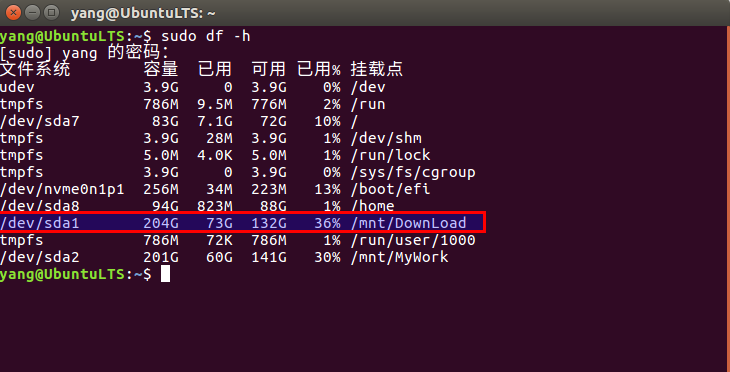   
5. 取消自启动服务  
```shell
cd /etc/init.d
sudo update-rc.d -f mountDownLoad.sh remove
```
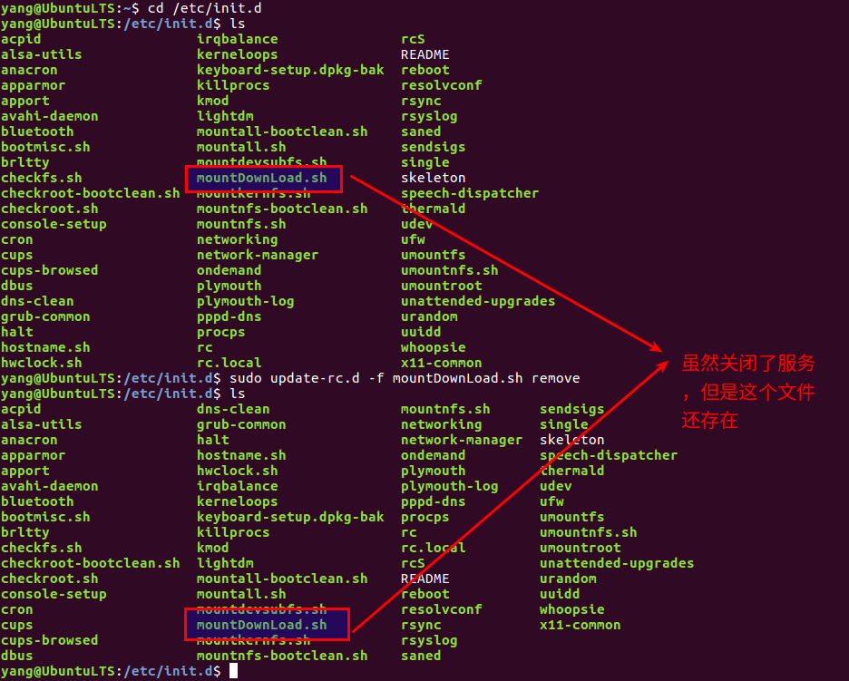   


6. 重启动测试   
测试成功，DownLoad未被加载:  
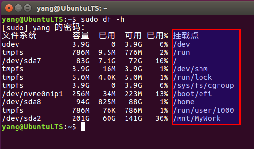   


## 3 扩展  
1. **利用rc.local**的方法更适用于那些**长久性**的操作，也就是添加完命令后就不在修改，例如：长期的挂载一些硬盘；  
2. **添加开机启动服务**更适应于那些短期内使用，但是**有时用有时又不用**，也就是可以在/etc/init.d/文件夹下存档，用的话就开启，不用的话就关闭；  
3. 对于不想让一些应用自启动，可以利用**取消自启动服务类似的方法**将其关闭掉；
4. 对于不明白书写格式的文档，可以先**参考当前目录下其他文档**或者里面的**README**时如何编写的，然后在根据情况进行修改，例如可以看看/etc/init.d文件夹下面的其他文档格式来确定自己的开启服务该怎么去写。
```shell
cd /etc/init.d
ls 
sudo vim dns-clean 
```
如图所示：  
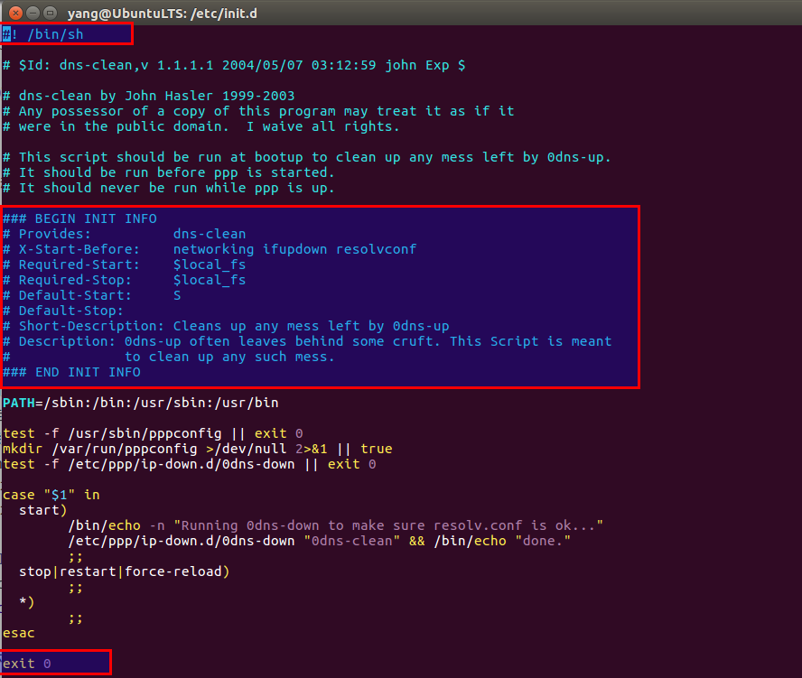   

## 4 更多方法  
https://blog.csdn.net/UNIONDONG/article/details/86613069


## 参考内容  
1. https://www.linuxidc.com/Linux/2017-09/147178.htm  
2. https://blog.csdn.net/upshi/article/details/53884770  
3. https://www.cnblogs.com/it-tsz/p/9865400.html  


