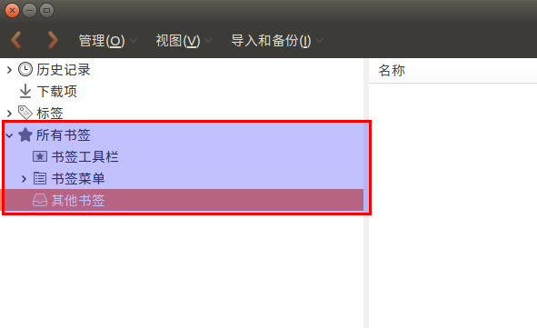
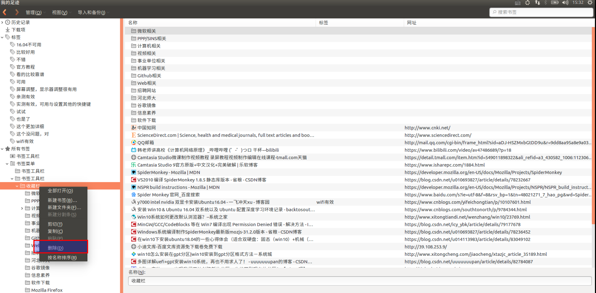
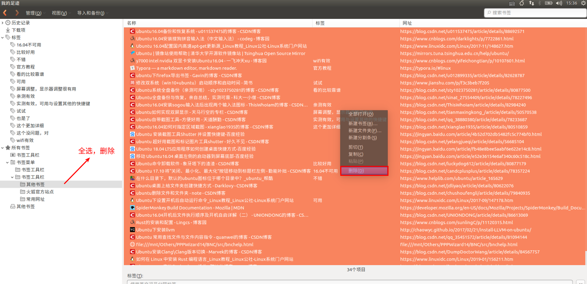
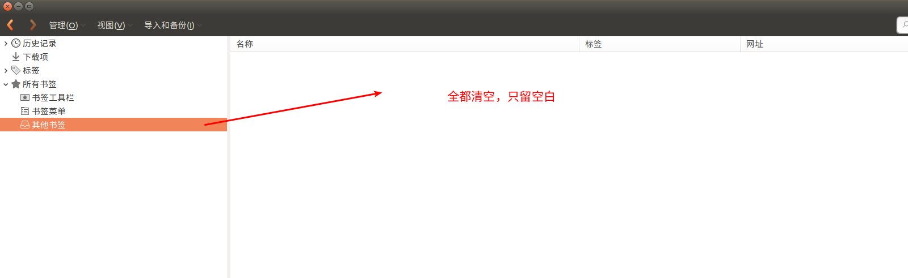
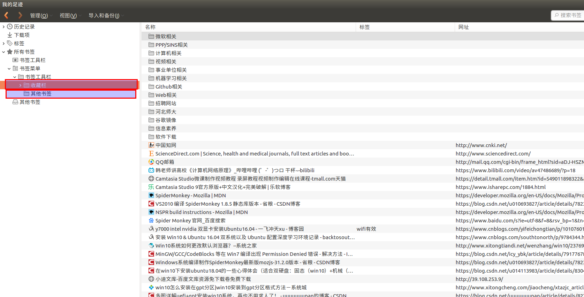

# 双系统下的书签同步   

## 1 浏览器选择  
在Win10系统下使用360安全浏览器，在Ubuntu16.04LTS下使用Firefox浏览器。  

## 2 书签导出与导入  
1. 在书签导入时先清空书签，然后再导入覆盖掉原来的书签；  
  
删除收藏夹：  
   
清空其他书签：  
   
剩下空白：   
   

2. 书签放在收藏夹 和 其他书签有效；  

3. 导入书签  
   

## 3 容易出现的问题  
1. 没有清空原来书签就导入，导致书签重复迭代；  
2. 没有及时备份，当导入其他书签时，导致一些书签被覆盖，丢失；  
3. 书签只是一个辅助，**多整理文档，在文档中写好链接，出处**。  

