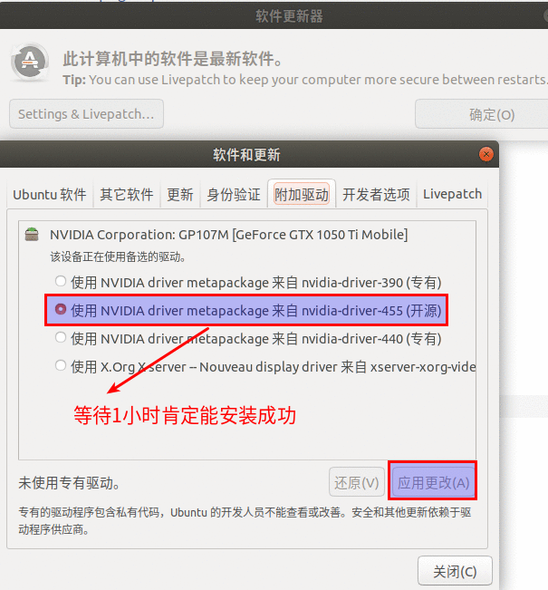

# Ubuntu2004独立显卡的安装     

## 1 更新系统      
- 时间可能很长     

```
sudo apt-get update  
```

## 2 安装gcc，g++，gdb，make     
```
sudo apt update
sudo apt install build-essential
gcc --version
sudo apt-get install gdb   
```

## 3 通过软件更新器更新     

        

## 4 踩坑方法   

1. 凡是下载\*.run相关的方法都是错的        
2. 凡是让关闭集成显卡驱动的多数会黑屏    

