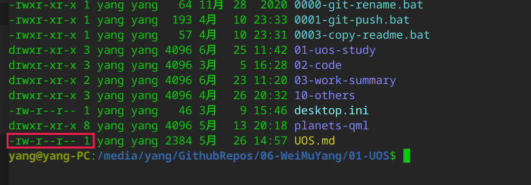

# Linux文件属性可不设置  

## 概述  

在Win10分区内的文件，将文件复制U盘，然后将U 盘插入到Linux系统时，发现markdown文件的属性不可设置。打开markdown文档时，总是提示运行文件还是显示文件，每次都要操作非常麻烦。 设置文件的属性也不能成功。猜测可能和U盘的分区格式有关系。  

## 解决思路  

当使用`FAT32`格式的U盘进行复制时，不会出现上述问题。而且markdown文档也没有运行的权限，因此，将U盘的格式由`NFTS`转成了`FAT32`解决了上述问题。markdown文档的权限就没有了执行权限。  

## 参考资料   

1. https://zhidao.baidu.com/question/455132463.html